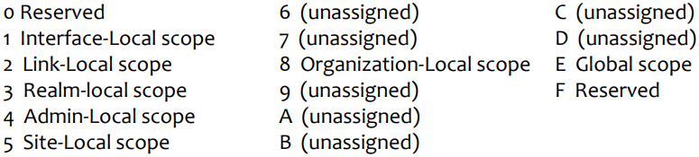

# Index
* [IPv6](#ipv6)
* [ICMPv6](#icmpv6-internet-control-message-protocol-for-ipv6)
* [Other Layers](#other-layers)
* [Transition and Interoperation Mechanisms](#transition-and-interoperation-mechanisms)

# IPV6

## Why IPv6? 
* Address Exhaustion: IPv4 addresses are running out; NAT is a temporary solution
* Improve router performance: simplifies IP header, aligns to 64 bits, address hierarchy with more levels, and simplifies routing tables
* Improve Mobile IP support

## Headers

* **Ver -** protocol version (=6)
* **Class -** similar to IPv4's ToS / DSCP
* **Flow Label -** flow identification;
    * Unique for each flow with the same (src,dst) pair
    * Zero means "no flow label"
* **Payload length -** data field size
    * Limited to 2¹⁶-1 bytes, but there there's an option for Jumbograms up to 2³²-1 bytes
    * No need for total length since the header size is fixed
* **Next Header -** type of next header
* **Hop Limit -** IPv4's TTL (but done properly)
* No checksum, with error checking performed by lower layers

## Addresses
* 128 bits represented in hexadecimal
* Leading zeroes may be omitted
* A sequence of zeroes may be abbreviated by ::
    * Only one :: in an address to avoid ambiguity
* Mask (prefix length) similar to IPv4 CIDR
* IPv4 can be embedded in IPv6 addresses

### Unicast
* Loopback ::1 (/128)
* Link-local:
    * Only used on the local link (not routed)
        * FE80::/64 (last 64 bits are device identifier)
* Site-local (deprecated):
    * Used within the same site, and therefore only valid therein
        * FEC0:0000:0000:\<Subnet(16)\>:\<Interface(64)\>
* Global address:
    * Internet routable address
        * 2000::/3
        * But there can be routable IPv6 addresses outside this range

### Multicast
* Multicast:
    * With different scopes

    

* 4-bit multicast scope field used to limit the scope of the multicast group

    

### Other
* Anycast address
    * Defined on more than one interface, but delivered only to one
* Unspecified address
    * Denoted by :: and used only during configuration

## Required addresses
* Node:
    * Loopback
    * Link-local for each interface
    * Configured unicast (or anycast)
    * All-nodes multicast
    * Solicited-node multicast address for each of its unicast and anycast addresses
    * Multicast groups that the node belongs to
* Router: all the above plus
    * Subnet-Router Anycast (equal to the subnet prefix)
    * All-Routers multicast

# ICMPv6 (Internet control message protocol for IPv6)
* **Type** defines the type, **code** a subtype (similar to ICMP (v4))
* Example:
    * Type = 1 (Error code for destination unreachable)
    * Code = 0 (no route to destination)
* Errors have type with high-order bit = 0 (0-126)
    * Informational are 128-254

## Neighbour Discovery
* Replaces IPv4 ARP
* Adds auto-configuration helper functions
* Extensible: messages may have options for added information
* IP Hop limit: set to 255

### Neighbour solicitation
* Sent by hosts or routers, for address resolution, neighbour unreachability detection (NUD), and duplicate address detection (DAD)
* Type = 135, code = 0 
* **Target address**
    * IP address of the solicitation target
* **IP destination address**
    * solicited-node multicast address corresponding to the target address, or the target address itself
* **IP source address**
    * address of the interface where the packet is sent, or unspecified address for DAD

### Neighbour advertisement
* Sent by hosts or routers, in response to solicitations or unsolicited
* Type = 136, code = 0
* **Target address**
    * For solicited: same as in solicitation
    * For unsolicited: IP address that changed link-layer address
* Option: source link-layer address of sender

## Solicited-Node MC Address
* Multicast address formed using ff02:0:0:0:0:1:ff00::/104 prefix and low-order 24 bits of an address (unicast or anycast)
    * Example:
        * Unicast address: 4037::01:800:20**0e:8c6c**
        * Solicited Address: ff02:0:0:0:0:1:ff**0e:8c6c**
* Most probably, no two nodes in the same network map to the same multicast address ➔ much more efficient than the local broadcast used by ARP!

## Router Discovery
* For discovering routers on the link and, possibly, address information
* **Router solicitations** (Type = 133, code = 0)
    * Sent by hosts to the link-local all-routers multicast address
* **Router advertisements** (Type = 134, code = 0)
    * Sent by routers
    * In response to solicitations - to unicast address of requester
    * Unsolicited - to all-nodes multicast address with link-local scope
    * Advertise: net prefix, default router(s), MTU

## Auto Configuration - SLAAC
* **StateLess** Address AutoConfiguration
    1. Generating link-local address
    2. Generating global address(es)
    3. Performing duplicate address detection (DAD)
* Based on Router Advertisements
* Uses advertised prefix and MAC address of interface
* Valid only for /64 networks

## What about DNS servers?
* IPv6 Router Advertisement Options for DNS Configuration
* Type: 25
* Length: indicates the length of the option
    * Implicitly the number of advertised DNS servers

## Duplicate Address Detection
* Used after address auto-configuration to check uniqueness of address
    * Not performed for anycast addresses (configured)
* Node sends neighbour solicitation with:
    * **Src address:** unspecified
    * **Dst address:** solicited-node multicast address of the tentative address
    * **Target address:** the tentative address
* Receiving Neighbour Solicitation
    * Target address is the tentative address
        * If src address is unicast (not DAD): ignore packet
        * If src address is unspecified: other node wants to use same address (DAD)
            * No node will use the target address (as extra precaution)
* Receiving Neighbour Advertisement
    * Target address is the tentative address
    * Address is not unique (cannot be used)

## Path MTU Discovery

* IPv6 does not support fragmentation in routers
* Senders need to transmit packets ≤ smallest MTU along the path (i.e., Path MTU)
* Procedure for discovering the Path MTU
    * Source node assumes path MTU = 1st hop link MTU
    * If this is too large for a link
        * router drops the packet
        * returns an ICMPv6 Packet Too Big (type = 2, code = 0)
    * Source reduces MTU to the indicated size
    * When the MTU used by the source ≤ Path MTU, packets reach the destination

# Other Layers

## DHCPv6
* Stateful configuration
* Uses UDP (like DHCPv4)
* DHCP clients use the link-local address
* Uses two multicast groups
* Requires DAD to ensure address uniqueness 
* Possible to obtain partial information via Information-Request message
* DHCP Unique Identifier (DUID) for client-server identification
    * Not all messages require this ID
* Optional authentication and encryption
* Information carried in options

### Messages

## Recursive DNS server configuration
* Approaches for DNS configuration in clients
    * Router Advertisements, DHCPv6, or well-known anycast address

## DNS - changes for IPv6
* AAAA new record type
    * IPv6 address
* AAAA queries returns all IPv6 addresses associated with domain name
* IP6.ARPA domain for reverse (PTR) queries (similar to IPv4's in-addr.arpa)
* Existing query types
    * NS, SRV, MX: re-defined to also return AAAA entries

## DNS in IPv4 and IPv6
* Maintain IPv4 and IPv6 accessible DNS recursive server
    * IPv4 only or dual stack
    * At least one IPv4 reachable server per DNS zone

# Transition and Interoperation Mechanisms

## IPv6 in an IPv4 world

### <u>Problem</u>
* Incompatibility arises due to differences in header formats, Sockets API, and applications

### <u>Solutions</u>
### Dual stack nodes
* Support both IPv4 and IPv6
* Routers must maintain both routing tables, protocols, etc.
### Configured Tunneling (Aka 6in4)
* Tunnel endpoints encapsulate the original IPv6 in an IPv4 packet
* Tunnel endpoints (routes) are manually configured
* Does not scale well
    * Requires a different tunnel for each pair of routers ➔ O(n²)

### 6to4
* 6to4 Tunnel (without explicit setup)
* Use of 2002:V4ADDR::/48 networks
* Sites use 6to4 relay to communicate through the tunnels
    * These relay routers can have an IPv4 anycast address of 192.88.99.1
    * Sites may also have connection to IPv6-only networks
* **Components:**

| Router B | 6to4 Router C | 6to4 relay Router A
|----------|---------------|--------------------
<ul><li>Connects to the IPv6 backbone</li><li>Has a native IPv6 address (not 2002::/16)</li><li>Does not handle IPv4</li></ul>|<ul><li>Connects to the IPv4 backbone</li><li>Does not relay packets to the IPv6 backbone</li><li>6to4 IPv6 address and a native IPv4 address</li></ul>|<ul><li>Connects to the IPv4 and IPv6 backbone</li><li>Has a 6to4 and a native (not 2002::/16) IPv6 address</li><li>Has a native IPv4 address</li></ul>

* **Issues:** 6to4 causes asymmetric routing and relays may receive traffic from anywhere. 6rd is a slight modification that solves this issue
    
    

### 6rd
* IPv**6 R**apid **D**eployment on IPv4 Infrastructures
* Similar to 6to4 but using ISP-specific prefix instead of 2002::/16
    * Allows use of private IPv4 addresses
    * ISP-specific prefix length not fixed
* The ISP
    * Operates one or more gateways at the IPv4/IPv6 border
    * Deploys relays with specific anycast addresses (only for its customers)
    * Has more control over traffic flowing through its network

### Intra-Site Automatic Tunnel Addressing Protocol (ISATAP)

* Connects dual-stack nodes over IPv4 networks
* Uses entire IPv4 network as a link layer (NBMA)
* Defines locators (mappings) on interfaces for routing packets
* Requires a Potential Router List (PRL) (obtained by doing a DNS lookup for isatap.\<domain\>) for communication with the public IPv6 Internet
* ISATAP IPv6 addresses:
    * \<prefix\>:0000:5efe:\<IPv4 addr\>

### Teredo
* Allows automatic IPv6 tunneling between hosts that are located across one or more IPv4 NATs
* Encapsulates IPv6 packets in UDP
    * More overhead than other techniques ➔ use only when they are infeasible
* Use of 2001:0000::/32 for Teredo clients
    * 2001:0000:\<teredo server IP address\>:\<flags (16)\>:\<obscured UDP port\>:\<obscured public IPv4 address\>
* Discovers and maintains NAT mappings to the client
* Components:
    * Client: has IPv4 connectivity, wants IPv6
    * Server: to discover external address and type of NAT
    * Relay: forwards traffic using the Teredo encapsulation on IPv4 and to the IPv6

## IPv4 in an IPv6 world
* Increasing deployment of IPv6 ➔ need for
    * Nodes in IPv6-only networks to reach IPv4-only services on the Internet
    * Traversal of IPv6-only operator networks to reach IPv4-only services on the Internet
* Larger IPv6 addresses make it easier to use translation/NAT instead of tunneling
    * IPv6 addresses can embed IPv4 addresses

### NAT64/DNS64
* NAT64 facilitates access to IPv4-only services from IPv6-only networks by translating IPv6 to IPv4 addresses.
* DNS64 synthesizes AAAA records for services offering only A records, using the chosen prefix.
* Example:

    

* Limitations include IPv4-only software, IPv4 literals (no DNS lookup is performed), and IPv4 networks behind IPv6-only ISP networks

### Stateless IP/ICMP Translation (SIIT)
* Translates headers of IP packets and IP packet fragments inside ICMP messages (for transparency)
* Comes in two flavors:
    * "Traditional" SIIT (entire IPv4 address embedded in an IPv6 address with given prefix)
    * SIIT with Explicit Address Mappings (EAM) (uses configured host-specific or block mappings)
* Advantages of stateless translation:
    * No need to maintain per-flow state
    * Easier load distribution - translator for outgoing and incoming packets needs not be the same
* Disadvantage: the 1:1 mapping between IPv4 and IPv6 addresses wastes scarce IPv4 addresses
* Example ("traditional" SIIT):

    

### 464XLAT

* 464XLAT is an architecture combining Stateful NAT64 with an additional, stateless translator (SIIT)
    * CLAT: Client-side transLATor (SIIT)
    * PLAT: Provider-side transLATor (Stateful NAT64)
* Addresses the use cases not covered by NAT64/DNS64
