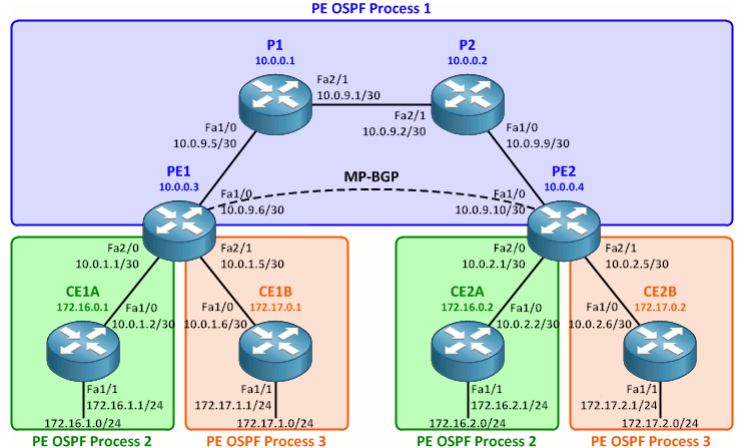

# Multi-Protocol Label Switching (MPLS)

# Index
* [Multiprotocol Label Switching (MPLS)](#multiprotocol-label-switching-mpls)
* [VPNs](#vpns)

## Virtualization of networks
* Virtualization of resources is a powerful abstraction in systems engineering
* Computing examples: virtual memory, virtual devices
* Layering of abstractions
    * Don't sweat the details of the lower layer, only deal with lower layers abstractly
* The Internet: virtualizing networks
    | **1974: Multiple Unconnected Nets** | **...differing in** |
    |-------------------------------------|------------------|
    | <ul><li>ARPAnet</li><li>Data-over-cable networks</li><li>Packet satellite network (Aloha)</li><li>Packet radio network</li></ul> | <ul><li>Addressing conventions</li><li>Packet formats</li><li>Error recovery mechanisms</li><li>Routing</li></ul> |
    

### Cerf & Kahn’s Internetwork Architecture
* Two layers of addressing: local network and internetwork
* New layer (IP) makes everything homogeneous at internetwork layer
* Underlying local network technology (Ethernet, satellite, ATM, **MPLS**) becomes "invisible" at internetwork layer. Looks like a link layer technology to IP!

### Virtual Circuit vs. Datagram Networks

| **Virtual Circuit Networks** | **Datagram Networks** |
|------------------------------|-----------------------|
| <ul><li>VC establishment prior to data transmission, first packets delayed</li><li>All packets follow the same path</li><li>In-order delivery</li><li>Failures must be explicitly handled</li><li>Exact matching of VC identifier</li><li>Packets contain VC identifier</li><li>Routers maintain per-VC info</li><li>Easy to combine with resource reservation</li><li>Traffic engineering easy</li></ul> | <ul><li>No VC establishment, data may be sent immediately</li><li>Packets forwarded independently</li><li>Packets may be reordered in transit</li><li>Robust to link or node failures</li><li>Longest prefix matching of addresses</li><li>Packets contain source & destination addresses</li><li>Routers maintain only aggregate destination info</li><li>Resource reservation hard, requires additional protocols</li><li>Traffic engineering harder</li></ul> |

## Multiprotocol Label Switching (MPLS)
* Initial goal: speed up IP forwarding by forwarding based on a fixed length label (instead of IP address)
    * Borrowing ideas from Virtual Circuit (VC) approach
    * IP datagram still keeps IP address!

### Objectives and Advantages
1. Flow detection and routing based on labels (simpler and faster decision process)
    * Greater scalability
    * Better performance (main reason at the beginning, not significant nowadays...)
    * Separation of Routing and Forwarding
        * <u>Routing:</u> how to send packets from source to destination - global action
        * <u>Forwarding:</u> transfer a packet from an entry port to an exit port - local action
2. Enable establishing VPNs across telecom operator's network
    * Interconnection simplicity for clients that want to use different sites as if they were a single network
3. Enable traffic engineering
    * Allows going beyond the routing protocols when deciding the path for a packet

### MPLS supports
* Integration with routing protocols (BGP, OSPF, etc.), unicast, multicast, source routing, route pinning, QoS

### MPLS - Global View

### MPLS - Architecture
* Switching based on labels (labels change at every node - label-swapping)
* Labels transported in frames or shim header
* **MPLS node**
    * Supports MPLS, forwards based on labels, and supports one or more L3 routing protocols
* **Label Switching Routers (LSR)**
    * MPLS Nodes capable of forwarding native L3 packets
* **Edge routers**
    * MPLS nodes at the border of MPLS domains
    * Ingress
        * Decides Forwarding Equivalence Class (FEC)
        * Transmits packet with label corresponding to FEC
    * Egress
        * Removes label*
* MPLS Routers
    * Search the label on the Label Information Base (LIB)
    * New label - Next-Hop Label Forwarding Entry (NHLFE)
    * Transmit packet in out interface with new label
* Requires a mechanism for label distribution 
    

### MPLS Forwarding Tables

### MPLS - Labels

| **Shim Header** | **Label** |
|-----------------|-----------|
| <ul><li>Generic</li><li>"Layer 2.5"</li><li>Stackable</li></ul> | <ul><li>Small</li><li>Fixed size</li><li>Local meaning</li></ul> |

### MPLS - Need for a TTL field
* Nodes after the MPLS domain must see the same TTL as if MPLS were not used
* TTL in shim header is set from the IP header
* TTL in the shim header is decremented in each MPLS node the packet goes through
* When removing the label, TTL in the IP header should be set to the value in the shim header

### Label stacking
* Non-hierarchical
    * Different labels added at the ingress LSR
    * Each router removes a label from the stack
    * More overhead, but even faster forwarding performance
* Hierarchical (tunneling)
    * Intra-domain and inter-domain 
    

## Forwarding Equivalence Class (FEC)
* Subset of packets handled similarly by the router (same Next Hop, interface, treatment)
* The FEC is determined only at the ingress LSR and determines the output label at that router
* Criteria for setting the FEC
    * IP prefix, aggregating
    * Egress edge router of domain
    * By flow, end-to-end
    * QoS / Traffic Engineering
    * Other criteria

## Label distribution
* Routing information used to distribute labels
    * Piggyback on routing protocols
* MPLS nodes
    * Receive mapping from nodes "down" the path
    * Allocate and distribute labels for nodes "up" the path
    

### Label Distribution Protocol (LDP) 
* Assign labels to routing table entries and define LDP adjacencies (Hello, etc.)
* Distribute info whether node
    * Is an egress LSR
    * Has an exit label for the FEC
* Two modes for label distribution:
    |Downstream On-Demand| Downstream Unsolicited|
    | ---|--- |
    || |
* Two modes for label control
    * <u>Ordered Control</u>
        * LSR advertises FEC if it is the egress LSR for the FEC or has received an advertisement from the donwstream peer
        * Non-egress LSRs must wait for their downstream peers before advertising the FEC
    * <u>Independent Control</u>
        * LSRs advertise independently
        * May lead to (temporary) blackholing of some traffic
* Applicable when FECs are associated with destination address
* Alternatives to LDP
    * CR-LDP (Constraint-based Routing LDP)
    * RSVP-TE (Extensions to RSVP for LSP Tunnels)

## Explicit Routing in MPLS
* Two options for route selection: Hop by hop routing or Explicit routing
* Explicit Routing (Source Routing) is a very powerful technique
    * With pure datagram routing, overhead of carrying complete explicit route is prohibitive
    * MPLS allows explicit route to be carried only at the time the LSP is setup, not with each packet
    * MPLS makes explicit routing practical ☺
* In an explicitly routed LSP
    * LSP next hop is not chosen by the local node
    * It is selected by a single node, usually the ingress
* The sequence of LSRs may be chosen by
    * Configuration (administrator or centralized server)
    * An algorithm (e.g., the ingress node may use topological information learned from a link state routing protocol)

# VPNs

## Motivation
### Layer2 Example

### Overlay Model
* Service Provider provides PtP links to customer routers on other sites
* Connectivity
    * Fully connected
    * Hub-and-spoke

### Limitations of Overlay
* Customers need to manage the backbones
* Mapping between Layer 2 QoS and IP QoS
* Scaling problems

## The Peer Model
* Service provider and customer exchange Layer 3 routing information
    * Provider relays data between customer sites using best path
* Goal: provide a large-scale VPN service
* Key technologies
    * Constrained distribution of routing info (do not mix routes from different customers)
    * Multiple forwarding tables (one per VPN)
    * VPN-IP addresses (combine VPN info and IP prefix)
    * MPLS switching

## Layer 2 vs Layer 3 VPNs

| **Layer 2 VPNs** | **Layer 3 VPNs** |
|------------------|------------------|
| <ul><li>Provider devices forward customer packets based on Layer 2 information</li><li>Tunnels, circuits, LSPs, MAC address</li><li>“Pseudo-wire” concept</li><li>VPLS - Virtual Private LAN Service Using (LDP) Signaling </li></ul> | <ul><li>Provider devices forward customer packets based on Layer 3 information (e.g., IP)</li><li>Service Provider involvement in routing</li><li>MPLS/BGP VPNs, GRE, virtual router approaches</li></ul> |

> The following discussion will concern Layer 3 VPNs

## Terminology

|  |  |
|---------------|-----------------|
| **CE router**  |  <ul><li>Customer Edge router</li></ul>|
| **PE router** | <ul><li>Provider Edge router</li><li>Interfaces to CE routers</li><li>Is a Label Edge Router (LER)</li></ul> |
| **P router** | <ul><li>Provider (core) router, without knowledge of VPN or customer routes</li><li>Is a Label Switching Router (LSR)</li></ul> |
| **Route Distinguisher (aka route target)** | <ul><li>Attribute of each route used to uniquely identify prefixes among VPNs (64 bits)</ul></li> |
| **VPN-IPv4 addresses** | <ul><li>Address including the 64 bits Route Distinguisher and the 32 bits IP address</ul></li> |
| **VRF** | <ul><li>VPN Routing and Forwarding Instance</li><li>Routing table and FIB table</li></ul> |

### Network Example

### Forwarding Example

## Connection Model
* The VPN backbone is composed by MPLS LSRs
    * PE routers (edge LSRs)
    * P routers (core LSRs)
* PE routers are faced to CE routers and distribute VPN information through MBGP to other PE routers
* P routers do not run MBGP and do not have any knowledge of VPNs
    * Complexity kept at the edges
* P and PE routers share a common IGP
    * Routing for destinations in the provider network
* PE and CE routers exchange routing information through some means
    * eBGP, OSPF, RIP, static routing
    * Protocol may be different in different sites of the same customer
* CE routers run standard routing software

## Routing
* Routes PE receives from CE are installed in the appropriate VRF
    * Assigned according to the incoming interface
    * VRF necessary to segregate customers
* By using separate VRFs, addresses need NOT be unique among VPNs
    * Useful with private addressing
* Routes PE receives through the backbone IGP are installed in the global routing table
    * Routes in the provider network 

## Forwarding
* PE routers use MBGP to exchange reachability
information and learn the BGP Next-Hop
* PE and P routers use IGP to establish the IGP NextHop towards the BGP Next-Hop
    * The BGP Next-Hop is the egress PE router
* Labels corresponding to BGP Next-Hops are distributed through LDP (hop-by-hop)
* Label Stack is used for packet forwarding
    * Top (outer) label indicates IGP Next-Hop
    * Bottom (inner) label indicates outgoing interface or VRF
* The upstream LDP peer of the BGP next-hop (PE router) will pop the first level label
    * Penultimate Hop Popping
    * Avoid double processing at the egress PE Router
* The egress PE router will forward the packet based on the bottom label
    * The only one it receives
    * Determines the outgoing VPN and interface

## Scalability
* Existing BGP techniques can be used to scale the route distribution (e.g, use of route reflectors)
* Each edge router needs only the information for the VPNs it supports
    * Directly connected VPNs
* Easy to add new sites
    * Configure the site on the PE connected to it, the network automatically does the rest ☺

## Demo

* In this demo, OSPF is used in provider network and customer networks
* In general, different protocols can be used
    * In the provider and customer networks
    * In the networks of different customers
    * In different sites of the same customer

### Routes on PE1
* Global routing table 
    10.0.0.0/8 is variably subnetted, 7 subnets, 2 masks 
    O 10.0.9.0/30 [110/2] via 10.0.9.5, 00:23:17, FastEthernet1/0 
    C 10.0.9.4/30 is directly connected, FastEthernet1/0 
    O 10.0.0.2/32 [110/3] via 10.0.9.5, 00:23:17, FastEthernet1/0 
    C 10.0.0.3/32 is directly connected, Loopback0 
    O 10.0.9.8/30 [110/3] via 10.0.9.5, 00:23:17, FastEthernet1/0 
    O 10.0.0.1/32 [110/2] via 10.0.9.5, 00:23:17, FastEthernet1/0 
    O 10.0.0.4/32 [110/4] via 10.0.9.5, 00:23:17, FastEthernet1/0

* Routing table for vrf Customer_A 
    172.16.0.0/16 is variably subnetted, 4 subnets, 2 masks 
    O 172.16.1.0/24 [110/2] via 10.0.1.2, 00:23:35, FastEthernet2/0 
    O 172.16.0.1/32 [110/2] via 10.0.1.2, 00:23:35, FastEthernet2/0 
    B 172.16.2.0/24 [200/2] via 10.0.0.4, 00:22:48 
    B 172.16.0.2/32 [200/2] via 10.0.0.4, 00:22:48 
    10.0.0.0/30 is subnetted, 2 subnets 
    B 10.0.2.0 [200/0] via 10.0.0.4, 00:22:48 
    C 10.0.1.0 is directly connected, FastEthernet2/0

* Global routing table 
    172.16.0.0/16 is variably subnetted, 4 subnets, 2 masks 
    C 172.16.1.0/24 is directly connected, FastEthernet1/1 
    C 172.16.0.1/32 is directly connected, Loopback0 
    O IA 172.16.2.0/24 [110/3] via 10.0.1.1, 00:23:39, FastEthernet1/0 
    O IA 172.16.0.2/32 [110/3] via 10.0.1.1, 00:23:39, FastEthernet1/0 
    10.0.0.0/30 is subnetted, 2 subnets 
    O IA 10.0.2.0 [110/2] via 10.0.1.1, 00:23:39, FastEthernet1/0 
    C 10.0.1.0 is directly connected, FastEthernet1/0

## MPLS Labels 

### BGP VPNV4 Labels

|PE1|
| ---|
||

### MPLS Fwd Table

|PE1| P1|
| ---|--- |
|| |

### Other uses of MPLS
* Traffic engineering, IPv6 over MPLS, QoS, Pseudowire - IETF WG, Virtual Private LAN Service (VPLS) IETF WG