# Multicast

# Index 
* [Multicast](#multicast)
* [Routing](#routing)
    * [PIM: Protocol Independent Multicast](#pim-protocol-independent-multicast)
        * [PIM-DM (Dense Mode)](#pim-dm-dense-mode)
        * [PIM-SM (Sparse Mode)](#pim-sm-sparse-mode)
    * [Source Specific Multicast (SSM)](#source-specific-multicast-ssm)
    * [Bidirectional PIM (BIDIR-PIM)](#bidirectional-pim-bidir-pim)
    * [PIM: Use Cases](#pim-use-cases)

## Why multicast?
* Need to send the same information to multiple receivers
    * Better use of network capacity
    * Less processing at routers and sources
    * Quicker participation
* Multicast applications
    * Audio and video diffusion, software distribution, web caches updates (e.g., CDN nodes), teleconference (audio, video, whiteboard, etc.), games, service or server discovery and other distributed apps

## One to many communication

|Multiple unicasts| In-network duplication: multicast/broadcast|
| ---|--- |
|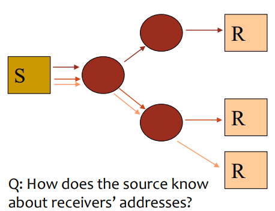| 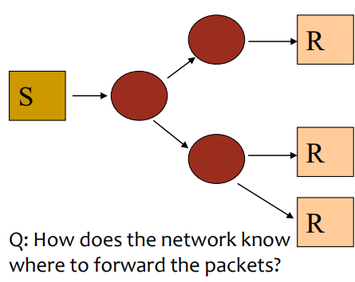|

## In-network duplication
* Simple flooding: when node receives broadcast packet, sends copy to all neighbours
    * <u>Problem: network cycles create broadcast storms</u>
* Controlled flooding: node only broadcasts packets it hasn't broadcast before
    * Nodes keeps track of packets already broadcast (e.g., using per-source sequence numbers/packet IDs) <u>or</u>
    * Reverse path forwarding (RPF) - only forward packets that arrived on shortest path between node and source
    * Nodes may still receive redundant copies 
* Spanning tree
    * Retransmit only on links belonging to the tree
    * Single path between source and any node: no redundant packets received by anyone
    * Typically **not** minimum spanning tree (MST)

## Hardware Multicast
* Broadcast
    * Packets delivered to every host
    * Ethernet: MAC=FF:FF:FF:FF:FF:FF
    * Problem: CPU use in every host
        * Even those not interested
* Multicast
    * Each host decides whether or not to receive
    * Network technologies have reserved addresses for multicast
    * Every host that configures the address, receives the packets destined to that address
    * Efficient support needs appropriate hardware
        * Chips without multicast filtering use promiscuous mode

## IP Multicast
* Abstraction of hardware multicast
    * Reach beyond local links
* Multicast groups identified by IP address
    * IPv4: Class D, up to 228 different groups
    * IPv6: 112 bits ➔ up to 2112 groups, with defined scope
* Dynamic attachment: nodes can
    * Join/leave groups at any moment
    * Join an arbitrary number of groups
* Hardware support
    * If hardware supports multicast, make use of it
    * Otherwise, simulate with unicast or broadcast

### IP multicast IPv4 

#### Addresses
* Class D addresses
    * range: 224.0.0.0 - 239.255.255.255
* Two types
    * Permanent (well-known): Defined by IANA. Usually used for control protocols
    * Temporary: Dynamic management
* Semantics
    * Only destination addresses are relevant
    * No ICMP errors for multicast packets
* Mapping to MAC addresses
    * Non-unique mapping: need to check at IP layer if subscribed to that multicast address

#### Scope (range)
* Local (link)
* Global
* Administratively scoped (239.xxx.xxx.xxx)
    * Organization-local, site-local
* Range restricted using TTL
    * 0 - host; 1 - local link; 2 - past 1st router; etc.

### IPv6 multicast addresses
* Flgs (0RPT) - T: temporary (1) or ‘well-known’ (0) address; P: prefix-based multicast address; R: RP address embedded
* Scope: 1 node-local scope, 2 link-local scope, 5 site-local scope, 8 organization-local scope, E global scope
* Mapping to Ethernet uses last 32 bits
    * Uses last 4 octets of IPv6 multicast destination address (13, 14, 15 and 16)

## Multicast Host Software extensions
* Sending:
    * Hosts do not need routes (Not even a default route (!))
    * Mapping to MAC address
    * Specify TTL
* Receiving:
    * API to:
        * Join/leave a group (on a specific interface)
        * Activate/deactivate loopback of packets sent to subscribed group
    * Delivering packets to every process/app that joined the group
        * Maintain info on subscribed groups

## Multicast IP
* Routing across different subnetworks
    * Routers multicast
        * Shortest path
        * Do not send through path that leads to no receivers
        * Joining/leaving groups at any moment
* Best effort semantics
    * Losses, duplicates, out-of-order delivery
* Any host can send to the multicast address
    * Joining group only required for receiving

## Components
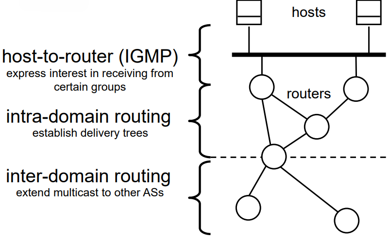

## IPv4 IGMP (Internet Group Management Protocol)
* A Querier is elected among MC routers on link
* Periodically (usually every 125 s) sends Membership Query message to all-systems group (224.0.0.1)
* Hosts start random timer for each group they belong to
* When timer expires host sends Membership Report
* Other hosts cancel timer for that group
* Router listens to every Report and removes groups where no report is received
* When a host joins a group it sends a Report without waiting for a Query

### IGMP Snooping
* IGMP runs between routers and hosts
* In switched Ethernet, efficient use of capacity requires sending only to ports with listeners
* Ethernet switches snoop IGMP packets to know whether or not to
forward on each port
* Optional: proxy reporting / report suppression to reduce load at the multicast router
* Examples: slides 26-28

### IPv6 Multicast Listener Discovery
* "MLDv2 is a translation of the IGMPv3 protocol for IPv6 semantics."
* "Used by an IPv6 router to discover the presence of multicast listeners on directly attached links, and to discover which multicast addresses are of interest to those neighbouring nodes."

## Multicast routing: requirements
* Dynamic routing
    * Changes if host join/leaves group
* Need to check more than destination address
    * Routing can also use the source address
* Multicast packets can originate on a host not belonging to the group

## Routing characteristics
* Data policy:
    * Receiver-driven / opt-in: send only to hosts that joined
    * Data-driven / opt-out: broadcast, then prune paths without receivers
* Distribution trees:
    * Source tree: from each source to receivers
    * Shared tree: several sources share (part of) the path

## Spanning Tree
* First construct a spanning tree
* Nodes forward copies only along spanning tree
    * Packets can be sent in different directions on a link depending on the source

### Creation
* Select a centre/root node: in the example, node E
* Each node sends unicast join message to centre/root
    * Message is forwarded until it arrives at a node already in the spanning tree

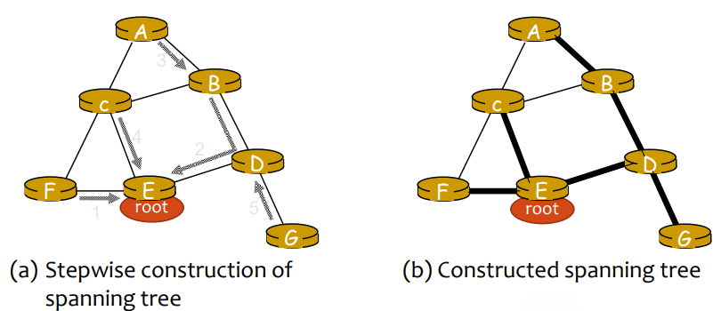

|Source-specific trees| Shared tree|
| ---|--- |
|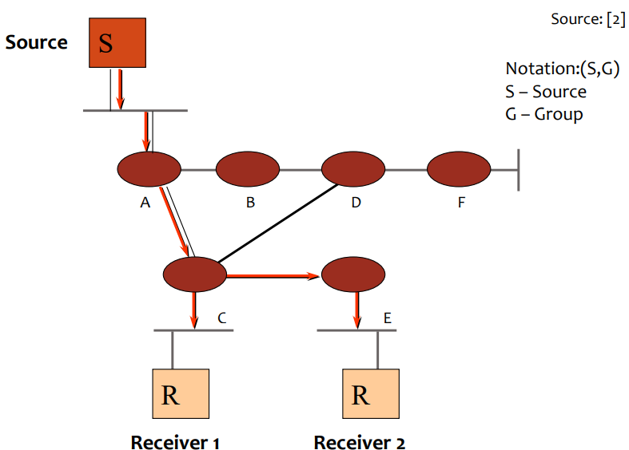| 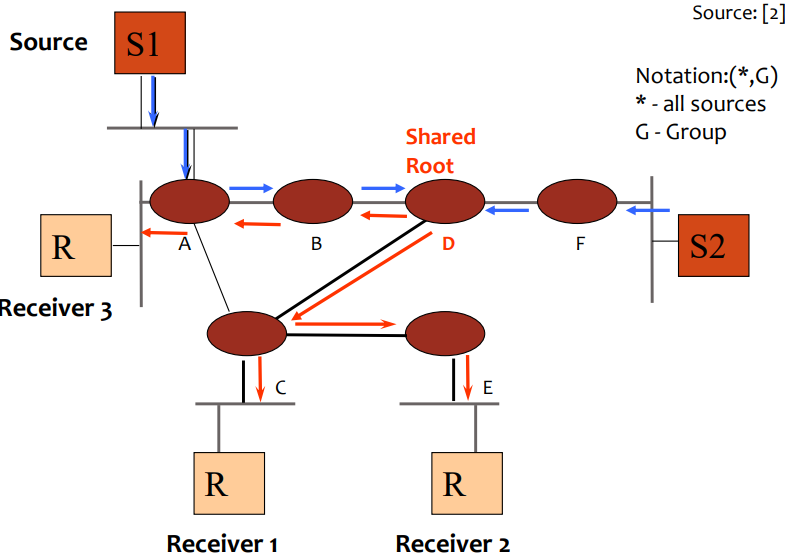|

## Multicast routing
* Reverse Path Forwarding (RPF)
    * Only retransmit packets that arrive on the interface that leads to the source (would be the next hop)
        * Retransmit on all other interfaces
* Truncated RPF (TRPF)
    * Additional restriction: only send through interfaces that lead to group members
        * Prune branches leading to no members
* Problems
    * Packet duplication
    * Delivery path depends on source
        * Tree rooted at source
* Multicast routers know which hosts belong to which group
    * Need to propagate group membership information through the network/Internet
* Routes may change according to receivers
    * Conflict between overhead and routing efficiency

## SSM and ASM
* Source-Specific Multicast
    * Specify which source to subscribe to
        * Requires host (API) and host-to-router (IGMP/MLD) support
* Any Source Multicast
    * Does not specify source
        * Every transmission to the group is received, irrespective of the sender

# Routing

## PIM: Protocol Independent Multicast
* Not dependent on any specific underlying unicast routing algorithm (works with all)
* Two different multicast distribution scenarios 

    |Dense| Sparse|
    |-----|-------|
    |<ul><li>Group members densely packed, in "close" proximity</li><li>Bandwidth plentiful</li></ul>|<ul><li># networks with group members small compared to # interconnected networks</li><li>Group members "widely dispersed"</li><li>Bandwidth scarce</li></ul>|

### Consequences of Sparse-Dense Dichotomy

|Dense| Sparse|
|-----|-------|
|<ul><li>Group membership assumed until routers explicitly prune</li><li>Data-driven construction of multicast tree (e.g., RPF)</li><li>Bandwidth and non-grouprouter processing profligate</li></ul>|<ul><li>No membership until routers explicitly join</li><li>Receiver-driven construction of multicast tree (centrebased)</li><li>Bandwidth and non-grouprouter processing conservative</li></ul>|

### PIM-DM (Dense Mode)
* Flood-and-prune
* Uses existing unicast routing tables for RPF
    * Protocol independent...
* Simpler (and less efficient) downstream flood than in DVMRP
    * To reduce reliance on underlying routing protocol
* Creates (S,G) state in every router
    * RPF ➔ sender dependent
    * Even without receivers!
* Example: slide 44-49

### PIM-SM (Sparse Mode)
* Receiver-driven (opt-in)
* Uses a unidirectional shared tree
* Rendezvous Point (RP) is the root of the tree
    * Group of potential RP
        * Only one active
        * Dynamic reconfiguration
* Data flows first through the shared tree
* Then source trees are created and data flows through them (switchover)
    * More efficient
* Example: slide 51-60

## Source Specific Multicast (SSM)
* Uses Source Trees only - simple!
* Assumes One-to-Many model
    * Most Internet multicast fits this model
* Hosts responsible for source discovery
    * Typically, via some out-of-band mechanism (e.g., web page)
    * Eliminates need for RP and Shared Trees
    * Eliminates need for additional inter-domain protocol ☺
* 232.0.0.0/8 reserved exclusively for SSM
    * Building shared trees for these addresses disallowed
    * Can use other addresses through configuration

### SSM Overview
* Hosts join a specific source within a group
    * Content identified by specific (S,G) instead of (*,G)
    * Hosts responsible for learning (S,G) information
    * Requires IGMPv3 or MLDv2
        * Alternatively, the last hop router may use static or DNS-based mappings to find sources in a group to join them all when a receiver uses IGMPv2 or v1
* Last-hop router sends (S,G) join toward source
    * Shared Tree is never Joined or used
    * Eliminates possibility of content jammers
    * Only specified (S,G) flow is delivered to host
* Makes address allocation trivial
    * Dissimilar content sources can use the same group without fear of interfering with each other
* PIM-SSM example: slide 63 and 64

## Bidirectional PIM (BIDIR-PIM)
* Source trees work great in most cases, but not all
    * Groups with many senders create huge amounts of (S,G) state (e.g., large videoconference with many participants)
* Solution: use a single shared tree for all sources
    * This idea appeared first in CBT
* Single bidirectional tree from RP to receivers
    * Single (*,G) in each router for all sources in group
    * Traffic from sources / to receivers follows the same path if on the
same branch of the RP
* RP Address needs not belong to an existing router
    * The RP performs no specific function in Bidir-PIM
    * May be any address in the subnet of an existing link (RP Link)

### Designated Forwarder
* Designated Forwarder elected per subnet based on
    * Higher preference
    * Lower metric to the RP
    * Higher IP address (for tie-breaking)
* Election is performed at RP discovery time
    * May be re-run when network conditions change
    
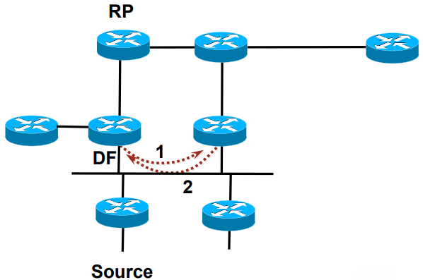

* The DF is the only router that
    * Forwards packets traveling downstream onto the link
    * Picks up packets traveling upstream off the link and forwards them to the RP
* The use of DFs allows multicast traffic to flow natively to the RPL without requiring source-specific state

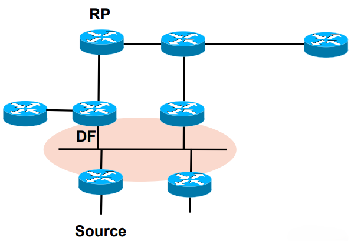

### Sources
* Traffic is forwarded natively toward the RP, rather than registered / tunneled
* A DF without (*,G) state (i.e., not in the tree) for the group forwards the packet toward the RP

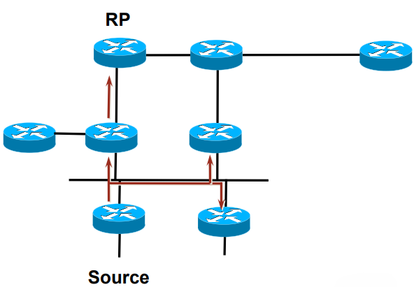

### Receivers
* Routers with receivers join toward the RP
* (*,G) state created for the RPF interface toward the RP and DF interfaces

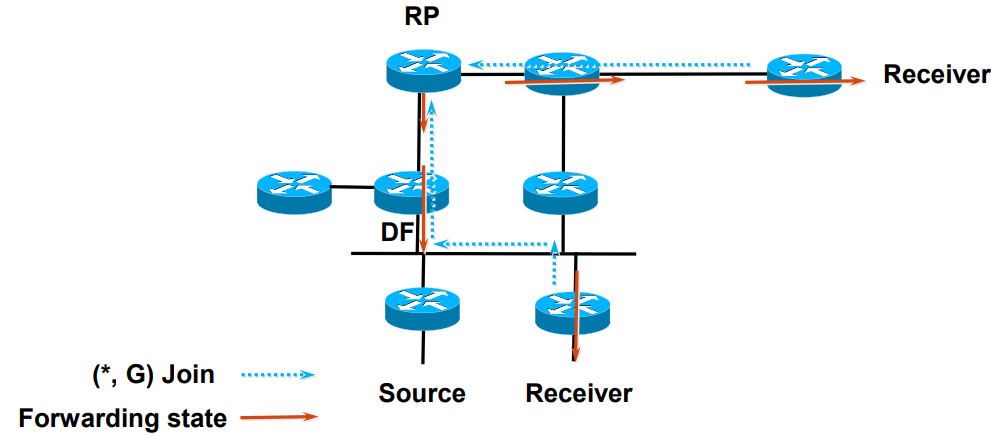

### BIDIR-PIM: Traffic Flow

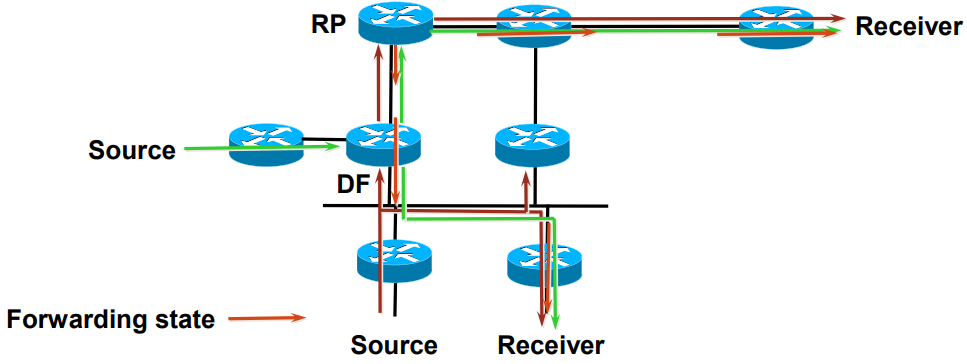

* Packets sent from source to RP by the DFs
    * Can be forwarded directly toward interested receivers on a branch
* Traffic for all sources in group G forwarded based on the same (*,G) entry
    * But NEVER re-sent to the receiving interface

## PIM: Use Cases

| 
**BIDIR-PIM**
 | 
**PIM-SSM** | 
**PIM-SM**
 | 
**PIM-DM**
 |
|---------------|-------------|------------|------------|
| <ul><li>Many sources (many-to-many or many-to-few applications)</li><li>Drastically reduces total (S,G) state in network</li></ul> | <ul><li>One-to-many applications</li><li>Simple</li><li>Eliminates the need for a RP</li></ul> | <ul><li>General purpose</li><li>Complex</li></ul> | <ul><li>Receivers in many (most) links</li><li>Eliminates the need for a RP</li><li>Scales poorly</li></ul> |

## Multicast Routing Protocols: Summary of Characteristics
* Building delivery trees
    * Broadcast then prune
    * Direct joins toward sources
    * Rendezvous points
* Types of trees
    * Unidirectional, per-source, per-group trees
    * Unidirectional, per-group trees, shared by all sources
    * Bidirectional, per-group trees, shared by all sources

## Inter-Domain Multicast Protocols
* Multiprotocol extensions to BGP-4 (MBGP)
    * Reachability information for efficient multicast distribution and
avoiding loops
* IPv4
    * Multicast Source Discovery Protocol (MSDP)
    * Connect multiple PIM-SM domains together
* IPv6
    * Use unicast-prefix-based multicast groups
    * Embed RP address in multicast address
* Alternative (IPv4 & IPv6): use SSM and be happy ☺

## Example inter-domain advertisement
1. Receiver joins (*,G); LHR already in shared tree
2. MSDP peering; Source appears, FHR registers to local RP
3. MSDP shares information about source with peers via Source Active message; MBGP to ensure peer-RPF check PASS (no loops)
4. Remote RP joins the source (S,G) and starts delivering multicast traffic via shared tree to interested receivers
5. LHR may decide to join the Source (SPT switchover is enabled), resulting in inter-domain optimal multicast data flow.

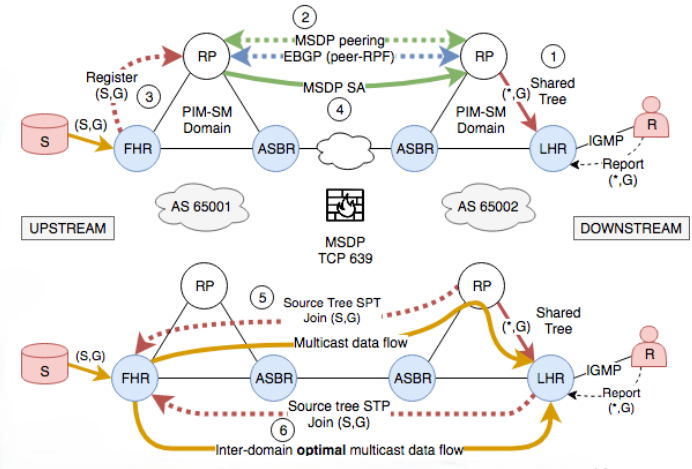

## Reliability
* Objective: no losses, no duplicates or data corruption
* Using TCP-like acknowledgements would not scale
    * Arbitrary number of members ➔ arbitrary number of ACKs (ACK implosion)

| **Solution 1** | **Solution 2** |
|----------------|----------------|
| <ul><li>Designated Routers along the path cache packets</li><li>Packets with (per source) sequence number</li><li>Receiver sends NACK when it detects losses</li><li>When it receives a NACK, DR (or source) retransmits</li></ul> | <ul><li>Redundancy</li><li>Two options<ul><li>Sending N copies of packet</li><li>Using Forward Error Correction Codes</li></ul></li></ul> |
