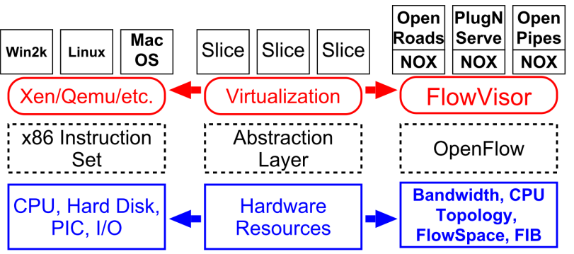

# Software Defined Networking (SDN)

# Index
* [Software Defined Networking (SDN)](#sdn)
* [OpenFlow](#openflow)
* [SDN and OpenFlow](#sdn-and-openflow)

## Motivation
* The Internet started simple but grew complex with added functionalities
* Network development focus on faster (not better) development
* No clear separation between control and data planes
    * OSPF and IP packets on the same "level"
* Closed systems (vendor hardware)

## Data Plane and Control Plane
* **Data plane:** process and deliver packets using local forwarding state
    * Forwarding state + packet header ➔ forwarding decision
* **Control plane:** compute the forwarding state for the device (router, switch, ...)
    * Determine how and where packets are routed
    * Routing, traffic engineering, firewall state, ...
    * Implemented with distributed protocols, manual configuration (and scripting) or centralized computation
* These two planes require different abstractions

## SDN
* Definition (according to the ONF)
    * The physical separation of the network control plane from the forwarding (data) plane, and where a control plane controls several devices
* Principles
    * Separation of control plane and data plane
    * Centralized control (network viewed as a whole)
    * Programmable (instead of merely configurable)
* Provides
    * Abstraction and modularity to the network as they exist on software programming
    * More flexibility in managing networks independently of the hardware vendor lock-in, domain, network

## Traditional Networking Industry
* Many complex functions baked into the infrastructure
    * OSPF, BGP, multicast, differentiated services, Traffic Engineering, NAT, firewalls, MPLS, redundant layers, ...
* An industry with a "mainframe-mentality"
* Little ability for non-telco network operators to get what they want
* Functionality defined by standards, put in hardware, deployed on nodes

## Internet: Layers
Applications
...built on...
Reliable (or unreliable) transport
...built on...
Best-effort global packet delivery
...built on...
Best-effort local packet delivery
...built on...
Physical transfer of bits

## New requirements ➔ Adding complexity
* Isolate traffic ➔ VLANs, ACLs
* Traffic engineering ➔ MPLS, ECMP
* Packet processing ➔ Firewalls, NATs
* Payload analysis ➔ Deep packet inspection (DPI)
* This was usually added to each network component (switch, router, NAT box, etc.)
* All adding to the control plane while keeping the data plane modular/simple

## From mastering complexity to extracting simplicity
* Networking still focused on mastering complexity
    * Little emphasis on extracting simplicity from control plane
* Extracting simplicity builds intellectual foundations
    * Necessary for creating a discipline...

## Example: Programming
* Machine languages: no abstractions
    * Mastering complexity was crucial
* Higher-level languages: OS and other abstractions
    * File system, virtual memory, abstract data types, …
* Modern languages: even more abstractions
    * Object orientation, garbage collection, ... 
    **Abstractions key to extracting simplicity**
* Good abstractions obviate the need for mastering all complexity

## Requirements to Abstractions
* Networks impose the following requirements that can be tackled by the abstractions:
    1. Operate without communication guarantees 
    **Need an abstraction for <u>distributed state</u>**
    2. Compute the configuration of each physical device 
    **Need an abstraction that <u>simplifies configuration</u>**
    3. Operate within given network-level protocol 
    **Need an abstraction for general <u>forwarding model</u>**

## 1. Distributed State Abstraction
* Shield control mechanisms from state distribution while allowing access to this state
* Natural abstraction: global network view
    * Annotated network graph provided through an API
* Implemented with a "Network Operating System"
    * Abstracts from the network hardware just like an OS abstracts from the computer hardware
* Control mechanism becomes a program using an API
    * No longer a distributed protocol, now just a graph algorithm
    * Much easier to reason about

|Traditional control mechanism| Software Defined Network (SDN)|
| ---|--- |
|  Distributed algorithm running between neighbours| |

### Major Change in Paradigm
* No longer designing distributed control protocols
    * Design one distributed system (NOS)
    * Use it for all control functions
* Now just defining a centralized control **function** 
**Configuration = Function(view)**

|Today| "SDN" approach to open it|
| ---|--- |
|  Closed Boxes, Fully Distributed Protocols| |

### The "Software-defined Network"

## 2. Specification Abstraction
* Control program <u>should</u> express desired behaviour
* It <u>should not</u> be responsible for implementing that behaviour on physical network infrastructure
* Natural abstraction: **simplified model** of network
    * Simple model with only enough detail to <u>specify</u> goals
* Requires a new shared control layer:
    * Map abstract configuration to physical configuration
* This is "network virtualization"

### Simple Example: Access Control

### SDN: Virtualization

### Slicing as Virtualization

## 3. Forwarding Abstraction
* Switches have two "brains"
    * Management CPU (smart but slow)
    * Forwarding ASIC (fast but dumb)
* Need a forwarding abstraction for both
    * CPU abstraction can be almost anything
* ASIC abstraction is much more subtle: OpenFlow
* OpenFlow:
    * Control switch by inserting <header;action> entries
    * Essentially gives NOS remote access to forwarding tables
    * Instantiated in hardware and software switches (e.g., Open vSwitch)

## SDN Brings Flexibility
* Provides the ability to tweak between the following configuration/control "settings"
    * Centralized vs. Distributed Control
    * Microflow vs. Aggregated
    * Reactive vs. Proactive (pre-populated)
    * Virtual vs. Physical
    * Fully Consistent vs. Eventually Consistent
 
### Centralized vs. Distributed Control

### Microflow vs. Aggregated

| **Microflow** | 
**Aggregated**
 |
|---------------|----------------|
| <ul><li>Every flow is individually set up by controller</li><li>Exact-match flow entries</li><li>Flow table contains one entry per flow</li> Good for fine grain control, policy, and monitoring, e.g., campus (access) network</ul> | <ul><li>One flow entry covers large groups of flows</li><li>Wildcard flow entries</li><li>Flow table contains one entry per category of flows</li> Good for large number of flows, e.g., backbone</ul> |

### Reactive vs. Proactive (pre-populated)

| **Reactive** | **Proactive** |
|--------------|---------------|
| <ul><li>First packet of flow triggers controller to insert flow entries</li><li>Efficient use of flow table</li><li>Every flow incurs small additional flow setup time</li><li>If control connection lost, switch has limited utility</li><li>Extremely simple fault recovery</li></ul> | <ul><li>Controller pre-populates flow table in switch</li><li>Zero additional flow setup time</li><li>Loss of control connection does not disrupt traffic</li><li>Essentially requires aggregated (wildcard) rules</li></ul> |

### Virtual vs. Physical

| **Virtual** | **Physical** |
|-------------|--------------|
| <ul><li>Assumes configurable switching within a host: in the OS or hypervisor</li><li>Software! Memory, processing, arbitrary modifications</li><li>Massive flow rates</li><li>Limited to the hardware below</li></ul> | <ul><li>No assumption of software changes; unmodified end hosts</li><li>Greater control over expensive forwarding resources</li></ul> |

### Fully Consistent vs. Eventually Consistent

| 
**Fully Consistent**
 | **Eventually Consistent** |
|----------------------|---------------------------|
| <ul><li>Certainty about state</li><li>Consistent state is harder to scale</li><li>Easier to reason about state and its transitions</li><li>May eliminate route flaps</li></ul> | <ul><li>Uncertainty about state now, but eventually converges</li><li>Probabilistic state is easier to scale</li><li>Introduces the possibility of long-lived route flaps and unstable control systems</li></ul> |

#### Example Issue w/ Eventual Consistency

# OpenFlow

## What is OpenFlow
* First standard protocol for communication between SDN controllers and packet switches
* Allows remote configuration of the forwarding (data) plane
* Based on the abstraction of flow tables containing rules for matching packets and associated actions  
* OpenFlow is a forwarding table management protocol
    * Abstracts the data plane
    * Adds the ability to modify, experiment…
    * Adding features to a network still harder than it should be to
        * Analogous to programming in assembly
    * Other abstractions are used on top of it

## OpenFlow: a pragmatic compromise for research/experimentation
* \+ Speed, scale, fidelity of vendor hardware
* \+ Flexibility and control of software and simulation
* \+ Vendors don’t need to expose implementation
* \+ Leverages hardware inside most switches today (ACL tables)
* \- Least-common-denominator interface may prevent using all hardware features
* \- Limited table sizes
* \- Switches not designed for this
* \- New failure modes to understand

## Flow Tables

## Group Table (since v1.1)

* Allows grouping sets of actions
    * Packet modifications
    * Forwarding to ports
* Layer of indirection
    * Allows reusing sets of actions for different flows
    * Efficient changes to sets of actions shared across flows

### Group Types
|All (required)| Select (optional)| Fast Failover (optional)| Indirect (required) |
| ---|--- |---|---|
|| ||<ul><li>Single bucket</li><ul><li>Similar to all with 1 bucket</li></ul><li>Allows faster / more efficient changes to shared entries</li></ul>

## Meter Table (since v1.3)

* Contains meter entries defining per-flow meters
* Enables simple QoS operations (e.g., rate limiting)
* May be combined with per-port queues to implement complex QoS (e.g., DiffServ)

## OpenFlow Pipeline
* A packet is matched against Table 0
* A matching entry may specify that it be further matched against other (higher-numbered) tables
* A table may specify that misses be matched against other tables

## OpenFlow Channel
* Interface connecting an OF switch to the controller
* TCP connection from the switch to the controller
    * Switch must be configured with the IP address and port of the controller
* Usually encrypted with TLS
    * Mutual authentication using certificates signed with a sitespecific private key
* Bidirectional communication between the switch and the controller is required
    * Even with empty flow tables
* Communication with the controller may be:
    * Out-of-Band
        * Through a separate port with traditional networking stack
    * In-Band
        * Through the regular SDN ports
        * Bootstraping problem:
            * OpenFlow Channel required for configuring packet forwarding
            * Packet forwarding required for OpenFlow Channel
            * Solution: use of preloaded rules

## OpenFlow Main Message Types
* **Controller-to-Switch:** Initiated by the controller. May or may not require a response from the switch
* **Asynchronous:** Sent unsolicited from the switch to the controller
* **Symmetric:** Sent unsolicited in either direction

### Some OpenFlow Messages
|  |  |
|---|---|
| **Hello (Symmetric)** | Sent by the switch and the controller for version negotiation |
| **Features Request / Reply (C to S)** | Allows controller to determine the features supported by the switch |
| **Set Configuration (C to S)** | Specify handling of fragmented packets and # of bytes of a packet to send to the controller |
| **Echo Request / Reply (Symmetric)** | Used to check the controller-switch connection and measure latency and bandwidth |
| **Packet-in (Async)** | When no match is found, the packet is sent to the controller. Only first N bytes if packet can be buffered, the entire packet otherwise |
| **Packet-out (C to S)** | Instruct switch to send packet (possibly received in Packet-in) on a specified port. May refer to a buffer |
| **Flow Mod (C to S)** | Add / modify / delete flow entries. May be triggered by Packet-In |
| **Port Mod (C to S)** | Modify port state (PortDown, NoFlood, NoFwd, …) |
| **Port Status (Async)** | Report port addition, removal or modification (e.g., link down) to the controller |
| **Flow Removed (Async)** | Report flow entry removal (inactivity or hard timeout) |

# SDN and OpenFlow

## SDN Architecture

## SDN APIs
* Southbound API
    * Typically OpenFlow (others possible)
    * Low level (the "assembly" of SDN)
* Northbound API
    * HTTP REST, Java, others
    * Higher level
* East/West interfaces possible for coordination among controllers

## The SDN Stack

## SDN Summary
* Provides a modularity/abstraction for networking
* Allows greater flexibility in managing networks
    * And virtualization of physical resources
* OpenFlow is a protocol for configuring rules on net equipment managed by a controller
    * Expose tables from said equipment
* Opens up new avenues for research and network usage (provider view)

## Some Final Notes on SDN
* SDN is not a panacea
* Some swear it is the future of networking, others assert it is dead or dying
* SDN will probably not become the dominant paradigm, but has some fields of application
    * E.g., campus network, cloud
* Eventually, it will succeed in new incarnation
    * New paradigms are hard to get right at first attempt (OpenFlow)
* SDN Lowers the barrier for new approaches (e.g., applying Machine Learning to networking)
