# Wireless Networks

# Index
* [Recap on Link Layer](#recap-on-link-layer)
* [Wireless](#wireless)
    * [IEEE 802.11 Wireless LAN](#ieee-80211-wireless-lan)

# Recap on Link Layer

## Link Layer Services
* **Framing, link access:**
    * Encapsulate datagram into frame, adding header, trailer
    * "MAC" addresses used in frame headers to identify source, dest (different from IP address!)
* **Reliable delivery between adjacent nodes:**
    * Generally used less on low bit-error (fibre, some twisted pair), but crucial for wireless links with high error rates
* **Error detection and correction:**
    * Detection of errors caused by signal attenuation and noise.
    * Receiver identifies and corrects bit error(s) without necessarily requiring retransmission
* **Flow control:**
    * Pacing between adjacent sending and receiving nodes
* **Half-duplex or full-duplex:**
    * Half-duplex allows nodes at both ends of the link to transmit but not simultaneously.

## Multiple Access Links
* **Point-to-point:** Direct link between two nodes (leased line, full-duplex Ethernet)
* **Broadcast (shared medium):** Multiple nodes share a common medium (old-fashioned Ethernet, upstream HFC (cable), 802.11 wireless LAN)

## Multiple Access Protocols
* Single shared broadcast channel
* Two or more simultaneous transmissions by nodes: **collision**
* **Multiple access protocol**
    * Distributed algorithm that determines how nodes share channel, i.e., determine when node can transmit
    * Communication about channel sharing must use channel itself (no out-of-band channel for coordination!)
    * <u>Ideal Multiple Access Protocol:</u> efficient use and fair distribution of the channel capacity among nodes, fully decentralized, simple.

## MAC Protocols: a taxonomy
* **Channel Partitioning:** Divide channel into smaller "pieces" (time slots, frequency, code) assigned to nodes for exclusive use
* **Random Access:** Channel not divided, allow collisions. "Recover" from collisions
* **"Taking turns":** Nodes take turns, but nodes with more to send can take longer turns

## Channel Partitioning MAC protocols
### TDMA (Time Division Multiple Access)
* Access to channel in "rounds", where each station gets a fixed length slot (length = pkt tx time) in each round
* Unused slots go idle
* Example: In a 6-station LAN, stations 1, 3, and 4 have pkts to send, while slots 2, 5, and 6 remain idle.

### FDMA (Frequency Division Multiple Access)
* Channel spectrum divided into frequency bands, assigning each station a fixed frequency band
* Unused transmission time in frequency bands go idle
* Example: In a 6-station LAN, stations 1, 3, and 4 have pkts to send, while freq. bands 2, 5, and 6 remain idle.

### CDMA (Code Division Multiple Access)
* Unique "code" assigned to each user ➔ code set partitioning
* All users share same frequency, but each user has own "chipping" sequence (code) to encode data
* **Encoded signal** = (original data) × (chipping sequence)
* **Decoding**: inner-product of encoded signal and chipping sequence
* Allows multiple users to "coexist" and transmit simultaneously with minimal interference

|CDMA Encode/Decode| CDMA: two-sender interference|
| ---|--- |
|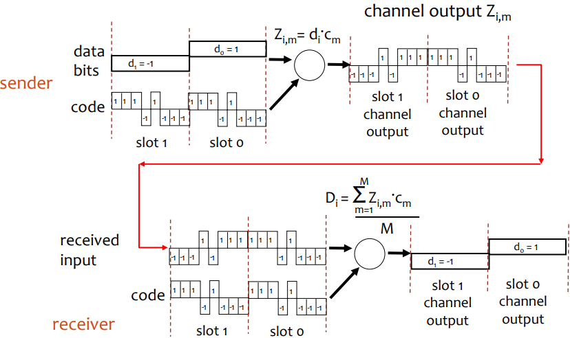| 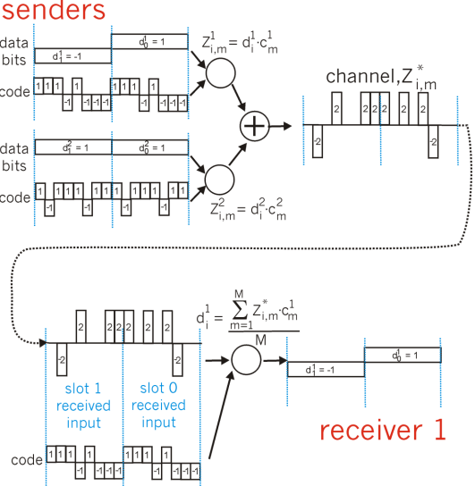|

## Random Access Protocols
* When node has packet to send
    * Transmit at full channel data rate R
    * No a priori coordination among nodes
* Two or more transmitting nodes ➜ "collision"
* Specifies how to detect collisions and how to recover from them
* Examples: ALOHA; slotted ALOHA; CSMA, CSMA/CD, CSMA/CA

### Slotted ALOHA
#### Assumptions:
* All frames have same size
* Time divided into equal size slots (time to transmit 1 frame)
* Nodes start to transmit only at slot beginning
* Nodes are synchronized
* If 2 or more nodes transmit in slot, all nodes detect collision

#### Operation:
* When node obtains fresh frame, transmits in next slot
    * If no collision: node can send new frame in next slot
    * If collision: node retransmits frame in each subsequent slot with prob. p until success

#### Pros and Cons:
|Pros|Cons|
|----|----|
|<ul><li>Single active node can continuously transmit at full rate of channel</li><li>Highly decentralized: only slots in nodes need to be in sync</li><li>Conceptually simple</li></ul>|<ul><li>Collisions, wasting slots</li><li>Idle slots</li><li>Nodes may be able to detect collision in less time than to transmit packet</li><li>Needs clock synchronization</li></ul>|

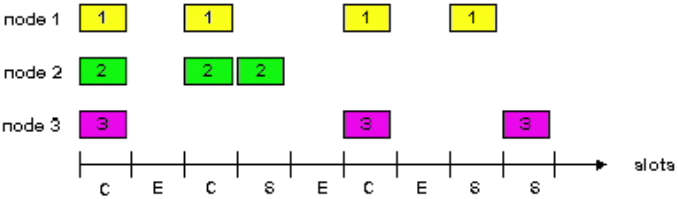

#### Slotted ALOHA efficiency
> At best: channel used for useful transmissions only 37% of the time!

### Pure ALOHA
* Simple, no synchronization needed
* When frame first arrives, transmit immediately
* Collision probability increases

### ALOHA efficiency
> Efficiency: long-run fraction of successful slots (many nodes, all with many frames to send)

> At best: channel used for useful transmissions only 18% of the time!

### Pure vs Slotted ALOHA
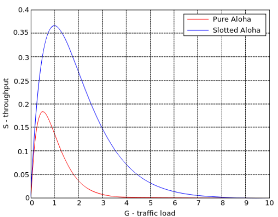

### CSMA (Carrier Sense Multiple Access)
* Listen before transmit:
    * If channel sensed idle: transmit entire frame
    * If channel sensed busy, defer transmission
    * Human analogy: don't interrupt others!
* <u>CSMA collisions</u>
    * **Collisions can still occur:** propagation delay means two nodes may not hear each other's transmission
    * **Collision:** entire packet transmission time wasted
    * **Note:** role of distance & propagation delay in determining collision probability
* CSMA/CD used in Ethernet and CSMA/CA used in 802.11

### CSMA/CD (Collision Detection)
* Carrier sensing, deferral as in CSMA
    * Collisions detected within short time and colliding transmissions are aborted, reducing channel wastage
* Collision detection:
    * Easy in wired LANs: measure signal strengths, compare transmitted, received signals
    * Difficult in wireless LANs: received signal strength overwhelmed by local transmission strength
* Human analogy: the polite conversationalist

## "Taking Turns" MAC protocols
* Aim to find a balance between:
    * <u>Channel partitioning MAC protocols</u>
        * Share channel efficiently and fairly at high load
        * Inefficient at low load: delay in channel access, 1/N bandwidth allocated even if only 1 active node!
    * <u>Random access MAC protocols</u>
        * Efficient at low load: single node can fully utilize channel
        * High load: collision overhead

### Polling
* Master node "invites" slave nodes to transmit in turn
* Typically used with "dumb" slave devices
* Concerns include polling overhead, latency, single point of failure (master)

### Token passing
* Control <u>token</u> passed from one node to next sequentially
* Token message
* Concerns include token overhead, latency, single point of failure (token)

# Wireless
## Elements of a wireless network
| Wireless hosts | Base station | 
Wireless link
 |
|-----------------|--------------|---------------|
|<ul><li>Laptop, smartphone, ...</li><li>Run applications</li><li>May be stationary or mobile (Wireless does not always mean mobility)</li></ul>|<ul><li>Typically connected to wired network</li><li>Relay - responsible for relaying packets between wired network and wireless host(s) in its "area"</li><ul><li>e.g., cell towers, 802.11 access points</li></ul></ul>|<ul><li>Typically used to connect mobile(s) to base station</li><li>Also used as backbone link</li><li>Link access coordinated by a multiple access protocol</li><li>Various data rates, transmission distance</li></ul>

## Characteristics of selected wireless link standards

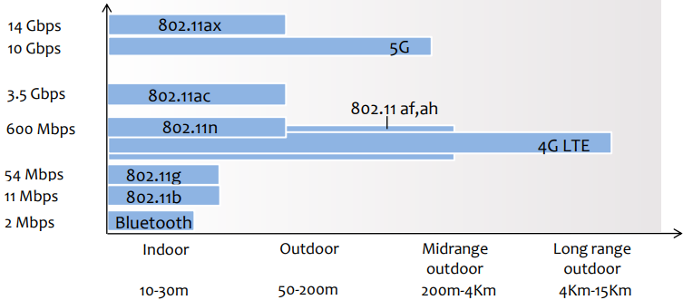

## Modes of Operation
### Infrastructure mode
* Base station connects mobiles into wired network
* Handoff: mobile changes base station providing connection into wired network

### Ad hoc mode
* No base stations
* Nodes can only transmit to other nodes within link coverage
* Nodes organize themselves into a network: route among themselves
* Requires all **nodes in range** of each other or an **ad hoc routing protocol**

## Wireless network taxonomy
|   | Single hop | Multiple hops|
|---|------------|--------------|
**Infrastructure (e.g., APs)**|Host connects to base station (WiFi, WiMAX, cellular), which connects to larger Internet|Host may have to relay through several wireless nodes to connect to larger Internet: mesh network|
|**No infrastructure**|No base station, no connection to larger Internet (Bluetooth, ad hoc nets)|No base station, no connection to larger Internet. May have to relay to reach other wireless nodes MANET, VANET, ...|

## 802.11 Concepts & Terminology
* **Station (STA):** The mobile terminal
* **Access Point (AP):** STAs connect to APs on infrastructure networks
* **Basic Service Set (BSS):** STAs and AP on the same covered cell, using the same frequency; If no distribution system exists, then it is independent (IBSS)
* **Extended Service Set:** BSSs with APs interconnected through a distribution system
* **Distribution system:** Interconnection of several BSSs to form an ESS
* **Portal:** Bridge to access other networks (e.g., ethernet)
* **Service Set Identifier (SSID):** Network name (32 bytes); One per ESS (or IBSS)
* **Basic Service Set Identifier (BSSID):** Cell identifiers (6 bytes); MAC address of AP

## Infrastructure - Components

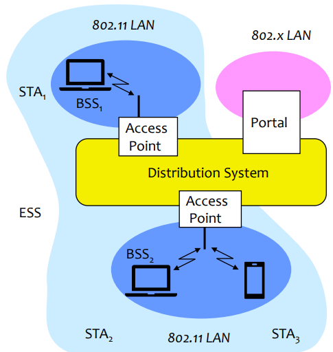

## Digital Modulation
* Data transmission over radio waves requires modulating (changing properties of) a wave amplitude, frequency, phase

## Quadrature Amplitude Modulation
* Change amplitude and phase to send a symbol
* Multiple bits per transmitted symbol (log₂(n) bits per symbol with a constellation of size n)

## Wireless Link Characteristics
Differences from wired link...
* **Decreased signal strength:** radio signal attenuates as it propagates (path loss)
    * Even in free space, decreases with the distance squared
* **Interference from other sources:** standardized wireless network frequencies (e.g., 2.4 GHz) shared by other devices (e.g., phone); devices (motors) interfere as well
* **Multipath propagation:** radio signal reflects off objects, ground, arriving at destination at slightly different times 

...make communication (even point-to-point) across wireless links much more "difficult"

* Max. theoretical capacity: 𝐶 = 𝐵𝒸 ∙ log₂ (1 + 𝑃ᵣ/N)
* SNR: signal-to-noise ratio
    * larger SNR - easier to extract signal from noise (good)
* SNR versus BER tradeoffs
    * **Given modulation:** increase power → increase SNR → decrease BER (bit error rate)
    * **Given SNR:** choose modulation that meets BER requirement, giving highest throughput
    * SNR may change with mobility: dynamically adapt physical layer (modulation technique, rate)

## Wireless Network Characteristics
* Multiple wireless senders and receivers create additional problems (beyond multiple access):

    | Hidden terminal problem         | Signal attenuation      |
    |---------------------------------|-------------------------|
    | <ul><li>B, A hear each other</li><li>B, C hear each other</li><li>A, C cannot hear each other means A, C unaware of their interference at B</li></ul> | <ul><li>B, A hear each other</li><li>B, C hear each other</li><li>A, C cannot hear each other interfering at B</li></ul> |

## IEEE 802.11 Wireless LAN

| Wi-Fi Standard         | Frequency      | Maximum Speed | Features                          |
|------------------------|----------------|---------------|-----------------------------------|
| 802.11b                | 2.4 GHz        | 11 Mbps | DSSS in physical layer            |
| 802.11a                | 5 GHz          | 54 Mbps | OFDM in physical layer            |
| 802.11g                | 2.4 GHz        | 54 Mbps |                                   |
| 802.11n (Wi-Fi 4)      | 2.4 GHz        | 600 Mbps| MIMO (multiple antennas)          |
| 802.11ac (Wi-Fi 5)     | 5 GHz          | 7 Gbps  | MU-MIMO (downlink only)           |
| 802.11ax (Wi-Fi 6/6E)  | 2.4, 5, 6 GHz  | 9.6 Gbps| MU-MIMO, OFDMA (optional)         |
| Upcoming: 802.11be (Wi-Fi 7)| 2.4, 5, 6 GHz | 46 Gbps| MLO, Preamble puncturing       |

* Different physical layers
* All use CSMA/CA for multiple access
* All have infrastructure and ad-hoc network versions
<!--
* Others
    | Wi-Fi Standard     | Description                                      |
    |--------------------|--------------------------------------------------|
    | 802.11s            | Mesh networks                                    |
    | 802.11p            | Wireless access in vehicular environments (WAVE) |
    | 802.11e            | Medium Access Control (MAC) Quality of Service Enhancements |
    | 802.11r            | Fast Basic Service Set (BSS) Transition (handoff) |
    | 802.11i and 802.11w| Security enhancements                           |
    | 802.11-2012        | Incorporates all the above standards             |
-->

## 802.11 
### LAN architecture
* Wireless hosts communicate through an access point (**Access point (AP) = Base station**)
* **Basic Service Set (BSS)** (aka "cell") in infrastructure mode contains:
    * Wireless hosts
    * Access point (AP): base station
    * Ad hoc (IBSS) mode: hosts only

### Channels, association
* 802.11b: 2.4GHz-2.485GHz spectrum divided into 11 to 14 channels at different frequencies
    * AP admin chooses frequency for AP
    * Interference possible if channel is the same as that chosen by neighboring AP!
* Station (host): must associate with an AP
    * Scans channels, listening for beacon frames containing network name (SSID) and AP MAC address
    * Selects AP to associate with
    * May perform authentication
    * Will typically run DHCP to get IP address in AP's 
* 802.11b Channels: Some countries restrict use of some channels; others (Japan) added another channel
    * Defined "regulatory domain" used to limit available channels
* **Channel planning**
    * Placing access points and assigning channels so that coverage is maximized and interference minimized 
    * Easier in the 5GHz band where range is shorter and more channels are available

### Passive/active scanning
|Passive Scanning|Active Scanning|
|----------------|---------------|
|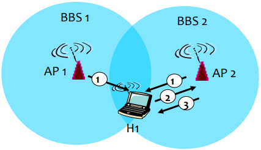|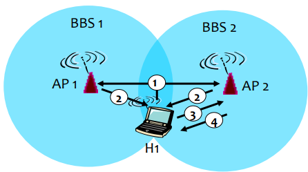|
|<ul><li>(1) Beacon frames sent from APs</li><li>(2) Association Request frame sent: H1 to selected AP</li><li>(3) Association Response frame sent: selected AP to H1</li></ul>|<ul><li>(1) Probe Request frame broadcast from H1</li><li>(2) Probe response frames sent from APs</li><li>(3) Association Request frame sent: H1 to selected AP</li><li>(4) Association Response frame sent: selected AP to H1</li></ul>|

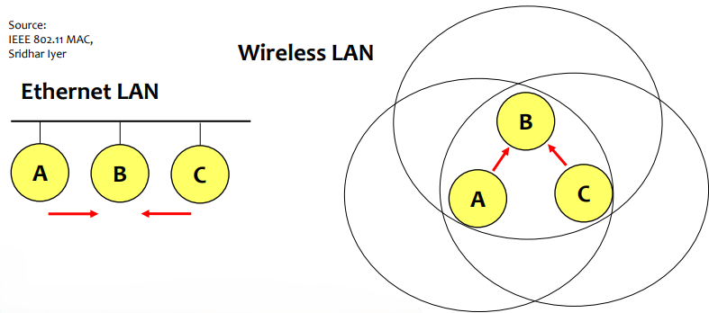

## Ethernet vs. Wireless

* A and C see free channel at same time
    * Transmit at the same time
* Ethernet: source can detect collision
* Wireless: half-duplex radios can't detect collision
    * Besides the hidden terminal problem

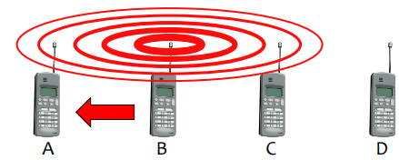

## Exposed node problem

* B transmits to A and C wants to transmit to D
* D is out of reach of B and A is out of reach of C
    * The transmission could be simultaneous
* But C senses medium busy
    * Does not transmit

## The need for a wireless MAC
* Shared medium cabled nets
    * Typically CSMA/CD
        * Free medium → STA transmits
        * Continue listening to detect collisions
* Wireless nets
    * Power diminishes with the square of the distance
    * Even if senders could use CD, collisions occur at receivers
        * Source may not "hear" collision (CD won't work)
        * CS may not work (hidden node problem)
        * CS may work "too much" (exposed node problem)

## IEEE 802.11: Multiple Access
* Avoid collisions (2+ nodes transmitting at same time)
* CSMA - sense medium before transmitting
    * Don't collide with ongoing transmission by other node
* No collision detection!
    * Extremely difficult to receive (sense collisions) when transmitting due to weak received signals
    * Can't sense all collisions in any case: hidden terminal, fading
    * Goal: **avoid collisions:** CSMA/C(ollision)A(voidance)

## IEEE 802.11 MAC Protocol: CSMA/CA

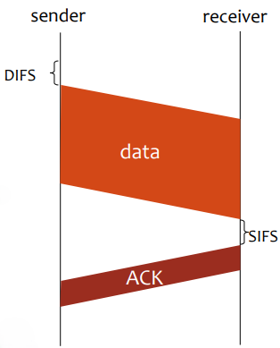

* **802.11 sender**
    1) If sense channel idle for DIFS then
        * Transmit entire frame (no CD)
    2) If sense channel busy then
        * Start random backoff time
        * Timer counts down while channel idle
        * Transmit when timer expires
        * If no ACK, increase random back off interval, repeat 2
* **802.11 receiver**
    * If frame received OK
        * Return ACK after SIFS (ACK necessary due to the hidden terminal problem) 

## Avoiding collisions (enhancement)
* Idea: allow sender to "reserve" channel, rather than random access of data frames
    * Avoid collisions of long data frames
* Sender first transmits small request-to-send (RTS) packets to AP using CSMA
    * RTSs may still collide with each other, but they're short
* AP broadcasts clear-to-send (CTS) in response to RTS
* CTS heard by all nodes
    * Sender transmits data frame
    * Other stations defer transmissions
> Avoid data frame collisions completely using small reservation packets!

### Multiple Access with Collision Avoidance (MACA)
* Prevents collisions using RTS (Request To Send) and CTS (Clear To Send) signaling packets before data
* Signaling Packets contain source address, destination address and estimated duration of transmission

### Collision Avoidance: RTS-CTS exchange

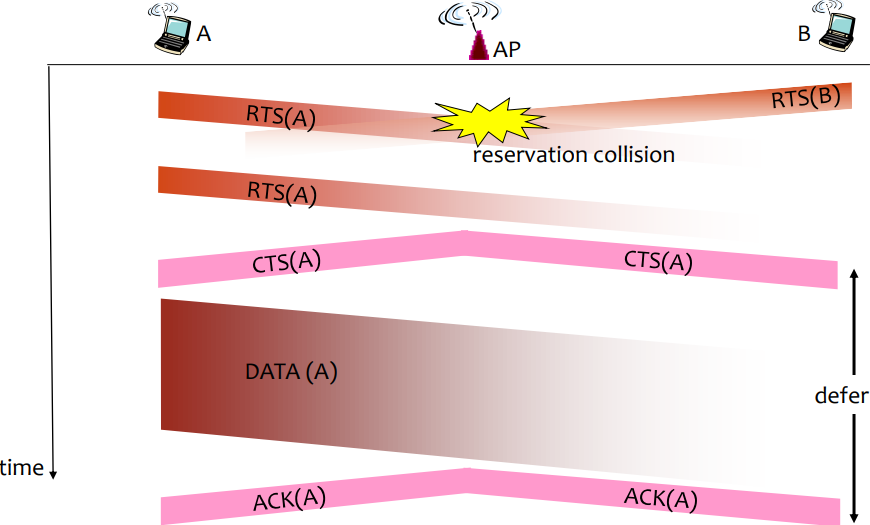

### MACA solves hidden node problem
* A and C want to transmit to B
* A sends RTS first
* C hears CTS and waits

## MAC
### Reliability
* Wireless prone to errors
* Solution: use ACKs
    * B receives data from A and sends ACK
    * If A does not receive ACK, retransmits
    * C does not transmit until end of ACK
    * RTS and CTS have estimated duration of transmission (including ACK)

### Avoiding collisions
* Half-duplex radios cannot detect collisions. Even if they could, collisions occur at receiver
* "Collision avoidance"
    * If channel is free, wait random time before trying to reserve it with RTS (or grabbing it with a data frame transmission)
* Distributed Coordination Function (DCF)
    * Before transmission, pick wait time [0,CW]
    * Free medium: count wait time
    * Busy medium: suspend counting
    * When count reaches 0, transmit RTS (or data frame)
* Contention window size tradeoff
    * Big CW → wait more before transmitting
    * Small CW → more collisions

### Congestion control
* Congestion varies with # of nodes and information to send
* DCF: congestion control varying CW
* Binary Exponential Backoff
    * If CTS fails after RTS (or ACK fails after data packet), the CW doubles (till CWmax)
    * After successful transmission, CW=CWmin
* Broadcast & multicast frames are not ACKed
    * No backoff!
    * Excessive broadcast /multicast traffic can lead to lots of collisions

### Mechanisms for Medium Access Control
* Distributed Coordination Function (DCF)
    * Asynchronous data service
    * CSMA/CA
    * Optionally with RTS/CTS
* Point Coordination Function (PCF)
    * Real-time data service
    * AP polls STAs
    * Only in infrastructure mode
* SIFS (Short Inter Frame Spacing)
    * Higher priority, for ACK, CTS, and answer to polling
* PIFS (PCF IFS)
    * Medium priority, for real-time service with PCF
* DIFS (DCF IFS)
    * Lower priority, for normal data service

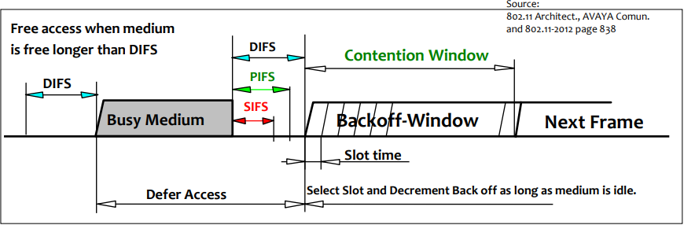

## Virtual Carrier Sensing
* NAV - Network Allocation Vector
    * Indicate medium usage (estimated)
    * RTS and CTS contain data packet duration; allows other STA to configure NAV

## Fragmentation
* Wireless → high error rates
* Without fragmentation: the full frame is retransmitted in case of error
* With fragmentation only the fragment with error is retransmitted
    * Big fragments → more collisions
    * Small fragments → more overhead/latency

## PCF with polling

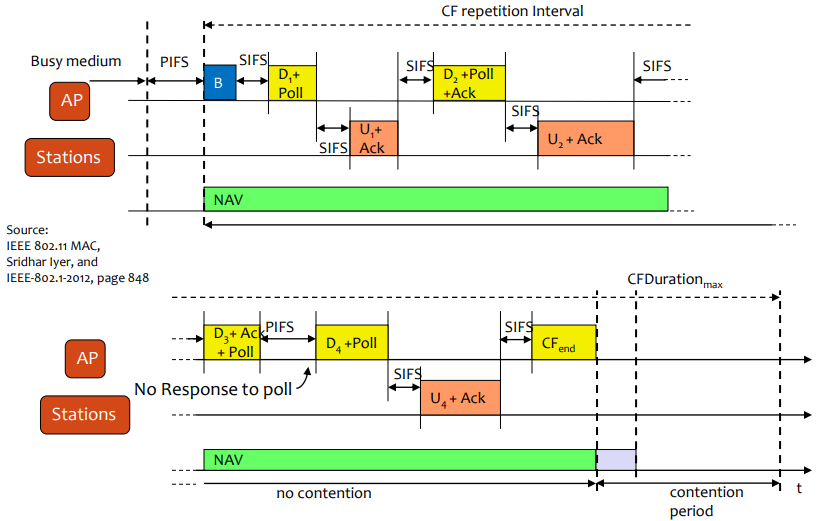

## 802.11e - WiFi Multimedia (WMM)
* New access control mechanism: Hybrid Coordination Function (HCF)
    * Enhanced distributed channel access (EDCA)
        * Like DCF, but supporting different access categories
        * Arbitration Inter-Frame Spacing (AIFSn) instead of DIFS
        * Frames of higher priority categories use shorter AIFS and shorter contention windows
        * Possibility of per-AC admission control at the AP
            * TSpec for uplink, downlink or both
    * HCF Controlled Channel Access (HCCA)
        * Improved PCF
        * Controlled Access Phase (CAP) like CFP, but can be initiated at any time
        * Optional, not implemented in commercial hardware

## 802.11 

### Frame
* **Duration:** duration of frame or reserved transmission time (RTS/CTS) in μs
* **Seq control:** frame seq #, to eliminate duplicates originated by retransmission
* **Type:** frame type (management, control, data)
* Adressing:
    * **Address 1 (Receiver address):** MAC address of wireless host or AP which is the immediate receiver of this frame (not necessarily the final receiver)
    * **Adress 2 (Transmitter address):** MAC address of wireless host or AP transmitting this frame (not necessarily its originator)
    * **Address 3:** varies...
    * **Address 4:** used only in wireless bridging

### L2 mobility (within same subnet)
* H1 remains in same IP subnet: IP address can remain the same
* How does the switch know which AP is associated with H1?
    * Self-learning: switch will see frame from H1 and "remember" which switch port can be used to reach H1
* No L3 mobility

### Rate Adaptation
* Base station, mobile dynamically change transmission rate (physical layer modulation technique) as SNR changes
1. SNR decreases, BER increase as node moves away from base station
2. When BER becomes too high, switch to lower transmission rate but with lower BER

## Power Saving

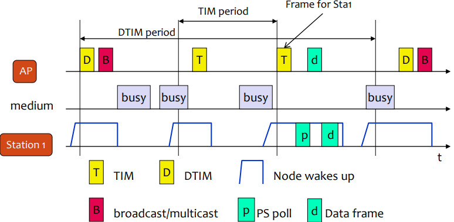

* Disconnect radio when not needed
* Saving in infrastructure mode
    * APs send Beacons
        * Beacons indicate nodes that have packets waiting
    * STA in saving mode wakes up to receive beacons
    * AP knows the status of each STA
* APs buffer data packets to sleeping STAs
    * APs announce buffered frames in beacon
    * Traffic Indication Map (TIM)
    * Common Period for multicast and broadcast frames (DTIM)
* STA wake periodically
    * If it has packets waiting sends PS-Poll
        * It knows from the TIM frame
    * AP answers with data

## Synchronization

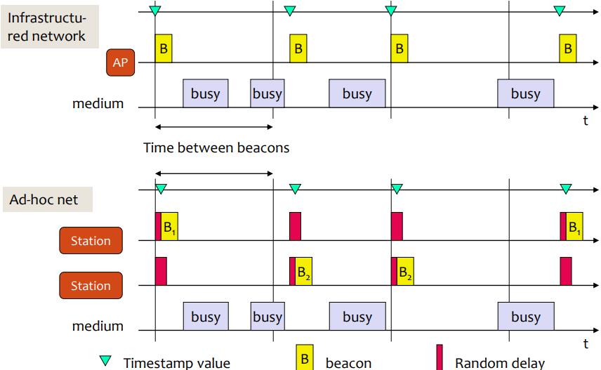

* Timing Synchronization Function (TSF)
    * Beacons from the AP are sent at defined times
    * Have the <u>exact</u> instant they were sent to the network
* Used for power management
    * Clocks for all STAs in the BSS are synchronized
* In ad-hoc mode (IBSS) every STA sends beacons
    * After a random delay to avoid collisions
    * After hearing a beacon from other STA, a STA does not send a beacon itself in this period

## MIMO - Multiple Input, Multiple Output
* 802.11n, ac and ax take advantage of multiple antennas at the transmitter and the receiver
* Gains from spatial diversity and beamforming (Tx & Rx)

### Beamforming
* Multiple antennas may use constructive/destructive interference to increase gain in some directions and decrease it in others
* Beamforming may be used in
    * Transmission: transmit a directed beam
    * Reception: listen selectively in some directions

## WiFi Direct (P2P)
* Device-to-device connectivity without infrastructure (AP) is useful in many scenarios
* But ad-hoc mode of 802.11 is has several drawbacks
    * Difficult to configure
    * All nodes use the same channel
    * Inefficient power management
* WiFi Peer-to-Peer allows ad-hoc formation of groups where one device, the Group Owner (GO), plays the role of an AP
    * Security built into the protocol
    * Provides device and service discovery
    * More efficient power saving
    * Extended QoS capabilities
    * Devices can belong to a group and be connected to the Internet simultaneously
* The role of GO can be negotiated between the devices or directly assumed by one of the devices
* IP configuration is easy
    * GO acts as DHCP server for other devices
* GO may provide routing to external networks
    * Typically, through NAT
    * Bridging is not allowed
* The role of GO is not transferrable
    * If the GO leaves, a new group must be formed
* WiFi Direct mandates support of WiFi Protected Setup (WPS)
    * Easy security configuration using a PIN or push-button

## TDLS (Tunneled Direct Link Setup) - 802.11z
* In infrastructure mode, nodes communicate through the AP (similarly in WiFi Direct through the GO)
* Frames are transmitted twice even if stations can hear each other
    * From source station to AP and from AP to destination station
* Inefficient use of capacity
    * More transmissions than necessary
    * More collisions…
* TDLS allows the negotiation of a different channel for direct communication
    * AP needs not be aware of negotiation ➔ works through any AP
    * AP may explicitly forbid it, though (in the beacons)
* Direct link may
    * Be in different frequency band
    * Use different PHY
    * ➔ useful even with old APs
* TDLS initiator and responder remain connected to the AP
* Single radio nodes periodically switch to base channel, with or without band steering
    * Listen to AP beacons
    * Communicate in the BSS

## Mesh Networking
### Why?
* Paradox: WLAN APs are typically wired!
* Wireless Distribution System
    * Standard defines frame format, but not how such frames should be used ➔ incompatible implementations

### 802.11s
* 802.11s added mesh networking capabilities to 802.11 WLANs
* Benefits: flexible, self-forming, self-healing wireless backhaul

#### Device Classes
* **Mesh Point (MP):** establishes peer links with MP neighbors, full participant in WLAN Mesh services
* **Mesh AP (MAP):** functionality of a MP collocated with AP which provides BSS services to support communication with STAs
* **Mesh Portal (MPP):** point at which frames exit and enter a WLAN Mesh (relies on higher layer bridging functions)
* **Station (STA):** outside of the WLAN Mesh, connected via Mesh AP

#### Addressing
* Two additional addresses in mesh frames
    * Need to identify mesh entry and exit points

#### Path Discovery & Selection
* "Routing", but at link layer
    * Using MAC (instead of IP) addresses
    * Full addresses (not prefixes), since MAC addressing is flat
* Hybrid Wireless Mesh Protocol (HWMP)
    * Reactive (on-demand) path descovery
        * Based on AODV
    * Proactive path discovery to mesh portals
        * Tree-based
    * Uses airtime as metric
        * Minimize total consumption of time for transmissions
* Other protocols and metrics may be used
    * But support for HWMP using airtime metric is mandatory