# **Index**
* [Class 1 - Introduction to requirements engineering](#class-1---introduction-to-requirements-engineering)
* [Class 2 - Requirements elicitation](#class-2---requirements-elicitation)
    |      |     |     |
    |------|-----|-----|
    | [Brainstorming](#brainstorming)| [Interviews](#interviews) | [Repertory grids](#repertory-grids) |
    | [Card sorting](#card-sorting) | [Introspection](#introspection) | [Reverse engineering](#reverse-engineering) |
    | [Crowdsourcing](#crowdsourcing) | [Joint application development (JAD)](#joint-application-development-jad) | [Scenarios](#scenarios) |
    | [Designer as apprentice](#designer-as-apprentice) | [Laddering](#laddering) | [Task analysis](#task-analysis) |
    | [Domain analysis](#domain-analysis) | [Protocol analysis](#protocol-analysis) | [Use cases](#use-cases) |
    | [Ethnographic observation](#ethnographic-observation) | [Prototyping](#prototyping) | [User stories](#user-stories) |
    | [Goal-based approaches](#goal-based-approaches) | [Quality function deployment (QFD)](#quality-function-deployment-qfd) | [Viewpoints](#viewpoints) |
    | [Group work](#group-work) | [Questionnaires](#questionnairessurveys) | [Workshops](#workshops) |
* [Class 3 - Writing the Requirements Document](#class-3---writing-the-requirements-document)
* [Class 4 - Requirements validations and verifications](#class-4---requirements-validations-and-verifications)
* [Class 6 - Requirements Specification and Agile Methodologies](#class-6---requirements-specification-and-agile-methodologies)
* [Class 7 - Tool support for requirements engineering](#class-7---tool-support-for-requirements-engineering)
* [Class 8 - Requirements Management](#class-8---requirements-management)

# **Class 1 - Introduction to Requirements Engineering**

# Introduction - What Are Requirements?

* **Functional Requirements:** Describe specific system functions and behaviors
* **Non-functional Requirements:** Address aspects like performance, security, and usability
* **Domain-specific Requirements:** May also be necessary to meet industry-specific standards and regulations

**Effective requirements engineering** 
* Involves gathering, analyzing, documenting, and managing requirements throughout the software development lifecycle
* Significantly influences the success or failure of software projects

**Definition** 
* Precise and detailed description of what a software system must achieve, how it should behave, and what it should look like from the end-user's perspective
* Serve as the foundation upon which software systems are designed, developed, and tested
* Articulate the expectations, functionalities, and constraints that must be satisfied to create a successful software product
* Help stakeholders to understand the project's scope and objectives clearly. Clear and well-defined requirements are crucial to ensure that the final software product meets user needs, operates effectively, and is delivered on time and within budget

# Importance of Requirements

1. **Alignment with User Needs:** Directly link software functionality to user expectations

2. **Scope Definition:** Prevent scope creep by clearly defining project boundaries

3. **Design and Development:** Guide the design and development process (system's architecture, features, and functionalities)

4. **Testing and Quality Assurance:** Provide a basis for testing and quality assurance efforts

5. **Project Planning:** Fundamental to project planning and estimation. Help in determining project timelines, resource allocation, and cost estimation

6. **Communication:** Enhance clarity among stakeholders to reduce misunderstandings

7. **Risk Management:** Anticipate and mitigate potential risks early in the project

8. **Validation and Verification:** Provide a basis for validating whether the software meets its intended purpose and verifying that it complies with quality standards and regulations

# Requirements level classification

## User Requirements (first level)
* Statements from end-users about what they expect the software to do 
* Often expressed in natural language 
* Used to capture the desired outcome without specifying the solution  

User requirements are about understanding the <u>'what'</u> from the user's point of view.

## System Requirements
Translate user needs into a detailed description that specifies:
* Exact system functions, constraints, and behaviors
* Both functional requirements (tasks the system must perform) and non-functional requirements (system qualities like performance and usability)
* A bridge between user expectations and technical design 

System requirements focus on the <u>'how'</u> at a high level.

## Design Specifications
Most technical level of requirements:
* Detailed descriptions of the software architecture, components, interfaces, and data
* They dictate the technical standards, algorithms, and protocols to be used 
* Developers rely on design specifications to build the system

Design specifications define the <u>'how'</u> in technical terms.

# Types of Requirements

## Functional Requirements (FRs)
Describe what the system should do. They focus on:
* **User Interactions:** How the user will interact with the system
* **System Capabilities:** Specific behaviors or functions of the system 
* **Data Handling:** How the system will process and store data
* **Performance Metrics:** What performance levels are expected from the system

Often stated as "The system shall..." to define a function or feature that must be present. There are many forms of representation for FRs, from natural language, visual models, and the more rigorous formal methods.

## Non-Functional Requirements (NFRs)
How the system performs a function rather than the function itself. They include:
* **Performance:** Speed, response time, and stability under load  
* **Usability:** How easy it is for users to learn and operate the system
* **Reliability:** The ability to perform under specified conditions for a specified period
* **Security:** How well the system protects against unauthorized access and loss of data
* **Maintainability, Testability, Interoperability, Constraints** (eg. design/implementation constraints, financial constrains, resources constraints)

Critical for ensuring the system's usability, efficiency, and security.

## Domain-Specific Requirements
Particular to the industry or field the software is being developed for, such as:
* **Regulatory:** Compliance with specific industry standards and regulations
* **Business Rules:** Company-specific rules that must be adhered to  
* **Operational:** Conditions under which the system will operate, including environmental and infrastructure considerations

Understanding these helps tailor the system to meet the unique challenges and constraints of the domain.

# Stakeholder Roles

## Stakeholders definition
* **In any software development project:**
    * Stakeholders are individuals or groups with a vested interest in the outcome of the project. Their needs and demands shape the software's development from conception through to implementation
* **In requirements engineering:**
    * A stakeholder is anyone impacted by the development and implementation of the software system. Can significantly influence the requirements, as their needs and constraints form the basis of what the software should achieve
    * Play a pivotal role in defining and prioritizing requirements. Their diverse perspectives ensure that the software caters to a broad range of needs
    * Effective stakeholder engagement is an ongoing process that leads to a more accurate elicitation of requirements and ensures that the software developed aligns with the user needs and business goals

## Who Are the Stakeholders?

* **End-users:** Those who will use the software  
    * Provide input on usability and functionality from the user's perspective
    * Expect the software to be intuitive, reliable, and meet their daily operational needs

* **Customers:** Individuals or organizations who pay for the development
    * Focus on the business value the software will deliver
    * Look for cost-effectiveness, scalability, and how well the software fits into the larger ecosystem of business operations

* **Developers:** The technical team responsible for building the software
    * Translate stakeholder needs into technical specifications
    * Seek clear, consistent, and testable requirements to guide the development process
    
* **Testers:** Professionals who validate the functionality against requirements
    * Ensure that the requirements are verifiable and that the final product adheres to these requirements
    * Rely on detailed requirements to create effective test plans and cases
    
* **Business Analysts:** Bridge between business needs and technical solutions
    * Act as a liaison between non-technical stakeholders and the development team
    * Ensure that the software requirements align with business strategies and goals

* **Regulators:** Authorities ensuring compliance with standards and laws
    * Impose requirements based on industry standards and legal compliance
    * Require that the software meets certain regulations before it can be released

* **Market Analysts:** Experts who understand market trends and user demographics
    * Inform about market trends, competition, and customer demographics that can influence requirements
    * Help in understanding the market positioning of the software and the feature set required to succeed

## Impact of stakeholders on requirements
Stakeholders not only define the requirements but also shape the project's trajectory through their influence. They can impact the prioritization of requirements, and their active involvement is crucial for the project's success.

* **Defining the scope**
    * Stakeholders' input is essential in defining what is in or out of the scope, which helps in managing expectations and project deliverables
    * Early engagement with stakeholders can prevent scope creep and ensure that the project remains focused and manageable

* **Prioritization of Requirements**
    * Different stakeholders may have different priorities, and their influence can sway the order in which requirements are addressed
    * Priority setting by stakeholders is key to ensuring that the most critical aspects of the software are developed first

* **Sign-off and Approval Processes**
    * Stakeholders are often part of the formal sign-off process, where they confirm that the requirements meet their expectations before development proceeds
    * Their approval is necessary for moving forward at various stages, making their role in the review and acceptance process integral

* **Feedback and Iterative Improvement**
    * Stakeholders provide feedback on the evolving product, leading to iterative improvements
    * This continuous feedback loop helps refine requirements and ensures the software evolves in alignment with stakeholder needs

## Stakeholder Dynamics and Requirements Evolution
The process of requirements engineering is complex, made even more so by the variety of stakeholder inputs and the dynamic nature of software projects. Stakeholders' diverse interests and perspectives can lead to conflicts, which must be effectively managed to ensure a successful project outcome.

* **Managing Diverse Perspectives**
    * Recognize and respect the diversity of stakeholder viewpoints and the value this brings to the project
    * Employ facilitation techniques during requirements gathering sessions to ensure all voices are heard

* **Conflict Resolution**
    * Address conflicts that arise from differing stakeholder needs and priorities by establishing clear communication channels and resolution processes
    * Utilize prioritization frameworks like MoSCoW (Must have, Should have, Could have, and Won't have) to reach consensus

* **Consensus Building**
    * Engage stakeholders in collaborative sessions to build consensus around key requirements and decisions
    * Document agreements and sign-offs to maintain a clear record of decisions and changes

* **Clear Comunication**
    * Ensure that all stakeholders have a clear understanding of the requirements and any changes that occur
    * Use visual aids, prototypes, and models to help stakeholders envision the end product and provide informed feedback

## Best Practices for Stakeholder Management
Effective stakeholder management is a critical component of successful requirements engineering. Best practices in this area facilitate better collaboration and ensure that stakeholders are actively engaged and their needs are accurately reflected in the requirements.

* **Regular Engagement**
    * Schedule regular meetings with stakeholders to discuss progress, gather ongoing feedback, and keep everyone informed and involved
    * Use these sessions to validate understanding and refine requirements as needed

* **Effective Communication Tools**
    * Utilize collaboration platforms, requirement management tools, and social media to maintain open lines of communication with all stakeholders
    * Ensure that all stakeholders have access to up-to-date information and a shared understanding of project goals and progress

* **Stakeholder Education**
    * Educate stakeholders about the requirements process, including how their input will be used and the importance of their timely feedback
    * Provide training sessions or workshops if necessary to ensure stakeholders understand the technical aspects and implications of the requirements

* **Feedback Mechanisms**
    * Implement a structured process for stakeholders to provide feedback on requirements documents, prototypes, and product increments
    * Use surveys, feedback forms, and review meetings as tools to gather and prioritize stakeholder input

# **Class 2 - Requirements Elicitation**

# Requirements Elicitation/Discovery Definition
* Involves uncovering what the customer needs and wants, discovering who the stakeholders are and also determining the NFRs, which are often overlooked
* While some requirements will be obvious, many requirements will need to be extricated from the customer through welldefined approaches

# Challenges
* **New Project Domain:** when requirements engineer doesn't possess enough knowledge on the industry or the developed solution. Engaging a domain expert can help alleviate this problem

* **Unclear Project Vision:** when stakeholders don't have a clear understanding of what functionality their system needs. A clear mission statement or ConOps can be very helpful to avoid this problem

* **Limited Access to Documentation:** when the requirements engineer can't access documentation or when evaluating the current state of the project takes too much time. Consistent and disciplined use of a good document/change management system is important to combat this problem

* **Focus on the Solution Instead of Requirements:** when the customer focuses more on solutions or architectural tactics instead of requirements themselves. Active expectation management is very important in this regard  

* **Fixation of Specific Functionalities:** when stakeholders insist on designing certain features because they believe they will benefit their business if it is not. Again, expectation management and refocus on the mission statement is the key to addressing this issue

* **Contradictory Requirements:** when a project includes a wide range of stakeholders, their requirements may contradict each other. There are some techniques for addressing this problem that we will discuss later

# Identifying and involving relevant stakeholders
* Identify all customers and stakeholders
* Partition customers and other stakeholders groups into classes according to interests, scope, authorization, or other discriminating factors (some classes may need multiple levels of partitioning)
* Select a champion or representative group for each user class and stakeholder group
* Select the appropriate technique(s) to solicit initial inputs from each class or stakeholder group

# Elicitation Techniques

## Brainstorming
* Consists of informal sessions with customers and other stakeholders to generate overarching goals for the systems
* Can be formalized with agenda, minute-taking, and formal structures
* Formality is probably inversely proportional to creative level exhibited at the meeting
* Meetings should be informal, spontaneous, with the only structure embodying some recording of any major discoveries
* Preliminary requirements may be generated, but secondary to the process
* More useful for general objective setting, such as mission or vision statement generation
* Guidelines include selecting a facilitator, ideas recorder, and participants, ensuring everyone understands the process, allowing each participant time to brainstorm independently, keeping everyone on topic, and not limiting creativity or the number of ideas
* After the brainstorming session, refining can be initiated using other elicitation techniques

## Card sorting
* Stakeholders complete cards with key functional information for the system/software product (include a ranking and rationale for each functionality is also a good idea)
* Time period for card completion is crucial
    * Recommended duration: 1 week (no more than 2 weeks) 
     OR 
    * Customers can complete cards in a 2-hour session and return for another session a week later for another session of card completion and review
* After each card generation session, requirements engineer organizes the cards generally clustering the functionalities logically, forming the basis of the requirements set. Sorted cards can also be used to develop CRC (capability, responsability, collaboration) cards to determine program classes in the code

## Crowdsourcing
* Crowdsourcing is a business model that harnesses the power of a diverse number of people to contribute knowledge and solve problems
* Combines crowd and outsourcing
* Captures requirements directly from the crowd (the bigger the crowd, the better), providing access to a wide diversity of actual and potential users which has the potential to increase the comprehensiveness and quality of the captured requirements
* The crowd for a system can be system users in the company, sales representatives, or millions of customers worldwide, it all depends on the system that is being developed
* Crowdsourcing tools for requirements elicitation include <u>CrowdREquire</u>, <u>Refine</u>, <u>StakeRare</u>, and <u>Requirements Bazaar</u>
* Challenges include challenges related to largeness, diversity, anonymity, competence, collaboration, intrinsic motivations, volunteering, extrinsic incentives, opt-out opportunity, and feedback
* Crowdsourcing can provide valuable feedback on various system requirements, although not all aspects are necessary or beneficial

## Designer as apprentice
* Designer as apprentice is a requirements discovery technique in which the requirements engineer "looks over the shoulder" of the customer in order to learn enough about the customer's work to understand their needs
* The relationship between the customer and the designer is similar to a master craftsman and apprentice
* The apprentice (designer) learns from the master (customer), guiding the customer in discussing and demonstrating their work
* The designer addresses specific needs, not necessarily requiring the customer to have teaching abilities
* Seeing the work reveals what matters, reveals details and structure

## Domain analysis
* Domain analysis involves any general approach to assessing the "landscape" of related and competing applications to the system being designed
* Helps identify essential and, later, missing functionality
* Can also be used later for identifying reusable components (such as open-source software elements that can be incorporated into the final design)
* The QFD elicitation approach explicitly incorporates domain analysis

## Ethnographic observation
* Ethnographic observation refers to any technique in which observation of indirect and direct factors inform the work of the requirements engineering
* Technique borrowed from social science in which observations of human activity and the environment in which the work occurs are used to inform the scientist in the study of some phenomenon
* In applying ethnographic observation to requirements elicitation, the requirements engineer immerses himself in the workplace culture of the customer, collecting evidence of customer needs derived from the surroundings that may not be communicated directly
* Designer as apprentice includes the activity of ethnographic observation
* **Objections:**
    * The process can be time-consuming (involves long periods of observation) and requires substantial training of the observer
    * The Heisenberg uncertainty principle, which states that you can't precisely measure something without affecting that which you are measuring, can lead to flawed decisions when observing the work environment for a client

## Goal-based approaches
* Goal-based approaches comprise any elicitation techniques in which requirements are recognized to emanate from the mission statement, through a set of goals that lead to requirements. That is, looking at the mission statement, a set of goals that fulfill that mission is generated
* Goals are subdivided one or more times to obtain lower-level goals, which are then branched out into specific high-level requirements. High-level requirements are used to generate lower-level ones.
* **Example: Baggage Handling System**
    * The mission statement is to automate all aspects of baggage handling from passenger origin to destination
    * Goals include tracking of baggage from check-in to pick-up (**goal 1**), routing of baggage from check-in counter to plane (**goal 2**), and reducing the amount of lost luggage to 1% (**goal 3**)
    * These goals can be decomposed into requirements using a structured approach such as goal-question-metric (GQM)
* **Goal-question-metric (GQM)**
    * Used in many aspects of systems engineering such as requirements engineering, architectural design, systems design, and project management
    * GQM incorporates three steps: 
        * State the system's objectives or goals
        * Derive from each goal the questions that must be answered to determine if the goal is being met
        * Decide what must be measured in order to be able to answer the questions
        * **Example:**
            * Related question (**goal 3**): "what percentage of luggage is lost for a given (airport/airline/ flight/time period/etc.)?" 
            * This question suggests a requirement of the form: "The percentage of luggage lost for a given [airport/airline/flight/time period/etc.] shall be not greater than 1%" 
            * The percentage of luggage lost for a particular airport/airline/flight/time period/etc. is the associated metric for this requirement
            * The appropriate question for some goal (requirement) is not always so obvious, nor is the associated metric so easily derived from the question. Here is where GQM really shows its strength

## Group work  
* Group work is a general term for any kind of group meetings that are used during the requirements discovery, analysis, and follow-up processes
* JAD is the most celebrated group-oriented work for requirements elicitation
* Group activities can be very productive in terms of bringing together many stakeholders but risk potential for conflict and divisiveness. The key to success is in the planning and execution of the group meetings
* **Important aspects include:**
    * Researching all aspects of the organization, problems, politics, environment, and so on
    * Agendas should be published several days before the meeting
    * Stay on the agenda throughout the meeting and do not leave until all items on the agenda have received sufficient discussion
    * Have a dedicated note-taker (scribe) on hand
    * Do not allow personal issues to creep in
    * Allow all to have their voices heard
    * Look for consensus at the earliest opportunity
    * Publish the minutes of the meeting within a couple of days of meeting close and allow attendees to suggest changes
* **Drawbacks:**
    * Difficulty in organizing group meetings and get the many stakeholders involved to focus on issues
    * Problems of openness and candor and dominance by certain individuals can occur because people are not always eager to express their true feelings in a public forum
    * Allowing a few to own the meeting can lead to feelings of being "left out" for many of the other attendees
* Effective meetings, and hence using group work, requires highly developed leadership, organizational, and interpersonal skills

## Interviews
* Involves in-person communication between two individual stakeholders or a small group of stakeholders (sometimes called a focus group)
* Interviews are an easy-to-use technique to extract system-level requirements from stakeholders, especially usability requirements
* Three types of interviews can be used:
    * **Unstructured** (probably the most common) **:** 
        * Conversational in nature and serve to relax the participants   
        * Can occur anytime and anywhere
        * Depending on the skill of the interviewer, unstructured interviews can be hit or miss
    * **Structured:** 
        * More formal and use predefined questions that have been rigorously planned
        * The main drawback is that some customers may withhold information because the format is too controlled
    * **Semi-structured:**
        * Combine the best of structured and unstructured interviews
        * The requirements engineer prepares a carefully thought-out list of questions, but then allows for spontaneous unstructured questions to creep in during the course of the interview
    * While structured interviews are preferred, the choice of which one is an opportunistic decision
* **Interviews are used in various situations including:**
    * Gathering initial background information when working on new projects in new domains
    * Whenever heavy politics are present to ensure that the group session does not self-destruct
    * When there is a need to isolate and show conflicts among stakeholders
    * When senior management has an idea, but the employees consider this idea to be unreasonable, the problem can be addressed by interviewing subject matter experts and visionaries
    * Using it with subject matter experts is essential when the users and customers are inaccessible.
* Sample interview questions include identifying an essential feature of the system, rating this feature, assessing its importance, making observations about this and other features, etc
* Care must be taken to ensure all the right questions are asked, and interviews can be done via telephone, videoconference, or email when necessary but certain important nuanced aspects to the responses may be lost

## Introspection
* The requirements engineer puts himself in the place of the customer and opines "if I were the customer I would want the system to do this ..."
* Useful when the requirements engineer's domain knowledge far exceeds that of the customer
* Introspection informs every aspect of the requirements engineer's interactions but should not dictate customer needs
* Useful for gathering requirements when users are busy and can be used to assess political and power relationships when working in new organizations

## Joint application development (JAD)
* JAD involves highly structured group meetings (sometimes called "mini-retreats") with system users, system owners, and analysts focused on a specific set of problems for an extended period of time
* This meetings occur 4-8 hours per day and over a period lasting 1 day to a couple of weeks
* While traditionally associated with large, government systems projects, JAD can be used in industrial settings on systems of all sizes
* JAD and JAD-like techniques are commonly used in systems planning and analysis activities to obtain a group consensus on problems, objectives, and requirements
    * Specifically, the requirements engeneer can use JAD sessions for the concept of operation definition, system goal definition, requirements elicitation, requirements analysis, and requirements document review
* **Planning for a JAD review or audit session involves three steps:**
    1. Selecting participants
    2. Preparing the agenda
    3. Selecting a location
* **Reviews and audits may include some or all of the following participants:**
    * Sponsors (e.g., senior management)
    * A team leader (facilitator, independent)
    * Users and managers who have ownership of requirements and business rules
    * Scribes (i.e., meeting minutes and note-takers)
    * Engineering staff  
* The sponsor, analysts, and managers select a leader    
* The leader may be in-house or a consultant
* One or more scribes (note-takers) are selected, normally from the software development team
* The analyst and managers must select individuals from the user community, which should be knowledgeable and articulate in their business area
* Before planning a session
    * The analyst and sponsor must determine the scope of the project and set the high-level requirements and expectations of each session
    * The session leader must also ensure that the sponsor is willing to commit people, time, and other resources to the effort
* The agenda depends greatly on the type of review to be conducted and should be constructed to allow for sufficient time. The agenda, code, and documentation must also be sent to all participants well in advance of the meeting
* **Rules for conducting software requirements, design audits, or code walkthroughs.** The session leader must make every effort to ensure these practices are implemented:
    * Stick to the agenda
    * Stay on schedule (agenda topics are allotted specific time)
    * Ensure that the scribe is able to take notes
    * Avoid technical jargon (if the review involves nontechnical personnel)
    * Resolve conflicts (try not to defer them)
    * Encourage group consensus
    * Encourage user and management participation without allowing individuals to dominate the session
    * Keep the meeting impersonal
    * Allow the meetings to take as long as necessary
* The end product of a review session is typically a formal written document summarizing agreed-upon items during the session
    * In the case of requirements elicitation the main artifact could be a first draft of the SRS

## Laddering
* The requirements engeneer asks short prompting questions (probes) to elicit requirements
* Follow-up questions are then posed to dig deeper below the surface
* The resultant information from the responses is then organized into a tree-like structure
* To illustrate the technique, consider the following sequence of laddering questions and responses for the pet store POS system (on the left). And how the responses to the questions are then organized in a ladder or hierarchical diagram (on the right)
    

    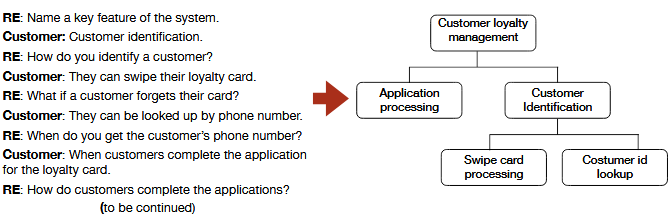
    

* The laddering technique assumes that information can be arranged in a hierarchical fashion, or, at least, it causes the information to be arranged hierarchically

## Protocol analysis 
* Process where customers with requirements engineers, walk through the procedures that they are going to automate
* During each walkthrough, customers explicitly state the rationale for each step that is being taken
* Similar to designer as apprentice, but with a more passive role of the requirements engineer

## Prototyping
* Prototyping involves the construction of models of the system in order to discover new features, particularly usability requirements
* Used extensively, for example, in the spiral software development model, and agile methodologies consist essentially of a series of increasingly functional non-throwaway prototypes
* Prototypes can involve:
    * **Working models:** Can include executable code in the case of software systems and simulations, or temporary or to-scale prototypes for nonsoftware systems
    * **Non-working models:** Can include storyboards and mock-ups of user interfaces
* In the case of working software prototypes, the code can be deliberately designed to be throwaway or it can be deliberately designed to be reused (non-throwaway)
* There are at least **three dangers** to consider when using prototyping for requirements elicitation:
    1. In some cases, software prototypes that were not intended to be kept are kept because of schedule pressures. This situation is potentially dangerous since the code was likely not designed using the most rigorous techniques. The unintended reuse of throwaway prototypes occurs often in the industry
    2. Prototyping is not always effective in discovering certain nonfunctional requirements (NFRs). Prototyping is particularly not suitable for those requirements that can only be derived by an analysis of prevailing standards and laws
    3. Problems can occur when using prototypes to discover the ways in which users interact with the system. The main concern is that users interact differently with a prototype (in which the consequences of behavior are not real) vs. the actual system

## Quality function deployment (QFD)
* Technique for discovering customer requirements and defining major quality assurance points to be used throughout the production phase
    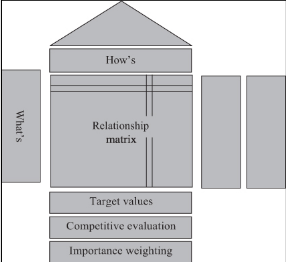
* Provides a structure for ensuring that customers' needs and desires are carefully heard, then directly translated into a company's internal technical requirements - from analysis through implementation to deployment
* The basic idea of QFD is to construct relationship matrices between customer needs, technical requirements, priorities, and (if needed) competitor assessment
* In essence, QFD incorporates card sorting, laddering, and domain analysis
* Because these relationship matrices are often represented as the roof, ceiling, and sides of a house, QFD is sometimes referred to as the "house of quality" (see figure)
* **The following requirements engineering process is prescribed by QFD:**
    * Identify stakeholder's attributes or requirements
    * Identify technical features of the requirements
    * Relate the requirements to the technical features
    * Conduct an evaluation of competing products
    * Evaluate technical features and specify a target value for each feature
    * Prioritize technical features for the development effort
* Uses a structured approach to competitive analysis. That is, **a feature list is created from the union of all relevant features for competitive products**
    * These features comprise the columns of a competition matrix
    * The rows represent the competing products, and the corresponding cells are populated for those features included in each product
    * The matrix can be then used to formulate a starter set of requirements for the new or revised product and also helps to ensure that key features are not omitted from the new system and can contribute to improving the desirable quality of requirements completeness
    * The matrix gives us a starter set of mandatory and optional features
* Since it incorporates a total life cycle approach to requirements engineering, QFD has several **advantages** over other stand-alone elicitation techniques
    * Improves the involvement of users and managers
    * Shortens the development lifecycle and improves overall project development
    * Supports team involvement by structuring communication processes
    * Provides a preventive tool that avoids the loss of information
* **Drawbacks:**
    * There may be difficulties in expressing temporal requirements
    * Difficult to use with an entirely new project type
        * The solution is to look at similar or related products, but still there is apt to be a cognitive gap
    * Sometimes it is hard to find measurements for certain functions and to keep the level of abstraction uniform (the less we know, the less we document)
    * As the feature list grows uncontrollably, the house of quality can become a "mansion"
* Even if QFD is not used as the primary requirements elicitation approach, its approach to competitive systems analysis should be employed wherever possible. The structured nature of the QFD competitive analysis is an effective way to ensure that no important requirements are missing, leading to more complete requirements set

## Questionnaires/Surveys
* Often used to reach large groups of stakeholders
* Generally used at the early stages of the elicitation process to quickly define the scope boundaries
* Survey questions of any type can be used
    * <u>Closed questions</u> (e.g., multiple-choice, true-false) have the advantage of easier coding for analysis, and they help to bind the scope of the system
    * <u>Open questions</u> allow for more freedom and innovation, but can be harder to analyze and can encourage scope creep
* There is a danger in overscoring and underscoring if questions are not adequately framed, even for closed-ended questions
    * Therefore, survey elicitation techniques are most useful when the domain is very well understood by both stakeholders and requirements engineers
* Before undertaking large-scale surveys, it is important to conduct a pilot study with a small subset of the intended survey population
    * The results are analyzed, and the survey participants are interviewed for the purpose of identifying confusing, missing, or extraneous questions
    * Then the instrument can be refined before administering the survey to the greater population
* In analyzing survey data, particularly when asking participants to identify and rank desirable features, be careful of the following effect: 
    > "When given a set of choices which do not have to be realized, a person will tend to desire a much larger number of options then if the decision were actually to be made"
    * We call this effect the "ice cream store effect"
* Surveys can be conducted via telephone, email, in person, and using web-based technologies
* There are a variety of commercial tools and open-source solutions that are available to simplify the process of building surveys and collecting and analyzing results that should be employed

## Repertory grids
* Incorporate a structured ranking system for various features of the different entities in the system and are typically used when the customers are domain experts
* Useful for the identification of agreement and disagreement within stakeholder groups
* Look like a feature or quality matrix in which rows represent system entities and desirable qualities, and columns represent rankings based on each of the stakeholders
* While the grids can incorporate both qualities and features, it is usually the case that the grids have all features or all qualities to provide for consistency of analysis and dispute resolution

## Reverse engineering
* If an existing system has outdated documentation (or even nonexistent documentation), then reverse engineering can be applied to the system to extract the requirements from the system to understand what the system does
* Particularly useful for migration projects when dealing with legacy systems
* Two types of reverse engineering techniques exist:
    * **Black-Box Reverse Engineering:** The system is studied without examining its internal structure (function and composition of software)
    * **White-Box Reverse Engineering:** The inner workings of the system are studied (analyzing and understanding of software code)

## Scenarios
* Scenarios are informal descriptions of the system in use that provide a high-level description of system operation, classes of users, and exceptional situations
* Quite useful when the domain is novel
* User stories are, in fact, a form of scenario

## Task analysis  
* Involves a functional decomposition of tasks to be performed by the system
* Starting at the highest level of abstraction, the designer and customers elicit further levels of detail. This detailed decomposition continues until the lowest level of functionality (single task) is achieved
* Here is an example from the pet store POS system:
        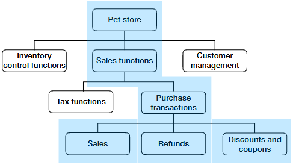
    * Here, the overarching pet store POS system is deemed to consist of three main tasks: 
        * inventory control, sales, and customer management
    * Drilling down under the sales functions, we see that these consist of the following tasks: 
        * tax functions and purchase transactions
    * Next, proceeding to the purchase transaction function, we decompose these tasks into 
        * sales, refunds, discounts, and coupons tasks
    * The task analysis and decomposition continue until a sufficient level of granularity is reached (typically, to the level of a method or nondecomposable procedure) and the diagram is completed

## Use cases
* Use cases are a way for more sophisticated customers and stakeholders to describe their desiderata
* Use cases depict the interactions between the system and the environment around the system, in particular, human users and other systems
* Can be used to model the behavior of pure software or hybrid hardwaresoftware systems
* Describe scenarios of operation of the system from the designer's (as opposed to customers') perspective
* Typically represented using a use case diagram, which depicts the interactions of the system with its external environment
* In a use case diagram
    * The box represents the system itself
    * The stick figures represent "actors" (can be humans, other systems, or device inputs) that designate external entities that interact with the system
    * Internal ellipses represent each activity of use for each of the actors (use cases)
    * The solid lines associate actors with each use
    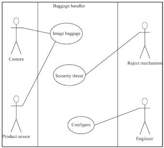
* Here is a use case diagram for the baggage inspection system:
    * Three uses are shown - capturing an image of the baggage ("image baggage"), the detection of a security threat (in which case the bag is rejected from the conveyor for offline processing), and then configuration by the systems engineer
    * Notice that the imaging camera, product sensor, and reject mechanism are represented by a human-like stick figure - this is typical - the stick figure represents a system "actor" whether human or not
* Each use case is a form of documentation that describes scenarios of operation of the system under consideration as well as pre-and post-conditions, and exceptions
* In an iterative development life cycle, these use cases become increasingly refined and detailed as the analysis and design workflows progress
* Interaction diagrams are then created to describe behaviors defined by each use case
* If well developed, sometimes, the use cases can be used to form a pattern language, and these patterns and the derived design elements can be reused in related systems
* Using patterns when specifying requirements ensures a greater level of consistency and can reduce errors in automated measurement of certain requirements properties

## User stories
* User stories are short conversational texts that are used for initial requirements discovery and project planning
* Widely employed in conjunction with agile methodologies
* Are written by the customers in terms of what the system needs to do for them and in their own "voice"
* Usually consist of two to four sentences written on a three-by-five-inch card
* Around 80 user stories are usually appropriate for one system increment or evolution, but the number depends on the application size and scope, and the development methodology to be used (e.g., agile vs. incremental)
* Should only provide enough detail to make a reasonably lowrisk estimate of how long the story will take to implement and when the time comes, the story developers will meet with the customer to flesh out the details
* User stories also form the basis of acceptance testing

## Viewpoints  
* Viewpoints are a way to organize information from the (point of view of) different constituencies
* Viewpoints incorporate a variety of information from business domain, process models, functional requirements specifications, and organizational models
* **The following components should be in each viewpoint:**
    * A <u>representation style</u>, which defines the notation used in the specification  
    * A <u>domain</u>, which is defined as the area of concern addressed by the viewpoint  
    * A <u>specification</u>, which is a model of a system expressed in the defined style  
    * A <u>work plan</u>, with a process model, which defines how to build and check the specification  
    * A <u>work record</u>, which is a trace of the actions taken in building, checking, and modifying the specification
* Viewpoint analysis is typically used for prioritization, agreement, and ordering of requirements

## Workshops
* Gathering of stakeholders for resolve requirements issues
* A good example of a formal workshop style is embodied in JAD
* Types of Workshops
    * **Formal:** 
        * Well-planned meetings
        * Often "deliverable" events that are mandated by contract
    * **Informal:** 
        * Usually less boring, less structured, but tend to be too sloppy and may lead to a sense of false security and lost information
    * If some form of the workshop is needed, formal workshops should be held using successful meeting parameters

# Eliciting Nonfunctional Requirements
* Nonfunctional requirement (NFR) elicitation techniques differ from functional requirements elicitation techniques
* NFRs are generally stated informally during the requirements analysis, are often contradictory, and are difficult to enforce and validate during the software development process
* NFR-related problems occur at four stages of the development process: 
    * Elicitation (flagged as the main source of potential NFR-related problems as NFR omission at the elicitation stage propagates through the entire development process)
    * Documentation
    * Management
    * Test
* The reasons are:  
    1. Certain constraints are unknown at the requirements stage
    2. NFRs tend to conflict with each other
    3. Separating FRs and NFRs makes it difficult to trace dependencies between them, whereas functional and nonfunctional considerations are difficult to separate if all requirements are mixed together
* It is not easy to choose a method for eliciting, detailing, and documenting NFRs among the variety of existing methods. **The following are the desirable characteristics of NFR elicitation methods:**
    1. A guided process to ease the method usage by less experienced personnel and to support repeatability of the results
    2. Derivation of measurable NFRs to ease quality assurance
    3. Reuse of artifacts to support completeness of the derived NFRs to support learning and to avoid rework
    4. Intuitive and creative elicitation of quality to capture also the hidden requirements and thus support completeness
    5. Focused effort for efficient elicitation and NFR prioritization to support trade-off decisions
    6. Handling dependencies between NFRs to support trade-off decisions
    7. Integration of NFRs with functional requirements

# Which Combination of Requirements Elicitation Techniques Should Be Used?

|    |  |
|--- |--- 
|**Technique Type** | **Techniques** |  
|Domain oriented  |Card sorting; Laddering; Designer as apprentice; Task analysis; Domain analysis  
|Ethnography |Ethnography observation
|Goals | Goal-based approaches; QFD
|Group work | Brainstorming; Group work; JAD; Workshops
|Interviews |Interviews; Introspection; Questionnaires  
|Prototyping |Prototyping  
|Scenarios |Scenarios; Use cases; User stories
|Viewpoints |Viewpoints; Repertory grids

  

| | | | | | | | | |
|--- |--- |--- |--- |--- |--- |--- |--- |--- |
| | **Interviews** | **Domain oriented** | **Group work** | **Ethnography** | **Prototyping** | **Goals** | **Scenarios** | **Viewpoints** |
| Understanding the domain | X | X | X | | | | X | X | X  
| Identifying sources of requirements | X | X | X | | | | X | X | X   
| Analyzing the stakeholders | X | X | X | X | X | X | X | X | X  
| Selecting techniques and approaches | X | X | X | | | | | |   
| Eliciting the requirements | X | X | X | X | X | X | X | X | X  

  

| | | | | | | | | |
|--- |--- |--- |--- |--- |--- |--- |--- |--- |
| | **Interviews** | **Domain oriented** | **Group work** | **Ethnography** | **Prototyping** | **Goals** | **Scenarios** | **Viewpoints** | 
| **Interviews** | --- | C | A | A | A | C | C | C  
| **Domain oriented** | C | --- | C | A | A | A | A | A 
| **Group work** | A | C | --- | A | C | C | C | C  
| **Ethnography** | A | A | A | --- | C | C | A | A   
| **Prototyping** | A | A | C | C | --- | C | C | C  
| **Goals** | C | A | C | C | C | --- | C | C
| **Scenarios** | C | A | C | A | C | C | --- | A
| **Viewpoints** | C | A | C | A | C | C | A | ---
A - Alternative C - Complementary

# **Class 3 - Writing the Requirements Document**

# Requirements Agreement and Analysis
* Throughout the elicitation activity and especially before finalizing the systems requirements specification, raw requirements should be analyzed for problems and these problems reconciled
* **Requirements analysis:**
    * Activity of analyzing requirements for problems
    * Problematic requirements include those that are:
        * Confusing, Extraneous, Duplicated, Conflicting, Missing
    * Usually informal
        * Formal methods provide more rigorous techniques for requirements analysis
* **Requirements agreement:**
    * Process of reconciling differences in the same requirement derived from different sources
    * Generally an informal process, though a systematic process should be used
    * Use cases, user stories and screen mockups are often effective tools for this purpose
        * Others suggest using scenarios, storyboards, paper prototypes, scripted concept generators, and functional prototypes
    * As part of the customer agreement process, you should ask the following questions:
        * Is the requirement complete/clear/implementable?
        * Is the qualification plan clear and acceptable?

# Requirements Representation
Various techniques can be used to describe functionality in any system. When making such selections, you need to consider the following factors:

* Technical issues such as the maturity and effectiveness of the technique being considered
* The complexity of the techniques
* Social and cultural issues such as organization's opposition to change
* The level of education and knowledge of developers

Certain characteristics of the software project such as time and cost constraint the complexity of the project, and the structure and competence of the software team. Selecting the right representation style for a single project or organization-wide use is a significant challenge

## Approaches to Requirements Representation
Requirements specifications can strictly adhere to one or another of the following approaches, but usually they contain elements of at least two of these approaches (informal and one other):

* **Informal Representation:**
    * Informal techniques cannot be completely transliterated into a rigorous mathematical notation
    * Informal techniques include natural language (i.e., human languages), flowcharts, ad hoc diagrams, and most of the elements that you may be used to seeing in Software/Systems Requirements Specifications Document (SRS)
    * Natural language is in fact the dominant form of requirements for projects in the industry
        * All SRS documents will have some informal elements. We can state this fact with confidence because even the most formal requirements specification documents have to use natural language, even if it is just to introduce a formal element
        * As natural language is notoriously imprecise, using it may face fundamental challenges in constructing software and systems
            * Some approaches bypass the challenges by using a constrained form of natural language, ensuring some degree of precision without going as far as the formal notations
* **Semiformal Representation:**
    * Include those that, while appearing informal, have at least a partial formal basis
    * UML and SysML are generally considered semiformal modeling techniques; however, they can be made entirely formal with the addition of appropriate mechanisms
    * Other semiformal techniques include KAOS, Rectify, and User Requirements Notations (URN)
* **Formal Representation:**
    * Examples: Z and VDM
    * Rely on mathetical formalisms to represent requirements. But even formal requirements specifications documents will have elements of the informal or semiformal specification

In practice, it is recommended to have an appropriate blend of informal (natural language), semiformal, and formal elements

## ISO/IEC/IEEE Standard 29148
* In 2011, three international standardization bodies, the International Standards Organization (ISO), the International Electrotechnical Commission (IEC), and the Institute for Electrical and Electronics Engineers (IEEE) jointly released the ISO/IEC/IEEE Standard 29148 (2011)
    * This standard for Systems and Software Engineering - Life Cycle Processes - Requirements Engineering is the result of harmonizing several different standards
* Standard 29148 expanded on IEEE 830 to incorporate the full system life cycle, recognize advances in agile and lean engineering, and focus on software-intensive systems as a general case of software
* IEEE 29148 is based on a model that produces a document that helps:
    * to establish the basis for agreement between the acquirers or suppliers on what the product is to do
    * to force a rigorous assessment of requirements before design can begin and reduce later redesign
    * to provide a realistic basis for estimating product costs and risks, and schedules organizations to develop validation and verification plans
    * to provide an informed basis for deploying a product to new users or new operational environments
    * to provide a basis for product enhancement
* **IEEE 29148 guidelines benefits:**
    * Provide a simple framework for the organization of the requirements document
    * The IEEE 29148 outline is particularly beneficial to the requirements engineer because it has been widely deployed across a broad range of application domains
    * IEEE 29148 provides guidance for organizing the functional and nonfunctional requirements of the SRS
    * The standard also describes ways to represent functional and nonfunctional requirements under Section 3, Specific Requirements

## Recommendations on Representing Nonfunctional Requirements
IEEE 29148 describes several types of nonfunctional requirements in Sections 3.2-3.7 involving:
* **Performance requirements:**
    * Specify both the static and the dynamic numerical requirements placed on the software or on human interaction with the software as a whole
    * Typical performance requirements might include the number of simultaneous users to be supported, the number of transactions and tasks, and the amount of data to be processed within certain periods for both normal and peak workload conditions
    * The performance requirements should be stated in measurable terms
* **Usability requirements:**
    * Define the requirements measuring the effectiveness in using the system's functionalities, efficiency, satisfaction criteria, and avoidance of harm that could arise from use in specific contexts of use
    * These kinds of requirements are hard to discover in novel systems or concerning new features
    * Prototyping can be helpful in discovering such requirements
* **Interface requirements:**
    * Define all inputs into and outputs from the system. Each defined interface should include the following content:
        * Name of item
        * Description of purpose
        * Source of input or destination of output
        * Valid range, accuracy, and/or tolerance
        * Units of measure
        * Timing
        * Relationships to other inputs/outputs
        * Data formats
        * Command Formats
        * Data items or information included in the input and output
* **Logical database requirements:**
    * Types of information used by various functions such as:
        * Frequency of use
        * Accessing capabilities
        * Data entities and their relationships
        * Integrity constraints
        * Security
        * Data retention requirements
* **Design constraints requirements:**
    * Related to standards compliance and hardware limitations
* **Software or system attribute requirements:**
    * Can often include reliability, availability, security, maintainability, portability, and many others
        * In general, any such attribute is termed an "ility" because most end with an "ility". But other attributes, such as safety, timeliness, security, and others, are also ilities

## Recommendations on Representing Functional Requirements
* The functional requirements should capture all system inputs and the exact sequence of operations and responses (outputs) to normal and abnormal situations for every input possibility
* Functional requirements may use case-by-case descriptions or other general forms of description
* IEEE 29148 provides a number of organizational options for the functional requirements. **Functional requirements can be organized by one or more the following organizational schemes:**
    * System mode (suitable if the system behaves differently under different modes of operations, e.g., navigation, combat, diagnostic)
    * User class (suitable if the system provides different functions to different user classes, e.g., user, supervisor, diagnostic)
    * Object (by defining classes/objects, attributes, functions/methods, and messages)
    * Feature (describes what the system provides to the user)
    * Stimulus (e.g., sensor 1, sensor 2, actuator 1, ...)
    * Response (suitable when the system is best described by all the functions in support of the generation of a response)  
    * Functional hierarchy (e.g., using a top-down decomposition of tasks)
      A combination of these organizational techniques can be used within one SRS document

## Object-oriented approach
* Very common in software-based systems to take an object-oriented approach to describe the system behavior
    * This is particularly the case when the software is expected to be built using a pure object-oriented language such as Java
* Object-oriented representations involve highly abstract system components called objects, and their encapsulated attributes and behavior
* Differences between traditional structured descriptions of systems and object-oriented descriptions of systems:
    <table class="tg"><thead>
    <tr>
        <th class="tg-0pky"></th>
        <th class="tg-0pky">Structured </th>
        <th class="tg-0pky">Object-Oriented</th>
    </tr></thead>
    <tbody>
    <tr>
        <td class="tg-0lax">Data and control specification</td>
        <td class="tg-0lax">Functions</td>
        <td class="tg-0lax">Objects</td>
    </tr>
    <tr>
        <td class="tg-0pky">Data and control specification</td>
        <td class="tg-0pky">Separated through internal decomposition</td>
        <td class="tg-0pky">Encapsulated within objects</td>
    </tr>
    <tr>
        <td class="tg-0pky" rowspan="3">Characteristics</td>
        <td class="tg-0pky">Hierarchical structure</td>
        <td class="tg-0pky">Inheritance relationship of objects</td>
    </tr>
    <tr>
        <td class="tg-0pky">Functional description of system</td>
        <td class="tg-0pky">Behavioral description of system</td>
    </tr>
    <tr>
        <td class="tg-0lax">Encapsulation of knowledge within functions</td>
        <td class="tg-0lax">Encapsulation of knowledge within objects</td>
    </tr>
    </tbody></table>
* When dealing with requirements organized in an object-oriented fashion, it is very typical to use user stories (especially in conjunction with agile software development methodologies) or use cases and use case diagrams to describe behavior

# UML/SysML
* The UML is a set of modeling notations that are used in software and systems engineering requirements specification, design, systems analysis, and more
* The SysML (System Modeling Language) is an extension of UML dedicated to systems engineering and provides requirements diagrams, allowing users to express requirements in a textual representation and cover non-functional requirements. SysML diagrams can also express traceability links between requirements or between requirements and implementation elements as well as other modeling artifacts
* Both UML and SysML are quite similar. Use cases are one of the models found in UML and are very important to requirements engineers

# The Requirements Document
* The system (or software) requirements specification document is the official statement of what is required of the system developers
* Under those circumstances where there is a customer-vendor relationship between the sponsor and builders of the system, the SRS is a contract and is, therefore, enforceable under civil contract law (or criminal law if certain types of fraud or negligence can be demonstrated)

## Users of a Requirements Document
* **Customers:**
    * Specify the requirements and are supposed to review them to ensure that they meet their needs
    * Also specify changes to the requirements
    * Because customers are involved, and they are likely not engineers, SRS documents should be accessible to the layperson (formal methodologies excepted)
* **Managers:**
    * Managers at all levels will use the requirements document to plan a bid for the system and to plan for managing the system development process
    * Managers, therefore, are looking for strong indicators of cost and time taken in the SRS
* **Developers**
    * Use the requirements specification document to understand what system is to be developed
    * At the same time, **test engineers** use the requirements to develop validation tests for the system
* **Maintenance Engineers:**
    * Will use the requirements to help understand the system and the relationship between its parts so the system can be upgraded or fixed
* **Stakeholders:**
    * Stakeholders who will use the SRS include all of the direct and indirect beneficiaries (or adversaries) of the system in question, as well as lawyers, judges, plaintiffs, juries, district attorneys, arbiters, mediators, etc., who wil view the SRS as a legal document in the event of disputes  
* It is not uncommon to have multiple specialized versions of the requirements document for a project that can be intended for different audiences. For example, a project can have a variation of:
    * **Product Requirements Document:**
        * Written from a user's point of view to understand what a product should do
    * **A User-Interface Requirements Document:**
        * Describes the look and feel of the User Interface (UI) of the system
            * Most often it includes mockup screenshots and wireframes to give readers an idea of what the finished system will look like
    * **Technical Requirements Document:** 
        * Includes requirements like the programming language the system should be developed in and the processor speed required to run the system
        * It might also consider the limitations of the system and its performance
    * **Quality Requirements Document:** 
        * Outlines the expectations of the customer for the quality of the final product
            * Consists of various criteria, factors, and metrics that must be satisfied

## Requirements Document Requirements
* There are many acceptable formats for an SRS
* For example, the IEEE 29148 standard provides a general format for a requirements specification document
    * Other standards bodies and professional organizations, such as the Project Management Institute (PMI), have standard requirements formats and templates
* Most requirements management software will produce documents in customizable formats. But the "right" format depends on what the sponsor, customer, employer, and other stakeholders require
* That the SRS document should be easy to change is evident for the many reasons we have discussed so far
    * Furthermore, since the SRS document serves as a reference tool for maintenance, it should record forethought about the lifecycle of the system, that is, to predict changes
* In terms of general organization, writing approach, and discourse, **best practices** include:  
    * Using consistent modeling approaches and techniques throughout the specification, for example, a top-down decomposition, structured, or object-oriented approaches 
    * Separating operational specification from descriptive behavior
    * Using consistent levels of abstraction within models and conformance between levels of refinement across models
    * Modeling nonfunctional requirements as a part of the specification models - in particular, timing properties  
    * Omitting hardware and software assignments in the specification (another aspect of design rather than the specification)
      Following these rules will always lead to a better SRS document

## Preferred Writing Style
* Requirements documents should be very well written
* Approach the requirements document like any writing - be prepared to write and rewrite, again and again
* Have the requirements document reviewed by several other stakeholders (and by non-stakeholders who write well)

## Text Structure Analysis
* Metrics can be helpful in policing basic writing features
    * One important feature of writing that is not computed by standard word processors, however, is the numbering structure depth
        * Numbering structure depth is a metric that counts the numbered statements at each level of the source document
            * For example, 
                * First-level requirements numbered 1.0, 2.0, 3.0, and so forth are expected to be very high-level (abstract) requirements
                * Second-level requirements numbered 1.1, 1.2, 1.3, ... 2.1, 2.2, 2.3, ... 3.1, 3.2, etc. are subordinate requirements at a lower level of detail
                * Even more detailed requirements will be found at the third level, numbered as 1.1.1, 1.1.2, and so on
                * A specification can continue to fourth or even fifth-level requirements, but normally third or fourth levels of detail should be sufficient
            * In any case, the counts of requirements at levels 1, 2, 3, and so on provide an indication of the document's organization, consistency, and level of detail
* A well-organized SRS document should have a consistent level of detail
        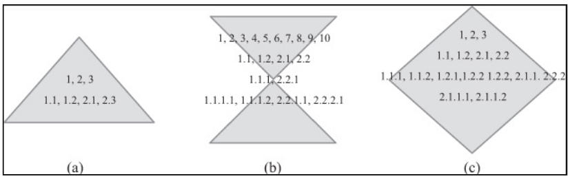
    * If you were to list out the requirements at each level, the resultant shape should look like a pyramid in that there should be a few numbered statements at level 1 and each lower level should have increasingly more numbered statements than the level above it **(a)**
    * Requirements documents whose requirements counts at each level resemble an hourglass shape **(b)** are usually those that contain a large amount of introductory and administrative information
    * Diamond-shaped documents represented by a pyramid followed by decreasing statement counts at lower levels **(c)** indicate an inconsistent level of detail representation

### NASA ARM tool
* The tool conducts an analysis of the text of the SRS document and reports certain metrics
    * The metrics are divided into two categories:
        * **Micro-level** indicators count the occurrences of specific keyword types
            * Micro-level indicators include:  
                * Imperatives 
                * Continuances
                * Directives
                * Options 
                * Weak phrases
        * **Macro-level** indicators are coarse-grained metrics of the SRS documentation
            * Macro-level indicators include:
                * Size of requirements
                * <u>Text structure</u>
                * Specification depth 
                * Readability

## Requirement Format
* Each requirement should be in a form that is clear, concise, and consistent in the use of language
* A requirement can be written in the form of a natural language or some other form of language
    * If expressed in the form of a natural language, the statement should include a subject and a verb, together with other elements necessary to adequately express the information content of the requirement
    * Using consistent language assists users of the requirements documents and renders analysis of the SRS document by software tools much easier
    * A simplified standard requirement form is:
        > **The [noun phrase] shall (not) [verb phrase]**
           where **[noun phrase]** describes the main subject of the requirement, the shall (or shall not) statement indicates a required or prohibited behavior, and **[verb phrase]** indicates the actions of the requirement
        * It is not uncommon for requirements to be written in a nonstandard form (but the standard form is desirable)
        * It is also not uncommon to omit the article ("The") in requirements
* It is important to identify requirements in some way for ease of reference, usually with hierarchical numbering
    * Hence the standard form for a requirement extends to the following: 
        > **\[identifier] The [noun phrase] shall (not) [verb phrase]**
* It is desirable to place measurable constraints on performance for functional requirements whenever possible, enriching the standard requirement form to:
    > **\[identifier] The [noun phrase] shall (not) [verb phrase] [constraint phrase]**

## Use of Imperatives
* "Shall" is a command word or imperative that is frequently used in requirements specifications
    * Other command words and phrases that are frequently used include "should," "must," "will," "responsible for", and there are more
* It is considered good practice to use "shall" as the imperative when requirements are mandatory and to omit the use of weak imperatives such as should for optional requirements
* When requirements are ranked for importance, as they should be, a requirement in standard form with a low rank is, essentially, one that can be deemed an optional requirement

## Shall or Shall Not?
* When writing requirements, it is generally preferred to use the positive form, rather than the negative form
    * That is, the requirement should be written using "shall" statements rather than "shall not" statements
* IEEE 29148 advises against writing "shall not" requirements altogether
    * But it is possible, and sometimes desirable, for there to be exceptions particularly for those requirements pertaining to hazards

## Avoiding Imprecision in Requirements
* All requirements in a specification document should be precise
    * That is by using measurable quantities and avoiding vague modifiers such as countless, some, approximately, huge, tiny, microscopic, and so on
        * These vague words need to be replaced with measurements
        * Assigning measurements to requirements is also a very powerful form of validation
* In a requirement, ambiguous terms should be replaced with fractions or ranges

## Requirements Document Size
* There are few studies covering the statistics of requirements specification document size in terms of number of requirements, page length, and other measures
* The industrial norm is for relatively short requirements specification documents. No judgment can be rendered as to whether this finding is good or bad since each individual SRS document has to be judged on qualities other than length

# Behavioral Specifications
* In some cases, the requirements engineer may be asked to reverse engineer requirements for an existing system when the requirements do not exist, are incomplete, are out of date, or are incorrect
* It may also be necessary to generate requirements for open-source software for the purposes of generating test specifications
* In these cases, a form of SRS, the behavioral specification, needs to be generated
    * The behavioral specification is identical in all aspects to the requirements specification, except that the former represents the engineers' best understanding of what the users intended the system to do, while the latter represents the users' best understanding of what the system should do
    * The behavioral specification has an additional layer of inference and, therefore, can be expected to be even less complete than a requirements specification
    * Fortunately, there is an approach to generating the behavioral specification. The technique involves assembling a collection of as many artifacts as possible that could explain the system's intent. Then, these artifacts are used to reconstruct the system's intended behavior as it is best understood
        * Artifacts that may be used to derive a behavioral specification include (but should not be limited to):  
            * Any existing requirements specification, even if it is out of date, incomplete, or known to be incorrect  
            * User manuals and help information (available when running the program)  
            * Release notes  
            * Bug reports and support requests  
            * Application forums  
            * Relevant versions of the software under consideration
              Some of these artifacts may have to be scavenged from various sources, such as customer files, emails, open-source community repositories, or archives

# Best Practices and Recommendations
Some of the more common **dangers in writing poor SRS documents** include:  
* Mixing of operational and descriptive specifications
* Combining low-level hardware functionality and high-level systems and software functionality in the same functional level  
* Omission of timing information

Other bad practices arise from failing to use language that can be verified
* For example, consider this set of requirements:
    * The system shall be completely reliable
    * The system shall be modular
    * The system will be fast
    * Errors shall be less than 99%
     The problem is they are completely vague and immeasurable, and therefore, their satisfaction cannot be demonstrated. For example,
        * What does "completely reliable" mean? Any arbitrary person will have a different meaning for reliability for a given system
        * Modularity (in software) has a specific meaning, but how is it measurable? 
        * What does "fast" mean? Fast as a train? Faster than a speeding bullet? This requirement is just so vague
        * "Errors shall be less than 99%" is a recipe for a lawsuit. 99% of what? Over what period of time?
* For the previous set of requirements, the improved version is:
    * Response times for all level one actions will be less than 100 ms
    * The cyclomatic complexity of each module shall be in the range of 10-40
    * 90% of the transactions shall be processed in less than 1s  
    * Meantime before the first failure shall be 100hours of continuous operation

Some final **recommendations for the writing of specification documents** are:  
* Invent and use a standard format and use it for all requirements 
* Use language in a consistent way
* Use "shall" for mandatory requirements
* Use "should" for desirable requirements
* Use text highlighting to identify key parts of the requirement
* Avoid the use of technical language unless it is warranted

# **Class 4 - Requirements Validations and Verifications**

# What Is Requirements Risk Management?
* Some of the most notorious system failures were due to poor requirements engineering
* Requirements can be inadequate in many ways including:  
    * Inaccurate or incomplete stakeholder identification  
    * Insufficient requirements validation/verification  
    * Incomplete/Incorrect/Inconsistent/ requirements  
    * Incorrectly ranked requirements
* Requirements risk management involves the proactive analysis, identification, monitoring, and mitigation of any factors that can threaten the integrity of the requirements engineering process
* Requirements risk factors can be divided into two types: 
    * **Technical:** Technical risk factors pertaining to the elicitation, analysis, agreement, and representation processes
    * **Management:** Requirements management risk factors tend toward issues of expectation management and interpersonal relationships

# Validation and Verification
* Requirements validation and verification involve review, analysis, and testing to ensure that a system complies with its requirements
* Applicable to both functional and nonfunctional requirements
* Boehm (1984) suggests the following to make the **distinction between verification and validation**:  
    * Requirements validation: "am I building the right product?" 
    * Requirements verification: "am I building the product right?"
    * In other words, validation involves fully understanding customer intent and verification involves satisfying the customer intent
* **Benefits** of implementing a requirements verification and validation program:
    * Early detection and correction of system anomalies
    * Enhanced management insight into the process and product risk
    * Support for life cycle processes to ensure conformance to program performance and budget
    * Early assessment of software and system performance  
    * Ability to obtain objective evidence of software and system conformance to support process
    * Improved system development and maintenance processes
    * Improved and integrated systems analysis model (IEEE Std 1012 2012)
* **Requirements validation:** 
    * Involves checking that the system provides all of the functions that best support the customer's needs and that it does not provide the functions that the customer does not need or want
    * Validation should ensure that there are no requirements conflicts and that satisfaction of the requirements can actually be demonstrated
    * There is some element of sanity check in terms of time and budget - a requirement may be able to be literally met, but the cost and time needed to meet it may be unacceptable or even impossible
* **Requirements verification (testing):**
    * Involves checking the satisfaction of a number of desirable properties of the requirements (e.g., IEEE 29148 rules)
    * Usually, we do both validation and verification (V&V) simultaneously, and often the techniques used for one or the other are the same

## Techniques for Requirements V&V
* May include some of the requirements elicitation techniques
* We can use comparative product evaluations to uncover missing or unreasonable requirements and task analysis to uncover and simplify requirements
* Systematic manual analysis of the requirements, test-case generation (for testability and completeness), using an executable model of the system to check requirements, and automated consistency analysis may also be used
* Wideband Delphi or the Analytical Hierarchy Process can be used for requirements reconciliation, harmonization, and negotiation
* Certain formal methods such as model checking and consistency analysis can be used for V&V

### Walkthroughs
* Walkthroughs or peer/team reviews are an informal methodology to detect errors and improve requirements quality
* A typical walkthrough scenario involves requirements engineers, a supervisor, and peers participating in a semistructured meeting to review the requirements before release
* The goal is to identify ambiguities and inconsistencies and to determine if the requirements can be tested
* The IEEE 29148 rules can be used as a framework or checklist for the walkthrough

### Inspections
* Inspections are a method of requirement quality control that can be informal (ad hoc) or highly structured
* More formal inspection processes, such as those described by Fagan (1986), provide close procedural control and repeatability. Fagan inspections define the following:
    * What can be inspected
    * When the code can be inspected
    * Who can inspect the code
    * What preparation is needed for the inspection
    * How the inspection is to be conducted
    * The follow-up activities
* Inspection can be used in many kinds of requirements engineering settings but is especially appropriate for safety-critical systems
* The inspection team is typically comprised of about several people, who are selected from among the following candidates:
    * Author(s) of the requirements being inspected
    * The reader who reads the requirements to the team during the inspection meeting
    * One or more inspectors who find errors, omissions, and inconsistencies
        * Appropriate inspectors of a requirements document include the project manager and a representative of the actual users
    * Representatives of anyone who has to do work based on the document bring a vital perspective
        * These include architects, designers, system test engineers, documentation writers, and support representatives
    * The moderator who chairs the inspection meeting and notes discovered errors
    * Scribe taking notes on the inspection process results
    * Representatives from other stakeholder groups such as program sponsors or primary users of the system
* The inspection process stages includes:
    * **The Preparation Stage:** During preparation, inspectors examine the requirements document to understand it and to find possible defects. Inspectors use checklists of typical requirements defects to help focus their attention
    * **Inspection Meeting:** During the inspection meeting, the reader describes their interpretation of each requirement in their own words. Such paraphrasing allows the other participants to compare their understanding with that of someone other than the author. Differences in interpretation can reveal omissions and surface assumptions. During the meeting, the record keeper documents the change requests, and the meeting moderator ensures the review is on track
    * **Rework:** In this stage, a list of change requests is assembled, and a record of the minutes meeting is documented. The requirements engineer then works on the change requests to fix the found issues

### Goal-Based Requirements Analysis
* Stakeholders tend to express their requirements in terms of operations and actions rather than goals
* A risk is posed when goals evolve as stakeholders change their minds and refine and operationalize goals into behavioral requirements
    * To reduce this risk, stakeholder goals need to be evolved until they can be structured as requirements
* Goal evolution is facilitated through goal elaboration and refinement
* Useful techniques for goal elaboration include 
    * Identifying goal obstacles
    * Analyzing scenarios and constraints
    * Operationalizing goals
* Goal refinement occurs when 
    * synonymous goals are reconciled
    * goals are merged into a subgoal categorization
    * constraints are identified
    * goals are operationalized (Hetzel 1988)
* Regarding operationalization, we will refer to goals-based analysis when discussing metrics generation

### Requirements Understanding
* Bill Hetzel proposed several paradigms for requirements verification and validation. To set the stage for this V&V, Hetzel addressed the problem of requirements understanding through the following analogy:
    > "Imagine you are having a conversation with a customer in which he says that he would like for you to develop some kind of health management system, which, among other things, ensures that patients are eating a "well-balanced meal." You readily agree to this requirement. Many weeks later as you begin thinking about a system design, you reconsider the requirement to provide a wellbalanced meal. What does that mean? In one interpretation, it could mean adding up everything consumed; were minimum nutritional guidelines in terms of calories, protein, vitamins, and so forth met? Another interpretation is that the patient ate exactly three, similar sized meals. Yet another interpretation is that the meals were well balanced in the sense that each food item weighed the same amount (Hetzel 1988)."
    * The phrase "well-balanced meal" may not have a language equivalent in different languages, creating issues for nonnative English speakers
        * Various problems can arise from language and cultural differences 
* **Solution**
    * Hetzel suggests that for correct problem definition it is best to specify the test for accepting a solution along with the statement of the requirement
        * For example, if we propose a requirement for a "well-balanced meal", we also offer a test for satisfying the requirement - that the meal must fall within the specified ranges of protein, fat, salt, sugar, and caloric content
            * When the statement and test are listed together, most problems associated with misunderstanding requirements disappear
                * In particular, we want to derive requirements-based test situations and use them as a test of requirement understanding and validation
        * For example, when a requirement is found to be incomplete, we can use the test case to focus on missing information
            * That is, design the test case to ask the question, "What should the system do in this case when this input is not supplied?" 
            * Similarly, when a requirement is found to be fuzzy or imprecise, use a test case to ask the question, "Is this the result I should have in this situation?" The specific instance will focus attention on the imprecise answer or result and ensure that it is examined carefully. Then an appropriate requirement can be introduced to deal with any lingering imprecision, ambiguity, or missing behavior
        * Today, Hetzel's approach would be called test-driven development

### Validating Requirements Use Cases
* When use cases comprise part of the requirements, these can be validated by asking a simple set of questions:  
    * Are there any additional actors that are not represented? Are there any activities that are not represented? Are each actor's goals being met? Are there events in the use case that do not address these goals? Can the use case be simplified? (other related questions can also be generated)

### Prototyping
* Useful in V&V when very little is understood about the requirements or when it is necessary to gain some experience with the working model in order to discover requirements
* Working prototypes recognize that requirements change with experience and prototyping yields that experience
* In software systems, incremental and evolutionary development approaches are essentially based on a series of non-throwaway prototypes
    * In <u>incremental development</u> the functionality of each release is planned
    * In <u>evolutionary development</u>, subsequent releases are not planned out
    * In both, lessons learned from prior releases inform the functionality of future releases' incremental and evolutionary development. In essence, early versions are prototypes used for future requirements discovery

### Tools for V&V
* In the last two decades, there have been many attempts to build tools to support the formulation, documentation, and verification of natural language requirements
    * Numerous tools use natural language processing (NLP) to mitigate the problems and increase the quality of natural language requirements

### Requirements V&V Matrices
**Requirements validation matrix** is an artifact that associates high-level requirements with system attributes for trade-off analysis and requirement intent confirmation
* Appropriate system attributes can include business need, safety, requirement volatility, and other factors
* A matrix that connects system requirements to business and stakeholder requirements is an example of a validation matrix
* Used early in the project life cycle
* **Importance of validation matrix:** Missing link between feature and cost can lead to unplanned expenses, a ripple effect and create slowdowns in product launches, weaken stakeholder confidence, and adversely affect the overall project budget

**Requirements verification matrix** associates requirements with test cases that verify that the requirement has been met 
* Used later in the project life cycle
* Facilitates a review of requirements and the tests and provides an easy mechanism to track the status of test-case design and implementation
* Easily made part of the master test plan and can be updated throughout the project to give a record of all requirements testing

## Standards for V&V
* The Institute for Electrical and Electronics Engineers (IEEE) sponsors or co-sponsors numerous international standards for the processes and documentation involved in the V&V of systems and software
* Software requirements V&V plan should always be written to accompany any major or critical software application
* The IEEE Standard 1012-2012, IEEE Standard for Software Verification and Validation, provides some guidelines to help prepare V&V plans

### ISO/IEC/IEEE Standard 29148
* "Describes recommended approaches for the specification of software requirements"
* The standard attempts to help:
    1. Software customers to accurately describe what they wish to obtain
    2. Software suppliers to understand exactly what the customer wants
    3. Individuals to accomplish the following goals:  
        a. Develop a standard software requirements specification (SRS) outline for their own organizations  
        b. Define the format and content of their specific SRSs  
        c. Develop additional local supporting items, such as an SRS quality checklist or an SRS writer's handbook
* But from a risk mitigation standpoint, we are most interested in the qualities of goodness for the requirements document that are described
* The IEEE 29148 specifies qualities for individual requirements and then for the set of requirements taken as a whole
    * First, the mandatory qualities for an individual requirement are that it must be:
        * **Singular**, **Feasible**, **Unambiguous**, **Complete**, **Consistent**, **Verifiable**, **Traceable**
    * Then, taken collectively, the set of all requirements in an SRS document should exhibit the following properties:  
        * **Complete**, **Consistent**, **Bounded**, **Affordable**
    * Next, a set of requirements is bounded if it does not exceed the scope of the system intent
    * Finally, affordable requirements are those that can be satisfied within budgetary constraints

We now look at each of the qualities for individual requirements in some detail:

#### Singularity
* The IEEE 29148 mandates that a requirement specifies a single behavior and has no conjunctions
* The problem with the conjunctions "and" and "or" is that they can introduce some ambiguity    
    * It is better to leave out conjunctions when possible

#### Feasibility
* A requirement is feasible if it can be satisfied with current technology and cost constraints, that is, it is not a ridiculous requirement
* Various techniques can be used to assess feasibility including reviews, inspections, and competitive analysis
    * A value engineering analysis also needs to be conducted to ensure feasibility

#### Ambiguity
* We define ambiguity by complementation - a requirement is unambiguous if it can have only one interpretation
* Conjunctions can cause ambiguity and that is why they should be avoided
* Another reason why ambiguity is so dangerous is that, in an ambiguous requirements specification, literal requirements satisfaction may be achieved but not customer satisfaction
* Some of the techniques that could be used to resolve the ambiguity of a requirement include formal reviews, viewpoint resolution, and formal modeling of the specification

#### Completeness
* According to the IEEE 29148, a single requirement is complete if it is "measurable and sufficiently describes the capability and characteristics to meet the stakeholder's need"
* We will use the following definition for completeness of a set of requirements: <u>an SRS document is complete if there is no missing functionality, that is, all appropriate desirable and undesirable behaviors are specified</u>
* Completeness is a difficult quality to prove for a set of requirements
    * If a single requirement contains "to be defined" (TBD) or some variation of this phrase, then clearly the requirement is incomplete
    * If the requirement is missing measurable indicators of satisfaction, then that is a problem of incompleteness
* Use the following techniques to look for missing requirements:
    * Check if you have received requirements from all your product's user classes
    * Make sure that the source and usage of all data items are stated
    * Check whether requirements are present in all pertinent functional categories for the system
        * These categories might include reporting, managing, and customizing users, edit operations, security, printing, and transaction logging, or whatever functional areas your system typically includes
    * Check whether NFRs, such as quality attributes and design and implementation constraints, have been specified
    * Ensure that the requirements conform to all applicable regulations
    * Build tables of similar requirements that fit a pattern to avoid duplications or oversights  
    * Represent requirements information in multiple ways
        * Models such as UML provide a high-level view and can help in catching missing use cases and requirements

#### Consistency
* Since requirements may be added to the project at different times and come from different sources, they are vulnerable to become inconsistent
* In the context of the SRS document, the consistency can take two forms:
    * **Internal Consistency:** that is, the satisfaction of one requirement does not preclude the satisfaction of another
    * **External Consistency:** that is, the SRS is in agreement with all other applicable documents and standards
    * When either internal or external inconsistency is present in the SRS, it can lead to difficulties in meeting requirements, delays, and frustration downstream
    * Internal and external consistency can be checked through reviews, viewpoint resolution, various formal methods, and prototyping

#### Verifiability
* An SRS is verifiable if satisfaction of each requirement can be established using measurement or some other unambiguous means
    * This quality is important because a requirement that cannot be shown to be met has not been met
    * When requirements cannot be measured, they cannot be met and disputes will follow
* Example: "The system shall be reliable"
    * The satisfaction of this requirement can't be demonstrated as it is subjective
    * One way to improve the above requirement is by associating metrics to quantify how the acceptance of "reliability" will be measured
* Overall, verifiability can be explored through various reviews, through test-case design (design-driven development), and through viewpoint resolution

#### Traceability
* "The ability to describe and follow the life of a requirement in both a forwards and backwards direction" from inception throughout the entire system's life cycle, provides useful support mechanisms for managing requirement changes during the ongoing change process
* The extent to which traceability is exploited is viewed as an indicator of system quality and process maturity and is mandated by many standards
* In general, an SRS is traceable if each requirement is clearly identifiable, and all linkages to other requirements (e.g., dependencies, subordinate, and predominant) are clearly noted
    * In some cases, the relationship is clear in the hierarchy of the numbering system
    * Traceability matrices are also designed for this purpose
    * In other cases, the linkages are made by requirements tools
* Traceability is an essential quality for effective communications about requirements, facilitating easy modification, and even for legal considerations
* Many organizations either focus their traceability efforts on functional requirements or else fail entirely to implement an effective traceability process
    * Tracing NFRs has, on the whole, been neglected mainly because 
        * NFRs tend to become scattered among multiple modules when they are mapped from the one-dimensional requirements domain to the n-dimensional solution space
        * NFRs can often interact in the sense that attempts to achieve one NFR can help or hinder the achievement of other NFRs at certain functionality
            * Such interaction creates an extensive network of interdependencies and trade-offs between NFRs which is not easy to trace
        * Despite limited prior work, traceability approaches have in fact been developed to support related activities while incorporating NFRs in software engineering processes

# **Class 6 - Requirements Specification and Agile Methodologies**

# Introduction to Agile Methodologies
* Agile methodologies:
    * Comprise a family of nontraditional software development strategies that have captured the imagination of many who are leery of traditional, process-laden (plan-driven) approaches
    * Characterized by their lack of rigid process
        * When correctly employed, they are still rigorous and suitable for industrial applications
        * What is characteristically missing from agile approaches, however, are "cook-book" solutions that focus on mandatory meetings and complex documentation-prescribed development approaches
    * Applyable to software engineering, but usually described as lightweight or lean when applied to non-software systems because agile methodologies depend on a series of rapid, non-throwaway prototypes, an approach that is not usually practical in hardware-based systems
        * Non-software engineer can still benefit from agile methodologies because they are increasingly being employed and because the mindset of the agile software engineer includes some healthy perspectives
* In order to fully understand the nature of agile methodologies, we need to examine a document called the Agile Manifesto and the principles behind it. The Agile Manifesto was introduced by a number of leading proponents of agile methodologies to explain their philosophy

## Principles Behind the Agile Manifesto
* At regular intervals, the team reflects on how to become more effective, then tunes and adjusts its behavior accordingly
* Our highest priority is to satisfy the customer through early and continuous delivery of valuable software 
* Welcome changing requirements, even late in development. Agile processes harness change for the customer's competitive advantage
* Deliver working software frequently, from a couple of weeks to a couple of months, with a preference for the shorter timescale 
* Business people and developers must work together daily throughout the project
* Build projects around motivated individuals. Give them the environment and support they need, and trust them to get the job done
* The most efficient and effective method of conveying information to and within a development team is face-to-face conversation
* Working software is the primary measure of progress
* Agile processes promote sustainable development. The sponsors, developers, and users should be able to maintain a constant pace indefinitely
* Continuous attention to technical excellence and good design enhances agility
* Simplicity - the art of maximizing the amount of work not done - is essential. "Do the simplest thing that could possibly work"
* The best architectures, requirements, and designs emerge from self-organizing teams

## Benefits of Agile Software Development
* **Subset of Iterative Methods:** Agile focuses on adapting to change, collaboration, and early delivery while maintaining quality
* **Prioritizing Working Code:** Emphasizes the importance of functional software over extensive documentation. Models and plans are secondary to developing working software
* **Adaptive Approach:** Agile is flexible and responsive, contrasting with traditional predictive models like the waterfall method which require detailed, long-term planning
* **Response to Changing Requirements:** Agile methods address the challenge of evolving requirements that can impede more rigid, documentation-heavy approaches
* **Integrated Testing:** In Agile, testing occurs alongside programming, allowing for continuous user validation and assessment of the software's value
* **User Involvement:** Frequent user interaction helps in assessing the financial and functional value of each iteration, guiding future development decisions
* **People-Oriented:** Agile aims to make software development enjoyable and engaging, focusing on team collaboration and individual contribution

## Extreme Programming (XP)
* One of the most widely used agile methodologies
* Traditionally targeted toward smaller development teams and requires relatively few detailed artifacts
* XP takes an iterative approach to its development cycles. We can visualize the difference in process between a traditional waterfall model, iterative models, and XP in this image:
    

    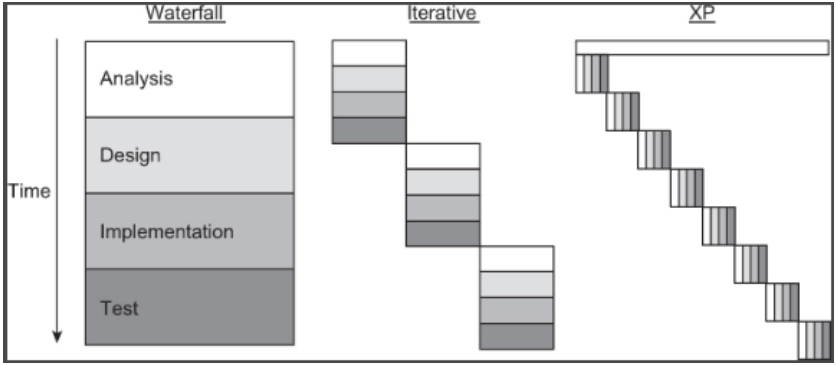
    

* Whereas an evolutionary or iterative method may still have distinct requirements analysis, design, implementation, and testing phases similar to the waterfall method, XP treats these activities as being interrelated and continuous
* XP promotes a set of 12 core practices that help developers to respond to and embrace inevitable change. The practices can be grouped according to four practice areas:  
    * **Planning:** Some of the distinctive planning features of XP include holding daily stand-up meetings, making frequent small releases, and moving people through different project roles
    * **Coding:** Coding practices include having the customer constantly available, coding the unit test cases first, and employing pair-programming (a unique coding strategy where two developers work on the same code together)
    * **Designing:** Design practices include looking for the simplest solutions first, avoiding too much planning for future growth (speculative generality), and refactoring the code (improving its structure) continuously
    * **Testing:** Testing practices include creating new test cases whenever a bug is found and having unit tests for all code, possibly using such frameworks as XUnit
      While removal of the territorial ownership of any code unit is another feature of XP, this framework may not work in the best way possible if all team members are not collocated

## Scrum
* Enables self-organizing teams by encouraging verbal communication across all team members and across all stakeholders
* A fundamental principle of Scrum is that traditional, plan-driven software development methodologies such as waterfall and iterative development focus too much on process and not enough on software
    * Moreover, while plan-driven development focuses on non-software artifacts (e.g., documentation) and processes (e.g., formal reviews), Scrum emphasizes the importance of producing functioning software early and often
* Scrum promotes self-organization by fostering high-quality communication between all stakeholders
* Scrum features a "living" (constantly changing) backlog of prioritized work to be completed
        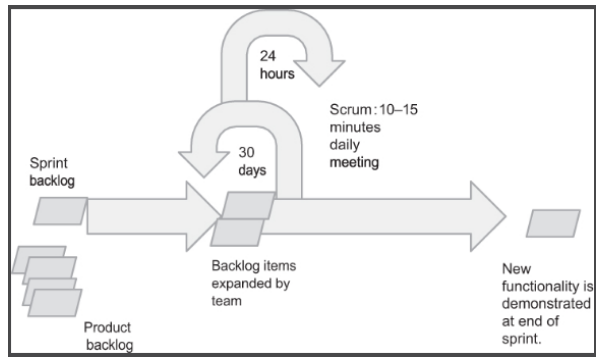
    * Completion of a largely fixed set of backlog items occurs in a series of short (approximately 30 days) iterations or sprints
    * Each day, a brief (e.g., 15-minutes) meeting or Scrum is held in which progress is explained, upcoming work is described, and impediments are raised
    * A short planning session occurs at the start of each sprint to define the backlog items to be completed
    * A brief postmortem or heartbeat retrospective review occurs at the end of the sprint
* Scrum Master:
    * Removes obstacles or impediments to each sprint
    * Is not the leader of the team (as they are self-organizing) but acts as a productivity buffer between the team and any destabilizing influences
    * In some organizations, the role of the Scrum Master can cause confusion
        * For example, if two members of a Scrum team are not working well together, it might be expected by a senior manager that the Scrum Master fix the problem but fixing team dysfunction is not the role of the Scrum Master. Personnel problems need to be resolved by the line managers to which the involved parties report. This scenario illustrates the need for institution-wide education about agile methodologies when such approaches are going to be employed

## Kanban
* The underlying Kanban method originated in lean manufacturing and focuses on visualizing the progress of the work items, from start to finish (usually through a Kanban board that can be physical or digital) 
* Kanban teams write the work items onto cards, usually one item per card
    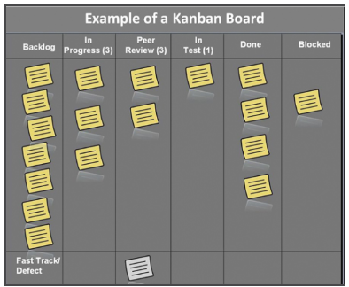
* The cards are placed on the board, which is typically divided into columns, that show each flow of the software production (e.g., In Progress, In Testing, Completed, etc.)
* As the development evolves, the cards contained on the "board" are moved to the proper column that represents its status, and when a new task comes into play, a new "card" is created
* Work moves around the board as capacity permits, rather than being pushed into the process when requested
* The Kanban method requires transparency and real-time communication so that the members of a team can know exactly at what stage the development is and can see the status of the project at any time
* Kanban has been effectively used to develop large software and software-intensive systems

## Lean Development
Lean Development encompasses hardware, software, and hybrid systems. "Lean Software Development" is borrowed from "Lean Manufacturing," which is a set of seven principles adapted from the Toyota Production System. The **seven principles** are:  

* **Eliminate Waste:** everything that does not bring effective value to the customer's project shall be deleted
* **Build Quality In:** creating quality in development requires discipline and control of the quantity of residuals created
* **Deliver Fast:** deliver value to the customer as soon as possible
* **Defer Commitments:** encouraging the team not to focus too much on planning and anticipating ideas without having a prior and comprehensive understanding of the requirements of the business
* **Optimize the Whole:** the development sequence has to be perfected enough to be able to delete errors in the code, in order to create a flow of true value
* **Respect People:** communicating and managing conflicts are two essential points
* **Creating Knowledge:** the team is motivated to document the whole infrastructure to later retain that value

Applying these principles in software and systems development allows the team to decrease the time needed to deliver functionalities since the principles prepare the development team in the decision-making process, hence increasing general motivation, while deleting superfluous activity, therefore saving time and money. Besides, these principles are easily scalable methodology and easily adaptable to projects of any dimension

# Requirements Engineering for Agile Methodologies
* The increasing adoption of Agile practices in software development has been on the radar of the Requirements Engineering (RE) community in recent years (Wagner et al. 2018). This is mainly because "doing requirements" consumes time that could be rather spent on writing code, and business stakeholders in an agile environment often feel better if they think that the development team is "working" (that is, coding) on their problems (Orr 2004)
* While many conventional RE practices are important also in agile projects, as Savolainen et al. (2010) observe, there are some major differences as well
* Paetsch et al. (2003) analyzed commonalities and differences between traditional RE approaches and agile software development. Their findings include that one of the differences is related to customers involvement
    * Customers are constantly involved in requirements discovery and refinement in agile methods
    * All systems developers should be involved in the requirements engineering activity, and each can, and should, have regular interaction with customers
    * In traditional approaches, the customer has less involvement once the requirements specification has been written and approved, and typically, the involvement is often not with the systems developers
* Another difference is in the timing of the requirements engineering activities
    * In traditional systems and software engineering, requirements are gathered, analyzed, refined, etc. at the front end of the process
    * In agile methods, requirements engineering is an ongoing activity; that is, requirements are refined and discovered with each system build. Even in spiral methodologies, where prototyping is used for requirements refinement, requirements engineering occurs much less so late in the development process
* A third noted difference in the agile approach to requirements engineering is much more invulnerable to changes throughout the process (remember, "embrace change") than in traditional software engineering

## Requirements Engineering in XP
* Requirements engineering in XP follows the model shown in the figure where the stack of requirements in Ambler's model refers to user stories
    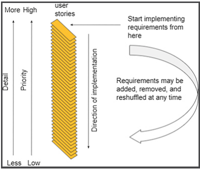
* And in XP, user stories are managed and implemented as code via the "planning game", which takes two forms: 
    * **Release planning** takes place after an initial set of user stories has been written. This set of stories is used to develop the overall project plan and plan for iterations. The set is also used to decide the approximate schedule for each user story and overall project
    * **Iteration planning** is a period of time in which a set of user stories and fixes to failed tests from previous iterations are implemented. Each iteration is 1-3 weeks in duration. Tracking the rate of implementation of user stories from previous iterations (which is called project velocity) helps to refine the development schedule
* Because requirements are constantly evolving during these processes, XP creator Kent Beck says that "in XP, requirements are a dialog, not a document" (Beck et al. 2001) although it is typical to convert the stack of user stories into a software requirements specification

## Requirements Engineering in Scrum
* In Scrum, the requirements stack shown in the model of figure in the previous section is, as in XP, the evolving backlog of user stories. And as in XP, these requirements are frozen at each iteration for development stability
* In Scrum, each iteration takes about a month. To manage the changes in the stack, one person is given final authority for requirement prioritization (usually the product sponsor)
    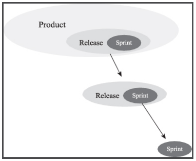
* In Scrum, the requirements backlog is organized into three types: 
    * **Product:** The product backlog contains the release backlogs, and each release contains the sprint backlog. The **product backlog** acts as a repository for requirements targeted for release at some point. The requirements in the product backlog include low-, medium-, and high-level requirements
    * **Release:** The **release backlog** is a prioritized set of items drawn from the product backlog. The requirements in the release backlog may evolve so that they contain more details and low-level estimates
    * **Sprint:** The **sprint backlog** list is a set of release requirements that the team will complete (fully coded, tested, and documented) at the end of the sprint. These requirements have evolved to a very high level of detail, and hence, their priority is high
* Scrum has been adopted in several major corporations, with notable success. Some of the authors' students also use Scrum in courses. In these cases, it proves highly effective when there is little time for long requirements discovery processes

## Gathering User Stories
* User stories are a common unit of requirements in most agile methodologies. Each user story represents a feature desired by the customer
* User stories gathering goes on throughout the project because user requirements keep on evolving throughout the project
* Initial user stories are usually gathered in small offsite meetings. Stories can be generated either through goal-oriented (e.g., "let's discuss how a customer makes a purchase") approaches or through interactive (stream-of-consciousness) approaches
* Developing user stories is an "iterative and interactive" process. Formal requirements, use cases, and other artifacts are derived from the user stories by the software engineering team as needed

## Writing User Stories
* User stories are written by the customer on index cards, though the process can be automated via wikis or other tools
* **A user story consists of the following components:**  
    * **Title:** this is a short handle for the story. A present tense verb in active voice is desirable in the title.
    * **Acceptance Test:** this is a unique identifier that will be the name of a method to test the story
    * **Priority:** this is based on the prioritization scheme adopted. Priority can be assigned based on "traditional" prioritization of importance or on the level of detail (higher priority is assigned to higher detail)
    * **Story Points:** this is the estimated time to implement the user story. This aspect makes user stories helpful for  effort and cost estimation
    * **Description:** this is one to three sentences describing the story
* User stories should be understandable to the customers and each story should add value
* Developers do not write user stories, but users do. But stories need to be small enough that several can be completed per iteration
* Stories should be independent (as much as possible); that is, a story should not refer back and forth to other stories
* Stories must be testable like any requirement, if it cannot be tested, it's not a requirement
    * The testability of each story is considered by the development team

## Estimating User Stories
* To measure the user stories, agile teams allocate story points - arbitrary values to measure the effort required to complete that user story
* These points can be allocated in many ways based on the team's preferences
    * In most cases, project managers define a story point complexity range as a Fibonacci series (for example, 1, 2, 3, 5, 8)
    * Another way is to pick a small reference story and estimate the other ones regarding that using the Delphi estimation technique known as "planning poker"
* The stories are rated and reviewed before entering the next phase of prioritization

## Prioritizing User Stories
* User stories are prioritized before iteration. The user stories are prioritized in terms of ranking (i.e., ordered as first, second, and third) and also as a group (e.g., "high priority," "low," and "medium")
* The high-priority user stories are recorded in the product backlog and used as a guide to carry out the development work
* Customers perform the prioritization task based on their understanding of the business value the user stories will bring using various techniques

## User Stories vs. Use Cases
* It is worth noting that there is a **significant difference between use cases and user stories**
* **User stories** come from the customer perspective and are simple and avoid implementation details
* **Use cases** are more complex and may include implementation details (e.g., fabricated objects)
    * Customers don't usually write use cases (and if they do, beware, because now the customer is engaging in "software engineering")
* It's hard to say what the equivalence is for the number of use cases per user story. One user story could equal one or more than 20 use cases
* In agile methodologies, user stories are much preferred to use cases

# **Class 7 - Tool Support for Requirements Engineering**

# Introduction
* Word processors, database managers, spreadsheets, content analyzers, concept mapping programs, automated requirements checkers, and so on are tools of interest to the requirements engineer
* The table compares the capabilities of conventional office tools used for requirements management to a featurerich requirements management tool.
    |     | Word Processor | Spreadsheet | Relational Database | Requirements Management Tool |
    |-----|-----|-----|-----|-----|
    Document size | Yes | No | No | Not in the preformatted state  
    Dynamic changes over time | Possible with complex change tracking enabled | No | No | Yes  
    Release size | Yes | Yes | Yes | Yes  
    Requirement expansion profile | No | No | Yes | Yes  
    Requirements verification | No | No | Possible | Possible  
    Requirements volatility | Yes | Yes | Yes | Yes  
    Test coverage | No | Possible with complex equation logic | Yes | Yes
    Test span | No | Possible with complex equation logic | Yes | Yes 
    Test types | Yes | Yes | Yes | Yes
* The most celebrated requirements tools are large, commercial, or open-source packages that provide a high level of integrated functionality
* These tools represent and organize all "typical" requirements engineering objects throughout the requirements engineering life cycle
* Six major capabilities exist for requirements engineering tools: requirements elicitation, analysis, specification, verification and validation, and management
* Verification and validation features are indeed an important component of any automated require,ents engeneering tool
* The more sophisticated commercial requirements engineering tools provide other requirements checking, tracing, and archiving features. These features are particularly important because they provide for the accurate tracing of artifacts over time. Traceability is an important characteristic of the SRS document and bears further discussion
* Other typical functionalities for these large, commercial requirements engineering tools include may include more capabilities such as:
    * Supports agile methodologies such as Scrum, Kanban, and collaborative working
    * Multiuser support and version control
    * Support for traceability
    * Verification and validation  
    * Online collaboration support
    * Issue resolution management
    * Configuration/Product/Project/Test management
    * Built-in support for standards templates
    * User-defined glossary support
    * Customizable functionality through a programmable interface
    * Customizable user interfaces
    * Product lifecycle management

# Traceability Support
* Subdiscipline of requirements management, and it is one of the main capabilities to look for in requirement tools
* Concerned with the relationships between requirements, their sources, and numerous other artifacts
* Different kinds of traceability can be established:
    * **Source Traceability:** This provides links requirements to stakeholders who proposed these requirements
    * **Requirements-Linkage Traceability:** This provides links between dependent requirements
    * **Requirements-Design Traceability:** This provides links from the requirements to the design
    * **Requirements-Source Code Traceability:** This provides links from the requirements to the code
    * **Requirement-Test Cases Traceability:** This provides links from the requirements to the test cases
* Especially relevant when developing safety-critical systems and therefore prescribed by safety guidelines
* Within the SRS document, traceability focuses on the interrelationship between requirements and their sources, stakeholders, standards, regulations, and so on
    * For these purposes, traceable artifacts include: 
        * Requirement
        * Stakeholder(s) who are associated with a requirement
        * Standard, regulation, or law that mandates the requirement
        * Rationale (for the requirement)
        * Keywords (for searching)
* The various combinations of these and other artifacts lead to many traceability formats
* One goal of traceability is to visualize the relationship between artifacts
    * As the number and complexity of trace links increases, techniques for traceability visualization are necessary
    * Common visualizations for traceability information are matrices, graphs, lists, and hyperlinks
    * Traceability can be realized by capturing traces either entirely manual or tool-supported

## Requirements Linkage Traceability Matrix
* In general, there are different types of relationships between requirements, a non-exclusive list may include:
    | | | |
    |---|---|---|
    | Requires | Is child of | Refers to
    | Is needed by| Is parent of | Is satisfied by
    | Supersedes | Refers to | Satisfied
    | Is superseded by | Uses | Contradicts to
    * The main distinction between "uses" and "refers to" is that the "uses" represents a stronger, direct link
* The primary artifact of traceability is the requirements traceability matrix
    * It can appear in tabular form in the SRS document, in a stand-alone traceabillity, or internally represented within a tool for modification, display and printout
    * There are many variations of traceability matrices depending on which artifacts are to be included.
    * One form of the matrix shows the interrelationship between requirements
        * The entries in this requirements traceability matrix are defined as follows:   
            * Rij = R if requirement i references requirement j (meaning "refers to" for informational purposes)
            * Rij = U if requirement i uses requirement j (meaning "depends on" directly)  
            * Rij = blank otherwise
            * When a requirement both uses and references another requirement, the entry "U" supersedes that of "R"
            * Since self-references are not included, the diagonal of the matrix always contains blank entries
            * We would also not expect circular referencing in the requirements so that if Rij = U or Rij = R, we would expect Rji to be blank. In fact, an automated verification feature in a requirements engineering tool should flag such circular references
* A low level of coupling within the requirements document is desirable - the more linked requirements, the more changes to one requirement propagate to others
    * Explicit requirements linkages violate the principle of separation of concerns
    * Link requirements only when absolutely necessary
* Each requirement should be verified by more than one test case. At the same time, each test case should exercise more than one requirement
* "Test span" metrics are used to characterize the test plan and identify insufficient or excessive testing: Requirements per test, Tests per requirement
    * Research is still ongoing to determine appropriate statistics for these metrics. But at the very least, you can use these metrics to look for inconsistencies and nonuniform test coverage. Of course, there is always a trade-off between time and cost of testing vs. comprehensiveness of testing

## Requirements Source Traceability Matrix
* Another kind of traceability matrix links requirements to their sources
* Aside from those coming directly from users, many requirements are derived from governmental regulations and from standards
* Linking the requirements to these sources can be very helpful when the sources change
* This kind of traceability matrix is especially useful for tracking nonfunctional requirements. Failure to trace nonfunctional requirements throughout the project life cycle can be a significant problem

## Requirements Stakeholder Traceability Matrix
* Another kind of traceability matrix links stakeholders to the requirements they submitted
* The table can also incorporates a ranking schema, which greatly facilitates requirements negotiation and trade-off analysis

# Traceability Matrices
* Only three kinds of traceability matrices have been shown in the previous sections, but any variation or combination of these can be created and they can incorporate the other traceability artifacts mentioned
* Commercial requirements engineering tools allow the user to customize all kinds of traceability matrices
* **Requirements traceability best practices include:**
    * Unique identifiers must be adopted for requirements and business rules
    * When tracing all requirements is simply time-prohibitive, the analyst may be selective based on effort and cost
    * A responsible party within the team must take ownership of traceability
    * An organization must adopt consistent practices in requirements management, including traceability, and the analyst must practice consistency in updates

# Requirements Management Tools
## Jira
* Jira is an issue tracking tool used by software development teams, people who are working on the support desk and business teams
* "Issue" is a generic term for a ticketed item that could be a task, bug, story, epic in software development projects, a simple to-do in business projects, or an incident, problem, or service request in service desk-based projects
* The popularity of Jira has increased because it can also be customized to act like a help desk system, a simple test management suite, requirements management, or a project management system with end-to-end traceability for software development projects
* Jira is mainly accessed using a web browser but it has a lot of integrations with other tools, and Jira comes with a RESTful API so you can interact with it programmatically

## Aha!
* Allows users to build and share visual roadmaps
* Connects the strategic business goals into high-level requirements (features) and releases
* Provides planning board capability where the team can define the features, prioritize the backlog, manage the daily work and plan upcoming releases
* Provides a scorecard feature to objectively rank features against the project's strategy
* Provides the capability to group multiple work items that span across many releases into epics, and it automatically syncs the status of epics and features so team members can keep track of the overall effort and report on progress
* Integrated with many third-party applications including JIRA, GitHub, and Azure DevOps Server

## Jama Software
* Provides upstream and downstream relationships traceability to understand the impact of change and coverage across the development lifecycle, realtime collaboration among team members, risk and hazard analysis, and requirements reuse and baseline management

## IBM Doors (dynamic object-oriented requirements system)
* DOORS is essentially an object database for requirements management
* Each feature is represented as an object containing a feature description, feature graph, and use case diagram
* The database is further organized by creating folders and projects, and a history of all module and object-level actions is maintained
* DOORS offers linking between all objects in a project for full traceability and missing link analysis
* Can be customized via a C-like programming language
* Standard templates are available to structure requirements in compliance with ISO 12207, ISO 6592, and other standards

## Tool Selection
* There are many commercial and open-source tools, and it is important to carefully evaluate the features of any tool before adopting it in the enterprise
* ISO/IEC TR 24766 (2009) Information Technology - Systems and Software Engineering - Guide for Requirements Engineering Tool Capabilities is a framework for assessing the capabilities of requirements engineering 
    * These capabilities are organized along with the following areas: elicitation, analysis, specification, verification and validation, management and other capabilities
* There are hundreds of thousands of open-source projects many of which are full-featured requirements management tools, and you are encouraged to turn first to open-source repositories to look for tools before purchasing or trying to develop them from scratch
* There are also utilities or resources for requirements engineering

## Requirements Engineering Tool Best Practices
An excellent set of such practices is offered by Cleland-Huang et al. (2007):  

* **Trace for a Purpose:** That is, determine which linkages are truly important; otherwise, a large number of extraneous links will be generated
* **Define a Suitable Trace Granularity:** For example, linkages should be placed at the appropriate package, class, or method level
* **Support In-Place Traceability:** Provide traceability between elements as they reside in their native environments  
* **Use a Well-Defined Project Glossary:** Create the glossary during initial discovery meetings with stakeholders and use it consistently throughout the requirements engineering process
* **Write Quality Requirements:** Make sure to follow generally accepted best practices such as IEEE 29148, which are particularly important for traceability
* **Construct a Meaningful Hierarchy:** Experimental results show that hierarchically organized requirements are more susceptible to intelligent linking software
* **Bridge the Intradomain Semantic Gap:** For example, avoid overloaded terminology, that is, words that mean completely different things in two different contexts  
* **Create Rich Content:** Incorporate rationales and domain knowledge in each requirement

Finally, be sure to use a process improvement plan for improving the requirements engineering process

# **Class 8 - Requirements Management**

# Introduction
* Requirements management involves identifying, documenting, and tracking system requirements from inception through delivery
* Inherent in this definition is the understanding of the true meaning of the requirements and the management of customer (and stakeholder) expectations throughout the system's lifecycle
* A solid requirements management process is the key to a successful project

# Requirements Management Process
* Most organizations do not have an explicit requirements management process in place
    * This does not mean that requirements management does not occur within the organization
    * The requirements practices probably exist implicitly in the organization, but these practices are not usually documented

* One of the first steps in improving the requirements management process in any organization is to document existing practices

* Throughout system development, even in the waterfall model, frequent customer and stakeholder interaction are essential
    * From the requirements engineering standpoint, interactions related to requirements changes must be managed effectively
        * Management of these changes includes documenting these change requests (honoring the configuration management process) and ensuring that these changes are effectively communicated to developers

* Along the way, there will be numerous opportunities for requirements engineers to exercise their leadership and negotiation skills to settle disputes and deal with various negative organizational forces that you have studied (including management and environmental antipatterns, negative personality types and behaviors, and cognitive dissonance)

* Reinhart and Meis (2012) discuss how certain requirements management approaches adapted from production engineering can be used to improve the execution of "simultaneous engineering", that is, the parallelization of unequal activities that are generally conducted sequentially
    * They suggest that success factors include simulation prototyping, integration of available knowledge, frequent communication, and efficient use of tools

* Wiegers (2003) **defines requirements management in terms of the following activities**:  
    * Change control refers to the (automated) procedures used in documenting requirements changes
    * Version control is used to track the age of a document and inform users of changes 
    * Status tracking defines each requirement whether it is: proposed, approved, implemented, verified, deleted, or rejected
    * Requirements tracing is a process tying user needs to requirements, and requirements to test cases and parts of the design

* **The International Council On Systems Engineering (ICOSE) explains the requirements management process in terms of the following activities:**
    1. **Identify and Document:**
        * Capture why the end product or system needs to exist in terms of value provided to the end-user
        * Elicit and document requirements from the client and stakeholders
        * Gain their agreement on the written statements and on the measures of successful completion
        * Ensure regulatory requirements are understood by all parties
    2. **Analyze and Allocate:**  
        * Derive explicit measurable requirements useful for the design that are directly traceable to providing the system's value within constraints (e.g., cost, regulatory, and social constraints)
        * Continue derivation and decomposition such that derived requirements can be allocated to the system and components
        * Link requirements and their supporting bases to provide two-way traceability
        * Demonstrate requirement validity through analysis, authority, or other demonstration of need
        * Valid requirements are those that are necessary, clear, achievable, and verifiable
    3. **Control Change:**
        * Analyze requirements changes for the full impact and approve change through a prescribed process and appropriate levels of authority
        * Understand the impact before committing to the change. Ensure approved changes are propagated to all affected items
    4. **Verify Compliance:**  
        * Verify requirements are met and that the resulting system actually provides the needed value in the real environment of use
        * Determine test conditions and acceptance criteria during design to enable test planning
    5. **Provide Oversight:**
        * Manage the resulting information and the processes being implemented. The depth of requirements managed by a program needs to be set. Usually, it is sufficient to manage to the level of subcontracts or procured items 
        * Develop metrics useful to show the quality of the requirements management activities. Integrate requirements across systems to ensure a balanced solution and compatible interfaces

# Configuration Management and Control 
**Configuration management** involves the identification, tracking, and control of important artifacts of the system
* Configuration items relevant to the requirements engineer include the individual requirements, sources of requirements, stakeholders, and the requirements specification document
    * When items are under configuration, changes to those items can only be made by those authorized to make the changes, and all of the changes are tracked, time-stamped, and version stamped
* Standards such as IEEE 29148, IEEE 12207, and ISO 9000 all require that a robust configuration management program be in place and that all requirements artifacts be placed under configuration control

**Configuration control** involves requesting, evaluating, and approving requirements changes, approving releases
* Placing all requirements artifacts under configuration control helps to reduce the likelihood of creating obsolete and ridiculous requirements

Therefore, an important part of requirements management is disciplined configuration management control processes. Requirements management, configuration management, or project management tools that include the appropriate functionality are essential in enforcing the discipline necessary for successful configuration management

# Reconciling Differences
* One of the most important activities in requirements management is **consensus building**, particularly when forming or discovering:
    * Mission statements 
    * Goals 
    * Requirements 
    * Rankings
* But achieving consensus between stakeholder groups is not easy
* Tuckman's theory of team formation suggests that group formation follows a pattern of "forming, storming, norming, performing, and adjourning." 
    * The premise is that a team can dramatically change a non-cohesive group to a high-functioning one

## Managing Divergent Agendas
* Each stakeholder has a different requirements agenda
    * **Business owners** seek ways to get their money's worth from projects
    * **Business partners** want explicit requirements because they are like a contract
    * **Senior management** expects more financial gain from projects than can be realized
    * **Systems and software developers** like uncertainty because it gives them the freedom to innovate solutions
    * **Project managers** may use the requirements to protect them from false accusations of underperformance in the delivered product

* One way to understand why the different agendas might exist - even among persons within the same stakeholder group - is the Rashomon effect
    * Rashomon is a highly revered 1950 Japanese film directed by Akira Kurosawa. The main plot involves the recounting of the murder of a samurai from the perspective of four witnesses to that event (the samurai, his wife, a bandit, and a woodcutter) each of whom has a hidden agenda and tells a contradicting accounting of the event
    * Stated succinctly "your understanding of an event is influenced by many factors, such as your point of view and your interests in the outcome of the event"
    
* The smart requirements manager seeks to manage these agendas by asking the right questions upfront. Andriole (1998) suggests the following questions are appropriate:
    1. What is the project request? 
         a. Who wants it? 
         b. Is it discretionary or non-discretionary? 
    2. What is the project's purpose? 
         a. If completed, what impact will the new or enhanced system have on organizational performance?
         b. On profitability? 
         c. On product development? 
         d. On customer retention and customer service?
    3. What are the functional requirements? 
         a. What are the specific things the system should do to satisfy the purposeful requirements? 
         b. How should they be ranked? 
         c. What are the implementation risks? 
    4. What are the nonfunctional requirements, like security, usability, and interoperability? 
         a. How should they be ranked? 
         b. What are the implementation risks? 
         c. How do you trade off functional and non-functional requirements? 
    5. Do we understand the project well enough to prototype its functionality? 
    6. If the prototype is acceptable, will everyone sign off on the prioritized functionality and nonfunctionality to be delivered, on the initial cost and schedule estimates, on the estimates' inherent uncertainty, on the project's scope, and on the management of additional requirements? 
      Andriole asserts that by asking these questions upfront, hidden agendas can be uncovered and differences resolved. At the very least, important issues will be raised upfront and not much later in the process

## Consensus Building
There are numerous approaches to consensus building. Existing trade-off techniques are categorized and sorted into three categories (Berander et al. 2005):

**Experience-based models**
* Rely on pure experience for supplying the needed information to perform the trade-off analysis

* Commonly used for cost and effort estimation, but rarely in literature, as they are ad hoc in nature, and the execution is up to the person performing the trade-off

* Provide quick analysis, but they are not repeatable, and they do not provide any figures presenting the trade-off

**Model-based techniques**
* Rely on constructing an, for example, graphical model for illustrating and concretize the relations between trade-off entities, thus facilitating the trade-off

* By applying a model-based trade-off approach, in comparison to an experience-based approach, it is possible to structure and communicate the knowledge

* Dealing with trade-offs concerning quality requirements is popularly treated through the model-based technique

**Mathematically based trade-off techniques**
* Rely on formalization for constructing and representing the trade-off, thus making it possible to feed the mathematical construct with appropriate values and receiving the best solution (either maximization or minimization or optimal with regard to certain criteria)

* Widely used in management for trade-off decision support. Estimation and calculations regarding break-even, optimum production volume, and so on all use mathematical techniques

* Examples of these techniques include the analytical hierarchy process (AHP) technique, Wideband Delphi technique, and reliability growth methods

* Mathematically based trade-off techniques can handle large amounts of variables and come up with results that are generally more accurate than common sense. It also enables repeatable and structured analysis. If a measurement program is in place collecting metrics, and if mathematically based trade-off techniques are used as a way to estimate issues, the work can be replicated over several releases tweaking the data and choice of the technique to correspond with needs

* Using the same types of techniques over an extended period of time can give an organization consistency and overview

## Analytical Hierarchical Process (AHP)
* The AHP is a technique for modeling complex and multi-criteria problems and solving them using a pairwise comparison process. Based on mathematics and psychology, it was developed by Thomas L. Saaty in the 1970s and has been extensively studied and refined since then

* AHP was refined through its application to a wide variety of decision areas, including transport planning, product portfolio selection, benchmarking and resource allocation, and energy rationing

* Simply described, AHP breaks down complex and unstructured problems into a hierarchy of factors. A superfactor may include subfactors. By pairwise comparison of the factors in the lowest level, we can obtain a prior order of factors under a certain decision criterion. The prior order of super-factors can be deduced from the prior order of subfactors according to the hierarchy relations

* The AHP process starts with a detailed definition of the problem; goals, all relevant factors, and alternative actions are identified. The identified elements are then structured into a hierarchy of levels where goals are put at the highest level and alternative actions are put at the lowest level
        

        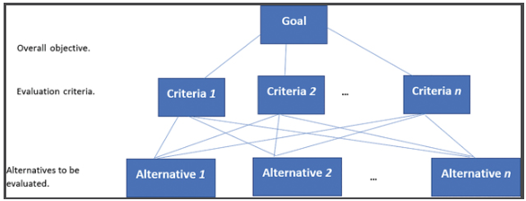
        

    * Usually, an AHP hierarchy has at least three levels: the goal level, the criteria level, and the level of the alternative. This hierarchy highlights relevant factors of the problem and their relationships to each other and to the system as a whole

* Once the hierarchy is built, involved stakeholders (i.e., decision-makers) judge and specify the importance of the elements of the hierarchy. To establish the importance of elements of the problem, a pairwise comparison process is used. This process starts at the top of the hierarchy by selecting an element (e.g., a goal), and then the elements of the level immediately below are compared in pairs against the selected element

* A pairwise matrix is built for each element of the problem; this matrix reflects the relative importance of elements of a given level with respect to a property of the next higher level. Saaty proposed the scale [1,3,5,..., 9] to rate the relative importance of one criterion over another:
    |   |   |
    |---|---|
    |Intensity of Judgment | Numerical Rating  
    |Extreme importance | 9  
    |Very strong importance | 7  
    |Strong importance | 5  
    |Moderate importance | 3  
    |Equal importance | 1  
    |For compromise between the above values | 2, 4, 6, and 8
    * Based on experience, a scale of 9 units is reasonable for humans to discriminate between preferences for two items

* One important advantage of using the AHP technique is that it can measure the degree to which a manager's judgments are consistent
    * In the real world, some inconsistency is acceptable and even natural
    * For example, in a sporting contest, if team A usually beats team B, and if team B usually beats team C, this does not imply that team A usually beats team C. The slight inconsistency may result because of the way the teams match up overall
    * The point is to make sure that inconsistency remains within some reasonable limits. If it exceeds a specific limit, some revision of judgments may be required. AHP technique provides a method to compute the consistency of the pairwise comparisons

## Wideband Delphi Technique
* One of the most celebrated consensus-building techniques in systems engineering is the Wideband Delphi technique

* Developed in the 1970s, but popularized in Barry Boehm in the early 1980s, Wideband Delphi is usually associated with the selection and prioritization of alternatives. These alternatives are usually posed in the form of a question: 
    > for the following alternative, rate your preference according to the following scale (5=most desired, 4=desired, 3=ambivalent, 2=not desired, 1=lease desired) 

    * The list of alternatives and associated scale is presented to a panel of experts (and in the case of requirements ranking, stakeholders) who rank these requirements silently and, sometimes, anonymously
        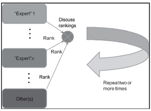
    * The ranking scale can have any number of levels. The collected list of rankings is then re-presented to the group by a coordinator. Usually, there is significant disagreement in the rankings. A discussion is conducted and experts are asked to justify their differences in opinion. After discussion, the independent ranking process is repeated
    
    * With each iteration, individual customer rankings should start to converge, and the process continues until a satisfactory level of convergence is achieved
        * A more structured form of the process is: 
            1. The coordinator presents each expert with a specification and an estimation form
            2. The coordinator calls for a group meeting in which the experts discuss estimation issues with the coordinator and each other
            3. Experts fill out forms anonymously
            4. The coordinator prepares and distributes a summary of the estimates
            5. The coordinator calls for a group meeting, specifically focusing on having the experts discuss points where their estimates vary widely
            6. Experts fill out forms, again anonymously, and steps 4-6 are iterated for as many rounds as appropriate
              There will never be a unanimous agreement in the Wideband Delphi process, but at least everyone involved will feel that his opinion has been considered. Wideband Delphi is a kind of win-win negotiating and can be used for other types of decision-making

# Global Requirements Management
Requirements engineering is one of the most collaboration-intensive activities in software development. The challenges of global requirements engineering, including:
1. **Time Delays and Time Zone Issues:** These can complicate communication and coordination in globally distributed projects
2. **Travel Costs and Stresses:** Physical travel to client and vendor sites can be costly and stressful, although necessary at times
3. **Limitations of Virtual Communication:** Virtual conferencing, telephone, and email communications have limitations, such as the loss of nonverbal cues, context switching, information fragmentation, and unreliability
4. **Language and Cultural Differences:** Offshoring in countries with different native languages and cultures introduces challenges like varying work schedules, communication barriers, and differing business practices
5. **Geopolitical Risks:** These risks need to be understood and factored into the requirements engineering process and schedule
6. **Legal and Business Practice Variations:** Different laws and legal processes, as well as varying expectations of honesty in business, can affect requirements engineering, especially during the elicitation phase
7. **Distinguishing Between Internationalization and Distribution:** Internationalization involves development for international customers, possibly with a single localized team, whereas distribution involves development in a globally distributed environment with many stakeholders in different locations. Each requires different strategies for effective management

The distributed nature of a development team may introduce an additional set of challenges related to:
* **Elicitation problems** may occur due to the distributed nature of the development
* **Communicating the captured requirements** in a distributed software development environment
* **Cooperation across organizational borders** to satisfy the requirements

Bhat et al. (2006) highlighted nine specific problems they observed or experienced when dealing with global requirements engineering. These included:
* Conflicting client - vendor goals
* Low client involvement
* Conflicting requirements engineering approaches (between client and vendor) 
* Misalignment of client commitment with project goals
* Disagreements in tool selection 
* Communication issues
* Disowning responsibility 
* Sign-off issues 
* Tools misaligned with expectation

# Antipatterns in Requirements Management
* In troubled organizations, the main obstacle to success is frequently accurate problem identification. Diagnosing organizational dysfunction is quite important in dealing with the underlying problems that will lead to requirements engineering problems

* Brown et al. (1998) groundbreaking book:
    * Described a taxonomy of problems or antipatterns that can occur in software architecture and design, and in the management of software projects
    * Described solutions or refactorings for these situations
    * The benefit of providing such a taxonomy is that it assists in the rapid and correct identification of problem situations, provides a playbook for addressing the problems, and provides some relief to the beleaguered employees in these situations in that they can take consolation in the fact that they are not alone

* These antipatterns bubble up from the individual manager through organizational dysfunction and can manifest in badly stated, incomplete, incorrect, or intentionally disruptive requirements

* The antipattern set consists of an almost even split of 28 environmental (organizational) and 21 management antipatterns (We will only see a small subset of the antipatterns set that is particularly applicable in requirements engineering)
    * **Environmental antipatterns** are caused by a prevailing culture or social model. These antipatterns are the result of misguided corporate strategy or uncontrolled sociopolitical forces
    * **Management antipatterns** are caused by an individual manager or management team ("the management"). These antipatterns address issues in supervisors that lack the talent or temperament to lead a group, department, or organization

## Environmental Antipatterns - Divergent Goals
* Everyone must pull in the same direction. There is no room for individual or hidden agendas that don't align with those of the business. The divergent goals antipattern exists when there are those who pull in different directions

* There are several direct and indirect problems with divergent goals
    * Hidden and personal agendas divergent to the mission of an organization starve resources from strategically important tasks
    * Organizations become fractured as cliques form to promote their own self-interests
    * Decisions are second-guessed and subject to "review by the replay official" as staff try to decipher genuine motives for edicts and changes
    * Strategic goals are hard enough to attain when everyone is working toward them, without complete support they become impossible and introduce risk to the organization
      There is a strong correspondence between stakeholder dissonance and divergent goals, so be very aware of the existence of both

* Since divergent goals can arise accidentally and intentionally, there are two sets of solutions or refactorings
    * Dealing with the first problem of comprehension and communication involves explaining the impact of day-to-day decisions on larger objectives. There is more than providing a coffee mug with the mission statement, however. Remember that the misunderstanding is not because the staff are not aware of the mission or goals; organizations are generally very good at disseminating them. It is that they don't understand that their decisions have any impact on those goals. They have a very narrow perspective on the organization and that must be broadened
    * The second problem of intentionally charting an opposing course is far more insidious, however, and requires considerable intervention and oversight. The starting point is to recognize the disconnect between their personal goals and those of the organization. Why do they feel that the stated goals are incorrect? If the motives really are personal, that they feel their personal success cannot come with success of the organization, radical changes are needed. Otherwise, the best recourse is to get them to buy into the organizational goals. This is most easily achieved if every stakeholder is represented in the definition and dissemination of the core mission and goals, and subsequently kept informed, updated, and represented

## Environmental Antipatterns - Process Clash
* A process clash is the friction that can arise when advocates of different processes must work together without a proven hybrid process being defined

* The dysfunction appears when organizations have two or more well-intended but noncomplementary processes; a great deal of discomfort can be created for those involved

* Process clash can arise when functional groups or companies (with different processes) merge, or when management decides to suddenly introduce a new process to replace an old one. Symptoms of this antipattern include poor communications - even hostility, high turnover, and low productivity

* The solution to a process clash involves 
    * Developing a hybridized approach - one that resolves the differences at the processes' interfaces
    * Retraining and cross-training could also be used
        * For example, by training all engineering groups in requirements engineering principles and practices, mutual understanding can be achieved
    * Another solution is to change to a third process that resolves the conflict

## Management Antipatterns - Metric Abuse
* The first management antipattern that might arise in requirements engineering is metric abuse, that is, the misuse of metrics either through **incompetence** or with **deliberate malice**

* **Incompetent metrics abuse** arises from failing to understand the difference between causality and correlation; misinterpreting indirect measures; underestimating the effect of a measurement program
    * Here's an example of the origin of such a problem
        * Suppose a fire control system for a factory is required to dispense fire retardant in the event of a fire. Fire can be detected in a number of ways - based on temperature, the presence of smoke, the absence of oxygen on the presence of gases from combustion, and so on. So, which of these should be measured to determine if there is a fire?
        * Selecting the wrong metric can lead to a case of metrics abuse

* **Malicious metrics abuse** derives from selecting metrics that support or decry a particular position based upon a personal agenda
    * For example, suppose a manager institutes a policy that tracks the number of requirements written per engineer per day and builds a compensation algorithm around this metric. Such an approach is simplistic and does not take into account the varying difficulties in eliciting, analyzing, agreeing, and writing different kinds of requirements. In fact, the policy may have been created entirely to single out an individual who may be working meticulously, but too slowly for the manager's preference
    * The solution or refactoring for metrics abuse is to stop the offending measurements. Measuring nothing is better than measuring the wrong thing. When data are available, people use them in decision-making, regardless of their accuracy
    * Once the decks have been cleared Dekkers and McQuaid suggest a number of steps necessary for the introduction of a meaningful measurement program: 
        1. **Define Measurement Objectives and Plans:** perhaps by applying the goal-question-metric (GQM) paradigm
        2. **Make Measurement Part of the Process:** don't treat it like another project that might get its budget cut or that one day you hope to complete
        3. **Gain a Thorough Understanding of Measurement:** be sure you understand direct and indirect metrics, causality vs. correlation, and, most importantly, that metrics must be interpreted and acted upon
        4. **Focus on Cultural Issues:** a measurement program will affect the organization's culture; expect it and plan for it
        5. **Create a Safe Environment to Collect and Report True Data:** remember that without a good rationale people will be suspicious of new metrics, fearful of a time-and-motion study in sheep's clothing. "É possível que este material esteja protegido por copyright"
        6. **Cultivate a Predisposition to Change:** the metrics will reveal deficiencies and inefficiencies so be ready to make improvements
        7. **Develop a Complementary Suite of Measures:** responding to an individual metric in isolation can have negative side effects. A suite of metrics lowers this risk
          If you believe that you are being metric mismanaged, then you can try to instigate the above process by questioning management about why the metrics are being collected, how they are being used, and whether there is any justification for such use. You can also offer to provide a corrective understanding of the metrics with opportunities of alternate metrics and appropriate use or more appropriate uses of the existing metrics

## Environmental Antipatterns - Mushroom Management
* Mushroom management is a situation in which management fails to communicate effectively with staff

* Essentially, information is deliberately withheld in order to keep everyone "fat, dumb, and happy." The name is derived from the fact that mushrooms thrive in darkness and dim light but will die in the sunshine. As the old saying goes "keep them in the dark, feed them dung, watch them grow ... and then cut off their heads when you are done with them." 

* The dysfunction occurs when members of the team don't really understand the big picture; the effects can be significant, particularly with respect to requirements engineering when stakeholders get left out

* It is somewhat insulting to assume that someone working on the front lines doesn't have a need to understand the bigger picture. Moreover, those who are working directly with customers, for example, might have excellent ideas that may have a sweeping impact on the company

* So, mushroom management can lead to low employee morale, turnover, missed opportunities, and general failure

* Those eager to perpetuate mushroom management will find excuses for not revealing information, strategy, and data. To refactor this situation some simple strategies to employ include:
    * Take ownership of problems that allow you to demand more transparency
    * Seek out information on your own. It's out there. You just have to work harder to find it and you may have to put together the pieces. Between you and the other mushrooms, you might be able to see most of the larger picture
    * Advocate for conversion to a culture of open-book management. With all refactoring, courage and patience are needed to affect change

# Standards for Requirements Management
* There are many different international standards that provide reference process models, management philosophies, or quality standards that can be used to inform the requirements engineering effort
    * These standards are not mutually exclusive in that they may be used in a complementary manner

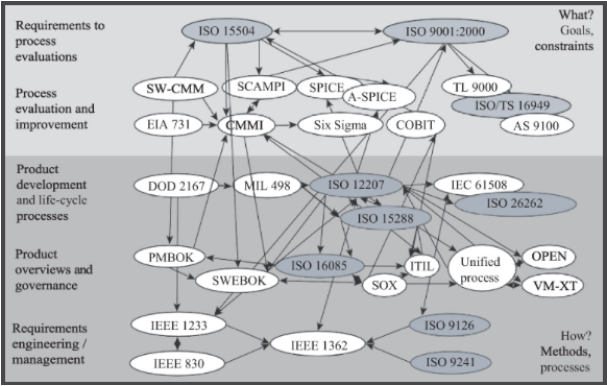

* In the figure, ISO standards are shaded and relevant standards are grouped into the following categories:
    1. Improvement standards (metamodels) such as **ISO 15504** (capability maturity determination and process assessment standard) and **ISO 9001** (quality management)

    2. Quality management and improvement frameworks, such as **CMMI** (capability maturity model integration) with SCAMPI (standard CMMI appraisal method for process improvement); **SPICE** (software process improvement and capability determination); **ISO 15504**; **COBIT** (control objectives for information and related technology) for IT organizations; **Six Sigma**; **TL 9000**, which details requirements and measurements to telecommunication quality management systems; **ISO/ TS**(technical standard) **16949**, which provides requirements to quality management in automotive systems; and **AS** (aerospace standard) **9100**, which enhances **ISO 9001** with specific requirements for the aerospace industry

    3. Process and life cycle models include **DoD** (USA Department of Defense) **2167 MIL** (military standard) **498**, **ISO 15288** (system life cycle), and **ISO 12207** (software life cycle) 

    4. Process implementation and governance regulations and policies include the **Sarbanes–Oxley Act** (SOX), standards such as **ISO 16085** (risk management), de facto standards such as **SWEBOK** and **PMBOK** (project management body of knowledge), and various frameworks (Ebert 2010)
     (We will explore only some of these standards)

## Capability Maturity Model Integration (CMMI)
* Is a systems and software quality model consisting of five levels

* The CMMI is not a life cycle model, but rather a system for describing the principles and practices underlying process maturity

* CMMI is intended to help software organizations improve the maturity of their processes in terms of an evolutionary path from ad hoc, chaotic processes to mature, disciplined processes

* Developed by the Software Engineering Institute at Carnegie Mellon University, the CMMI is organized into five maturity levels. Predictability, effectiveness, and control of an organization's software processes are believed to improve as the organization moves up these five levels. While not truly rigorous, there is some empirical evidence that supports this position

* CMMI describes both high-level and low-level requirements management processes
    * The high-level processes apply to managers and team leaders
    * The low-level processes pertain to analysts, designers, developers, and testers

* Typical high-level requirements practices/processes include:
    * Adhering to organizational policies
    * Tracking documented project plans
    * Allocating adequate resources
    * Assigning responsibility and authority
    * Training appropriate personnel
    * Placing all items under version or configuration control and having them reviewed by all (available) stakeholders
    * Complying with relevant standards
    * Reviewing status with higher management

* Low-level best practices/processes include:
    * Understanding requirements
    * Getting all participants to commit to requirements
    * Managing requirements changes throughout the life cycle
    * Managing requirements traceability (forward and backward)
    * Identifying and correcting inconsistencies between project plans and requirements

* Achieving level 3 and higher for the CMMI requires that these best practices be documented and followed within an organization

* The CMM family of quality models defines requirements management as: 
    > "establishing and maintaining an agreement with the customer on the requirements for the software project. The agreement forms the basis for estimating, planning, performing, and tracking the software project's activities throughout the software life cycle." 

* For maximum flexibility, CMM does not prescribe which tools or techniques to use to achieve these goals

## ISO 9001
* ISO Standard 9000, Quality Management, is a generic, worldwide standard for quality improvement

* The standard is
    * collectively described in four volumes:
        * ISO 9000, ISO 9001 (Quality Management SystemsRequirements), ISO 9004 (Managing for the Sustained Success of an Organization), and ISO 9011 (Guidelines for Auditing Management Systems)
    * designed to be applied in a wide variety of environments

* ISO 9000 applies to enterprises according to the scope of their activities. These ISO standards are process-oriented, common sense practices that help companies create a quality environment

* ISO 9001, Quality Management Systems - Requirements, provides some guidance on requirements management within the discussion for product realization. The standard calls for the following to be determined:
    1. Quality objectives and requirements for the product
    2. The need to establish processes, documents, and provide resources specific to the product 
    3. Required verification, validation, monitoring, inspection, and test activities specific to the product and the criteria for product acceptance 
    4. Records needed to provide evidence that the realization processes and resulting product meet requirements 

* ISO 9001 does not provide specific process guidance for requirements management. The aforementioned recommendations, however, are helpful as a checklist, especially when used in conjunction with appropriate requirements metrics. In order to achieve certification under the ISO standard, significant documentation is required.

## ISO/IEEE 12207
* ISO 12207: Standard for Information Technology - Software Life Cycle Processes, describes five primary processes: acquisition, supply, development, maintenance, and operation

* ISO 12207 divides the five processes into activities, and the activities into tasks, while placing requirements upon their execution. It also specifies eight supporting processes (documentation, configuration management, quality assurance, verification, validation, joint review, audit, and problem resolution) as well as four organizational processes (management, infrastructure, improvement, and training)

* The ISO standard intends for organizations to tailor these processes to fit the scope of their particular projects by deleting all inapplicable activities, and it defines ISO 12207 compliance as being in terms of tailored performance of those processes, activities, and tasks

* ISO 12207 provides a structure of processes using mutually accepted terminology, rather than dictating a particular life cycle model or software development method. Since it is a relatively high-level document, 12207 does not specify the details of how to perform the activities and tasks comprising the processes. Nor does it prescribe the name, format, or content of documentation. Therefore, organizations seeking to apply 12207 need to use additional standards or procedures that specify those details

* The IEEE recognizes this standard with the equivalent numbering: IEEE/ EIA 12207.0-1996, IEEE/EIA Standard Industry Implementation of International

* Standard ISO/IEC12207:1995, and (ISO/IEC 12207) Standard for Information Technology - Software Life Cycle Processes. ISO/IEC 15504 Information Technology - Process Assessment, also termed SPICE, is a derivative of 12207

## Six Sigma
* Developed by Motorola, Six Sigma is a management philosophy based on removing process variation
* Six Sigma focuses on the control of a process to ensure that outputs are within six standard deviations (six sigma) from the mean of the specified goals
* Six Sigma is implemented using define, measure, analyze, improve, and control DMAIC. An overview of a Six Sigma model for requirements management is depicted in this figure:

    

    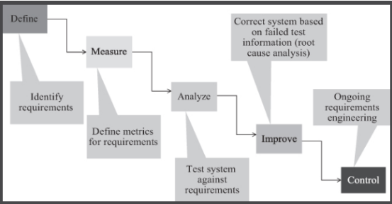
    

    * In Six Sigma, **"define"** means to describe the process to be improved, usually through using some sort of business process model. In the case of requirements engineering, we can think of this as identifying the required features that need improvement

    * **"Measure"** means to identify and capture relevant metrics for each aspect of the process model, in our case, the identified requirements. The goal-question-metric paradigm is helpful in this regard

    * **"Analyze"** means to study the captured metrics for opportunities for improvement

    * **"Improve"** means to change some aspect of the process so that beneficial changes are seen in the associated metrics, usually by attacking the aspect that will have the highest payback

    * **"Control"** means to use ongoing monitoring of the metrics to continuously revisit the model, observe the metrics, and refine the process as needed

* Six Sigma is more process yield-based than the CMMI so the CMMI process areas can be used to support DMAIC (e.g., by encouraging measurement). And, while CMMI identifies activities, Six Sigma helps optimize those activities
* Six Sigma can also provide specific tools for implementing CMMI practices (e.g., estimation and risk management)
* Some organizations use Six Sigma as part of their software quality practice. The issue here, however, is in finding an appropriate business process model for the software production process that does not devolve into a simple, and highly artificial, waterfall process. If appropriate metrics for requirements can be determined, then Six Sigma can be used to improve the RE process
